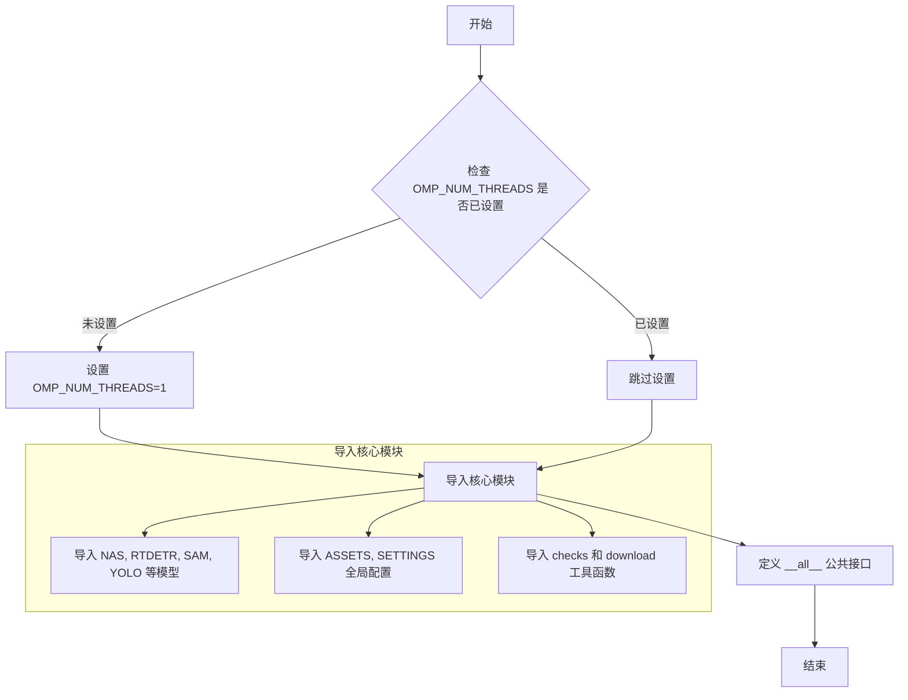

# __init__.py

This file documents the purpose of `__init__.py`.

# 代码解释

`__init__.py` 文件是 Python 包的入口文件，主要用于定义包的元信息、初始化环境变量以及导入核心模块。以下是文件的具体功能分解：

1. **版本号定义**：
   - 定义了 `__version__` 变量，表示 Ultralytics 库的版本号（当前为 `"8.3.89"`）。

2. **环境变量设置**：
   - 检查是否已经设置了 `OMP_NUM_THREADS` 环境变量。如果没有设置，则将其默认值设为 `"1"`，以减少训练过程中 CPU 的利用率。

3. **模块导入**：
   - 导入了多个核心模块和类，包括但不限于：
     - `NAS`, `RTDETR`, `SAM`, `YOLO`, `FastSAM`, `YOLOWorld`：这些是 Ultralytics 提供的不同模型或工具。
     - `ASSETS`, `SETTINGS`：提供全局配置和资源路径。
     - `checks` 和 `download`：分别用于检查 YOLO 配置和下载相关资源。

4. **暴露公共接口**：
   - 使用 `__all__` 列表定义了该模块对外暴露的公共接口，确保用户在导入时只能访问指定的内容。

---

# 控制流图

---

# 总结

### 文件角色与作用

1. **包初始化**：
   - `__init__.py` 文件作为 Ultralytics 包的入口文件，负责初始化包的环境和加载核心模块。

2. **版本管理**：
   - 定义了 `__version__` 变量，明确指出了当前库的版本号，便于开发者了解和维护。

3. **环境优化**：
   - 通过设置 `OMP_NUM_THREADS` 环境变量，默认限制 CPU 的线程数，从而降低训练过程中的资源消耗。

4. **模块集成**：
   - 导入了多个核心模块和工具类（如 `YOLO`, `NAS`, `SAM` 等），为用户提供了一站式的模型开发和部署能力。

5. **接口暴露**：
   - 使用 `__all__` 列表明确指定了对外暴露的接口，避免用户误用内部实现细节。

### 总体作用

`__init__.py` 文件的核心作用是为 Ultralytics 包提供一个清晰的入口点，确保用户能够方便地访问核心功能，同时通过环境变量优化和模块集成提升开发效率和用户体验。