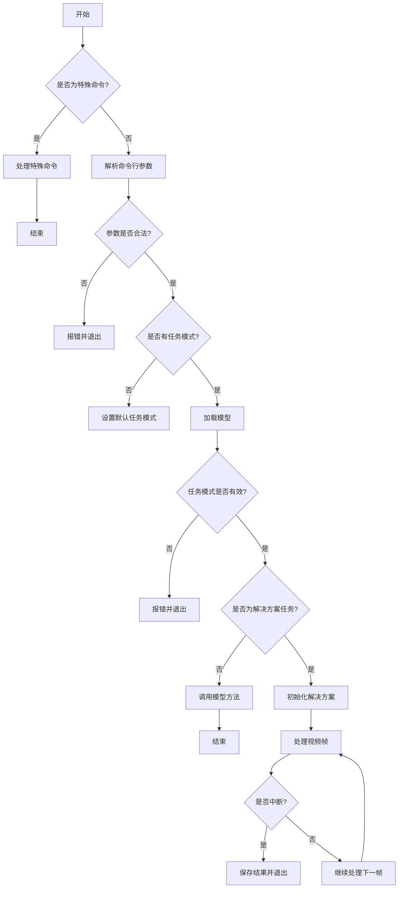

# __init__.py

This file documents the purpose of `__init__.py`.

# 代码解释
该代码是一个复杂的命令行接口（CLI）实现，主要用于Ultralytics库的多种任务模式和解决方案。以下是详细的功能分解：

1. **特殊命令处理**：
   - 支持帮助信息、版本显示、设置管理、登录/登出等特殊命令。
   - 提供详细的帮助信息（如`CLI_HELP_MSG`和`SOLUTIONS_HELP_MSG`），指导用户正确使用命令。

2. **参数解析与验证**：
   - 使用`merge_equals_args`合并命令行参数，支持`key=value`格式。
   - 检查参数合法性，确保键值对符合预期类型（如整数、浮点数、布尔值等）。
   - 提供默认值填充机制，避免用户遗漏必要参数。

3. **任务模式与模型加载**：
   - 支持多种任务模式（如训练、预测、验证、导出等）和解决方案（如计数、热图、队列管理等）。
   - 根据任务模式加载对应模型（如YOLO、RTDETR、FastSAM等），并调用相应方法。

4. **视频处理与输出**：
   - 对于解决方案任务（如计数、热图等），支持视频帧处理和结果保存。
   - 提供中断机制（如按`q`键退出）和输出文件保存功能。

5. **异常处理与日志记录**：
   - 在参数解析、模型加载和任务执行过程中，提供详细的异常处理和日志记录功能。
   - 确保用户能够快速定位问题并修复。

---

# 控制流图

以上控制流图清晰地展示了代码的主要逻辑分支和循环结构，便于理解复杂任务的执行流程。