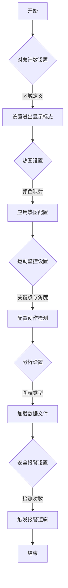

# 代码解释
这段YAML代码是一个全局配置文件，用于定义Ultralytics解决方案的各种设置和参数。具体功能如下：
1. **对象计数设置**：定义区域边界点，控制是否显示进入或离开该区域的对象。
2. **热图设置**：指定热图的颜色映射方案。
3. **运动监控设置**：通过关键点和角度阈值监控运动状态，例如俯卧撑的动作检测。
4. **分析设置**：定义数据分析的图表类型和相关文件路径。
5. **安全报警系统设置**：设定检测次数阈值以触发邮件报警。

# 控制流图
