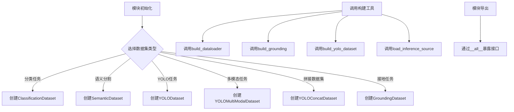

# __init__.py

This file documents the purpose of `__init__.py`.

# 代码解释
该代码是一个模块化的Python文件，主要用于支持计算机视觉任务（如分类、目标检测、语义分割等）的数据集定义与构建。具体功能如下：
1. **数据集类定义**：通过继承`BaseDataset`，定义了多种数据集类（如`ClassificationDataset`、`YOLODataset`等），用于处理不同任务的数据格式。
2. **构建工具函数**：提供了`build_dataloader`、`build_grounding`、`build_yolo_dataset`和`load_inference_source`等函数，用于动态构建数据加载器或加载推理数据源。
3. **模块导出**：通过`__all__`变量明确列出所有可导出的类和函数，便于外部模块按需导入。

# 控制流图
