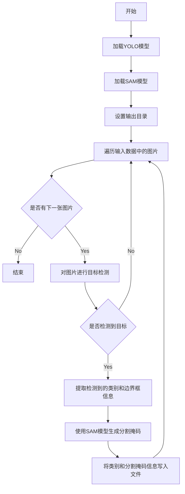

# annotator.py

This file documents the purpose of `annotator.py`.

# 代码解释
这段代码的功能是通过结合YOLO目标检测模型和SAM分割模型，自动为图像生成标注文件。具体功能分解如下：

1. **加载模型**：分别加载YOLO目标检测模型和SAM分割模型。
2. **设置输出目录**：如果未指定输出目录，则根据输入数据路径自动生成默认输出目录，并确保该目录存在。
3. **目标检测**：对输入数据中的每张图像进行目标检测，获取边界框、类别信息以及其他相关参数。
4. **条件判断**：如果检测到目标，则提取边界框信息并传递给SAM模型。
5. **分割掩码生成**：使用SAM模型基于检测到的边界框生成分割掩码。
6. **保存结果**：将每个目标的类别信息和对应的分割掩码保存为文本文件。

# 控制流图
