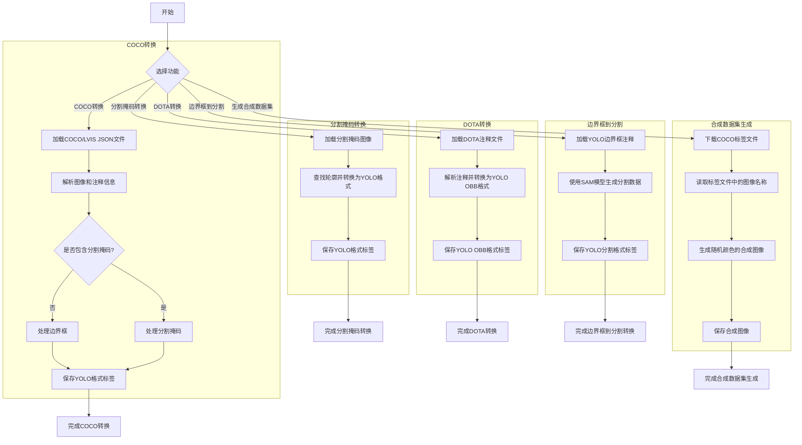

# converter.py

This file documents the purpose of `converter.py`.

# 代码解释

这段代码是一个多功能的数据集转换工具集合，主要用于将不同格式的数据集（如COCO、LVIS、DOTA等）转换为YOLO格式，同时支持生成合成数据集。以下是每个函数的具体功能和逻辑：

1. **`coco91_to_coco80_class` 和 `coco80_to_coco91_class`**  
   - 这两个函数用于在COCO数据集的80类和91类之间进行类别ID的相互映射。
   - `coco91_to_coco80_class`：将91类ID映射到80类ID。
   - `coco80_to_coco91_class`：将80类ID映射回91类ID。

2. **`convert_coco`**  
   - 将COCO或LVIS数据集转换为YOLO格式。
   - 支持边界框、分割掩码和关键点的转换。
   - 参数控制是否使用分割掩码（`use_segments`）或关键点（`use_keypoints`），以及是否将91类ID映射到80类ID（`cls91to80`）。
   - 遍历JSON文件中的注释信息，生成对应的YOLO格式标签文件。

3. **`convert_segment_masks_to_yolo_seg`**  
   - 将分割掩码图像转换为YOLO分割格式。
   - 输入是二值掩码图像，输出是YOLO格式的文本文件。
   - 使用OpenCV查找轮廓并将其转换为归一化的坐标。

4. **`convert_dota_to_yolo_obb`**  
   - 将DOTA数据集的注释转换为YOLO OBB（定向边界框）格式。
   - 遍历DOTA数据集的训练和验证图像及其注释文件，生成对应的YOLO格式标签文件。

5. **`min_index` 和 `merge_multi_segment`**  
   - 辅助函数，用于处理多段分割掩码的合并。
   - `min_index`：计算两个点集之间的最小距离索引。
   - `merge_multi_segment`：通过连接最短距离的点对，将多个分割片段合并为一个连续的片段。

6. **`yolo_bbox2segment`**  
   - 通过SAM模型将边界框注释转换为分割注释。
   - 输入是YOLO格式的边界框注释，输出是YOLO格式的分割注释。
   - 使用SAM模型生成中间分割数据。

7. **`create_synthetic_coco_dataset`**  
   - 生成合成的COCO数据集，用于测试或增强。
   - 下载COCO标签文件，根据标签文件中的图像名称生成随机颜色的合成图像。
   - 使用多线程加速图像生成过程。

---

# 控制流图

# 库解释

3. **`shutil`**  
   - 提供高级的文件操作功能，如复制、移动、删除文件和目录。  
   - 在代码中可能用于清理或组织数据集目录。

4. **`defaultdict` (from `collections`)**  
   - 是`dict`的子类，提供默认值生成的功能。  
   - 在代码中用于创建图像-注释的字典，默认值为列表，方便存储多个注释。

5. **`ThreadPoolExecutor` 和 `as_completed` (from `concurrent.futures`)**  
   - `ThreadPoolExecutor`：用于创建线程池，实现多线程并行处理任务。  
   - `as_completed`：用于监控线程池中任务的完成情况。  
   - 在代码中可能用于并行生成合成图像或处理大量数据。

6. **`Path` (from `pathlib`)**  
   - 提供对象化的路径操作接口，简化文件路径的处理。  
   - 在代码中广泛用于处理文件路径，如读取JSON文件、创建目录等。

7. **`cv2` (OpenCV)**  
   - 用于计算机视觉任务，如图像处理、特征提取等。  
   - 在代码中可能用于读取图像、查找轮廓、生成分割掩码等。

8. **`numpy` (as `np`)**  
   - 提供高效的数组操作和科学计算功能。  
   - 在代码中可能用于处理图像数据、坐标转换、矩阵运算等。

9. **`PIL.Image` (from `PIL`)**  
   - 提供图像处理功能，支持多种图像格式的操作。  
   - 在代码中可能用于生成随机颜色的合成图像。

---
