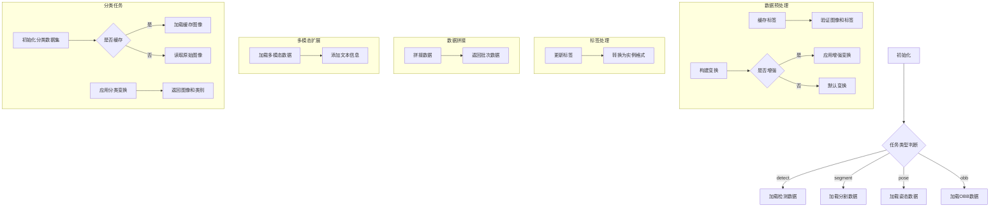

# dataset.py

This file documents the purpose of `dataset.py`.

# 代码解释
这段代码实现了一个功能丰富的数据集类体系，用于支持YOLO框架下的多种任务（如目标检测、分割、姿态估计等）。以下是各部分的详细功能描述：

1. **YOLODataset**：
   - 核心数据集类，支持多种任务类型（`detect`, `segment`, `pose`, `obb`）。
   - 提供缓存标签功能（`cache_labels`），验证图像和标签完整性。
   - 构建数据增强变换（`build_transforms`），支持马赛克、混合等增强方式。
   - 更新标签格式（`update_labels_info`），将原始标注转换为统一的实例格式。
   - 提供数据拼接方法（`collate_fn`），用于将多个样本合并为一个批次。

2. **YOLOMultiModalDataset**：
   - 继承自 `YOLODataset`，扩展了多模态任务的支持。
   - 在更新标签时添加文本信息（`texts`），适用于图像和文本联合训练。

3. **GroundingDataset**：
   - 从JSON文件加载标注数据，适用于 grounding 任务。
   - 支持从图像和标注中提取文本信息（`texts`），并将其与图像数据关联。

4. **YOLOConcatDataset**：
   - 用于合并多个数据集，确保所有子数据集使用相同的拼接函数。

5. **SemanticDataset**：
   - 占位类，尚未实现具体功能，用于语义分割任务。

6. **ClassificationDataset**：
   - 分类任务的数据集类，基于 torchvision 的 `ImageFolder` 扩展。
   - 支持图像缓存（RAM 或磁盘）、数据增强（如翻转、裁剪、颜色抖动等）。
   - 提供图像验证功能（`verify_images`），过滤无效图像。

# 控制流图
