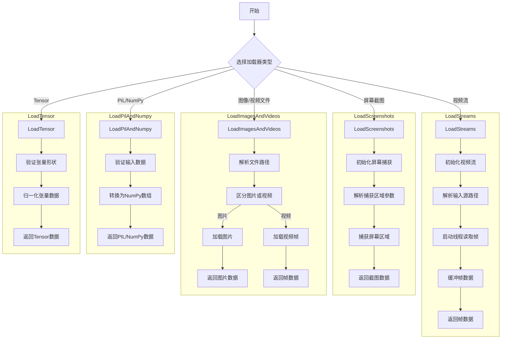

# 代码解释
这段代码实现了一个多功能的数据加载框架，主要用于YOLO（You Only Look Once）模型的输入数据预处理。以下是具体功能模块的详细说明：

1. **`SourceTypes` 类**  
   - 定义了输入源类型的布尔标志，用于标识数据来源是视频流、截图、图像文件还是张量。

2. **`LoadStreams` 类**  
   - 支持多路视频流（如RTSP、RTMP、HTTP等）的加载与处理。
   - 使用线程异步读取帧，支持缓冲机制以提高效率。
   - 初始化时解析输入源路径或URL，自动处理YouTube链接并转换为最佳质量流。
   - 提供迭代器接口，逐帧返回视频流数据。

3. **`LoadScreenshots` 类**  
   - 捕获屏幕区域作为数据源，支持指定屏幕编号和捕获区域（左、顶、宽、高）。
   - 使用`mss`库捕获屏幕，并将截图转换为NumPy数组格式。

4. **`LoadImagesAndVideos` 类**  
   - 处理本地图像和视频文件的加载，支持批量读取。
   - 自动区分图像和视频文件，分别调用不同的加载逻辑。
   - 对视频文件逐帧读取，并支持帧率步长控制。

5. **`LoadPilAndNumpy` 类**  
   - 加载PIL图像或NumPy数组格式的数据。
   - 对输入数据进行验证和格式转换，确保输出为标准的NumPy数组。

6. **`LoadTensor` 类**  
   - 加载PyTorch张量格式的数据。
   - 验证张量形状是否符合要求（BCHW），并对数据进行归一化处理。

7. **辅助函数**  
   - `autocast_list`：将多种类型的数据源（如字符串路径、PIL图像、NumPy数组）统一转换为标准格式。
   - `get_best_youtube_url`：从YouTube链接中提取最佳质量的MP4视频流URL。

# 控制流图
