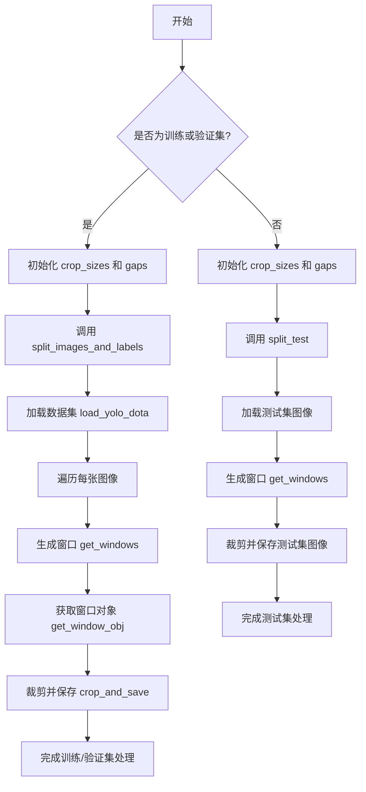

# split_dota.py

This file documents the purpose of `split_dota.py`.

# 代码解释
这段代码的主要功能是对DOTA数据集进行图像和标签的分割处理，适用于训练、验证和测试集。以下是具体模块的功能分解：

1. **`bbox_iof`**：计算多边形与边界框之间的交并比（IoF），用于判断目标是否在窗口内。
2. **`load_yolo_dota`**：加载DOTA数据集的图像路径和对应的标签信息，返回包含图像尺寸和标签的字典列表。
3. **`get_windows`**：根据图像尺寸生成滑动窗口坐标，支持多种窗口大小和步长。
4. **`get_window_obj`**：基于IoF阈值筛选出每个窗口内的目标对象。
5. **`crop_and_save`**：裁剪图像并保存新的标签文件，支持背景图像的保存选项。
6. **`split_images_and_labels`**：对图像和标签进行分割并保存，调用上述函数完成具体操作。
7. **`split_trainval` 和 `split_test`**：
   - `split_trainval`：分别处理训练集和验证集的分割。
   - `split_test`：仅处理测试集的图像分割，不涉及标签。

# 控制流图

### 控制流图说明
- **顶部决策节点**：判断是否为训练/验证集，决定调用 `split_trainval` 或 `split_test`。
- **训练/验证集流程**：
  - 初始化窗口参数。
  - 调用 `split_images_and_labels`。
  - 加载数据集。
  - 遍历每张图像，生成窗口、筛选目标、裁剪保存。
- **测试集流程**：
  - 初始化窗口参数。
  - 调用 `split_test`。
  - 加载测试集图像。
  - 生成窗口并裁剪保存。

  > DOTA（Dataset for Object deTection in Aerial images）是一个专注于航空图像目标检测的大规模数据集，主要用于支持旋转框和水平框标注的目标检测算法开发与评估‌57。以下是其核心信息：