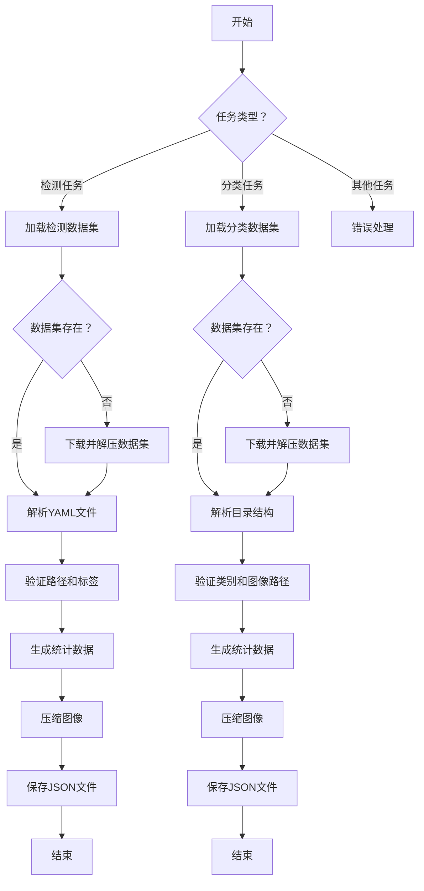
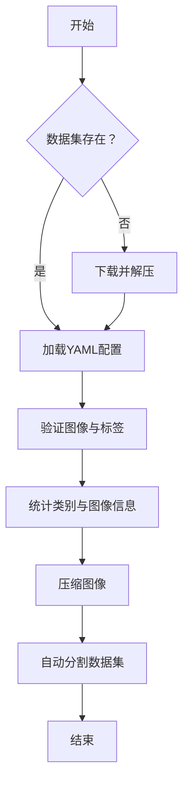

# utils.py

This file documents the purpose of `utils.py`.

# 代码解释
这段代码是一个功能丰富的模块，主要用于YOLO数据集的处理和验证。以下是具体的功能分解：

1. **数据集验证**：
   - `check_det_dataset`：验证检测任务的数据集，包括下载、解压、读取YAML文件、检查路径和标签格式。
   - `check_cls_dataset`：验证分类任务的数据集，支持从远程URL下载并解压，同时检查类别数量和图像路径。

2. **数据集可视化**：
   - `visualize_image_annotations`：根据YOLO格式的标注文件，在图像上绘制边界框和类别标签，并动态调整文本颜色以提高可读性。

3. **多边形到掩码转换**：
   - `polygon2mask` 和 `polygons2masks`：将多边形坐标转换为二值掩码或一组掩码，支持下采样以减少计算量。

4. **数据集统计与压缩**：
   - `HUBDatasetStats` 类：生成数据集的JSON统计信息，包括实例数、类别分布等，并通过线程池压缩图像以供HUB使用。
   - `compress_one_image`：单张图像的压缩函数，支持PIL和OpenCV两种实现方式。

5. **自动分割**：
   - `autosplit`：根据权重自动将数据集划分为训练、验证和测试集，并保存为对应的`.txt`文件。

6. **缓存文件处理**：
   - `load_dataset_cache_file` 和 `save_dataset_cache_file`：分别用于加载和保存数据集的缓存文件，确保高效复用。

---

# 控制流图

---

### 控制流图说明
1. **任务类型判断**：根据任务类型（检测/分类）选择不同的数据集处理逻辑。
2. **数据集加载**：如果数据集不存在，则尝试下载并解压；否则直接解析YAML文件或目录结构。
3. **数据集验证**：检查路径、标签格式、类别数量等是否符合要求。
4. **统计数据生成**：统计实例数、类别分布等信息，并生成JSON文件。
5. **图像压缩**：通过线程池对图像进行压缩，减少存储空间。
6. **结束**：完成所有操作后退出流程。

# 代码解释

这段代码的核心功能是对数据集进行预处理和验证，而不是直接进行模型训练或识别。以下是这6个步骤的实际意义：

1. **数据集验证**：
   - 确保数据集的完整性和正确性，例如检查图像格式、标签文件是否存在以及是否符合YOLO格式。
   - 这类似于人类视觉中的“初步筛选”，确保输入的数据是可用的。

2. **数据集下载与解压**：
   - 如果数据集不存在本地，则从远程下载并解压到指定目录。
   - 类似于在一堆资源中找到目标数据集并准备好使用。

3. **图像与标签路径映射**：
   - 自动生成图像路径对应的标签路径，确保每张图像都有对应的标注文件。
   - 这一步类似于将图像与其描述信息（标签）关联起来。

4. **数据集统计**：
   - 统计数据集中各类别的数量、图像尺寸等信息，并生成JSON文件以便后续分析。
   - 相当于对数据集进行“概览”，了解其整体结构和分布。

5. **图像压缩**：
   - 对图像进行压缩以减少存储空间，同时保持一定的质量。
   - 类似于调整图像分辨率，使其更适合后续处理。

6. **自动分割**：
   - 将数据集按比例划分为训练集、验证集和测试集，并保存为`.txt`文件。
   - 这一步类似于将数据集“分类整理”，以便后续用于不同的任务阶段。

这些步骤更像是数据集的“前置处理”动作，目的是为后续的模型训练和推理做好准备，类似于人类视觉系统中的“感知前处理”阶段。

---

# 控制流图

---

### 控制流图说明
1. **数据集存在检查**：判断数据集是否已存在于本地。
2. **下载与解压**：如果数据集不存在，则从远程下载并解压。
3. **加载YAML配置**：解析数据集的配置文件，获取路径和其他信息。
4. **验证图像与标签**：检查图像和标签文件的完整性与格式。
5. **统计类别与图像信息**：生成数据集的统计信息，包括类别分布和图像数量。
6. **压缩图像**：对图像进行压缩以减少存储空间。
7. **自动分割数据集**：将数据集划分为训练集、验证集和测试集。
8. **结束**：完成所有前置处理步骤。