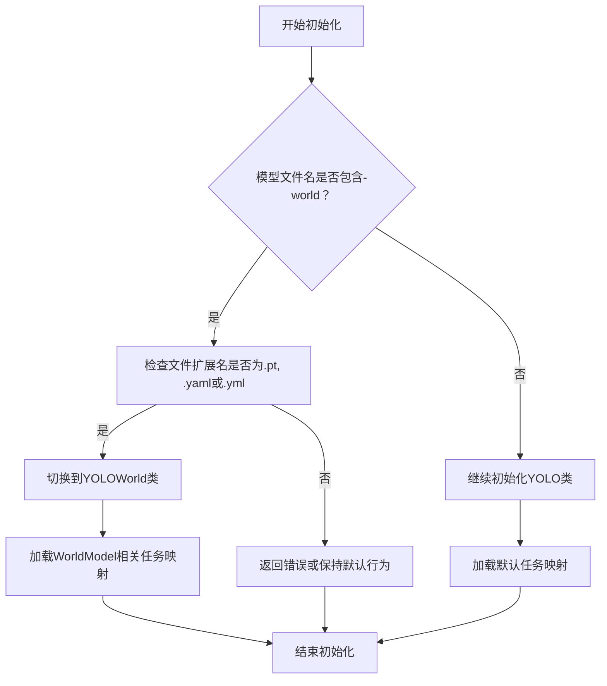

# model.py

This file documents the purpose of `model.py`.

# 代码解释
这段代码定义了两个类 `YOLO` 和 `YOLOWorld`，用于实现不同任务的物体检测模型。具体功能如下：

1. **`YOLO` 类**：
   - 初始化时根据传入的模型文件路径判断是否需要切换到 `YOLOWorld` 类。
   - 如果模型文件名包含 `-world` 并且扩展名为 `.pt`, `.yaml`, 或 `.yml`，则动态切换到 `YOLOWorld` 类。
   - 否则，继续使用默认的 `YOLO` 类进行初始化。
   - 提供了 `task_map` 属性，用于映射不同的任务（如分类、检测、分割等）到对应的模型、训练器、验证器和预测器。

2. **`YOLOWorld` 类**：
   - 继承自 `Model` 类，专门用于处理 `YOLOWorld` 模型。
   - 初始化时加载预训练模型，并为检测任务提供默认的 COCO 数据集类别名称。
   - 提供了 `set_classes` 方法，允许用户设置自定义类别名称，并移除可能存在的背景类别。
   - 提供了 `task_map` 属性，专门为检测任务定义了 `WorldModel`、验证器、预测器和训练器。

# 控制流图

### 补充说明
- **动态切换类**：通过修改实例的 `__class__` 和 `__dict__` 实现从 `YOLO` 到 `YOLOWorld` 的动态切换。
- **任务映射**：`task_map` 属性为不同任务提供了灵活的扩展性，支持多种任务类型（如分类、检测、分割等）。
- **自定义类别**：`YOLOWorld` 类允许用户通过 `set_classes` 方法设置自定义类别名称，增强了模型的灵活性。