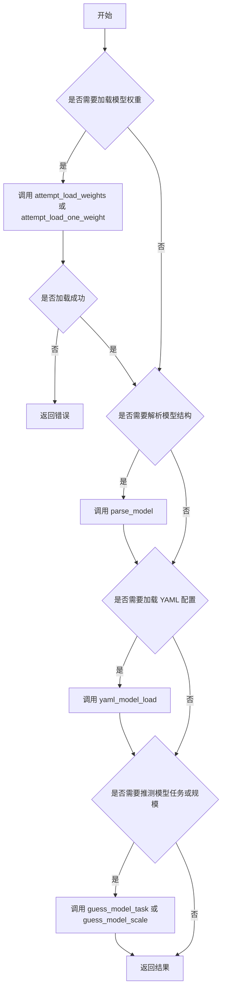

# __init__.py

This file documents the purpose of `__init__.py`.

# 代码解释  
这段代码是一个Python模块的定义文件，主要功能是提供模型加载、解析和任务类型推测的功能。具体功能分解如下：  

1. **导入函数和类**：从子模块 `tasks` 中导入多个函数和类，包括：
   - 模型加载相关：`attempt_load_one_weight` 和 `attempt_load_weights`，用于加载单个或多个模型权重。
   - 模型解析相关：`parse_model` 和 `yaml_model_load`，分别用于解析模型结构和从 YAML 文件加载模型配置。
   - 模型任务推测相关：`guess_model_task` 和 `guess_model_scale`，用于推测模型的任务类型（如分类、检测、分割）和模型规模。
   - 模型类定义：`BaseModel`、`ClassificationModel`、`DetectionModel` 和 `SegmentationModel`，分别表示基础模型和不同任务的模型。

2. **定义对外接口**：通过 `__all__` 变量明确列出该模块对外暴露的接口，确保使用者只能访问指定的函数和类。

---

# 控制流图  
以下流程图展示了该模块在实际使用中可能的逻辑控制流，假设用户调用这些函数来完成模型加载和解析任务：

### 流程图说明  
1. **起点**：从用户需求开始，判断是否需要加载模型权重。
2. **模型加载**：如果需要加载权重，则调用 `attempt_load_weights` 或 `attempt_load_one_weight`，并检查加载是否成功。
3. **模型解析**：如果加载成功，进一步判断是否需要解析模型结构，调用 `parse_model`。
4. **YAML 配置加载**：判断是否需要从 YAML 文件加载配置，调用 `yaml_model_load`。
5. **任务和规模推测**：判断是否需要推测模型的任务类型和规模，调用 `guess_model_task` 或 `guess_model_scale`。
6. **结束**：最终返回结果或错误信息。