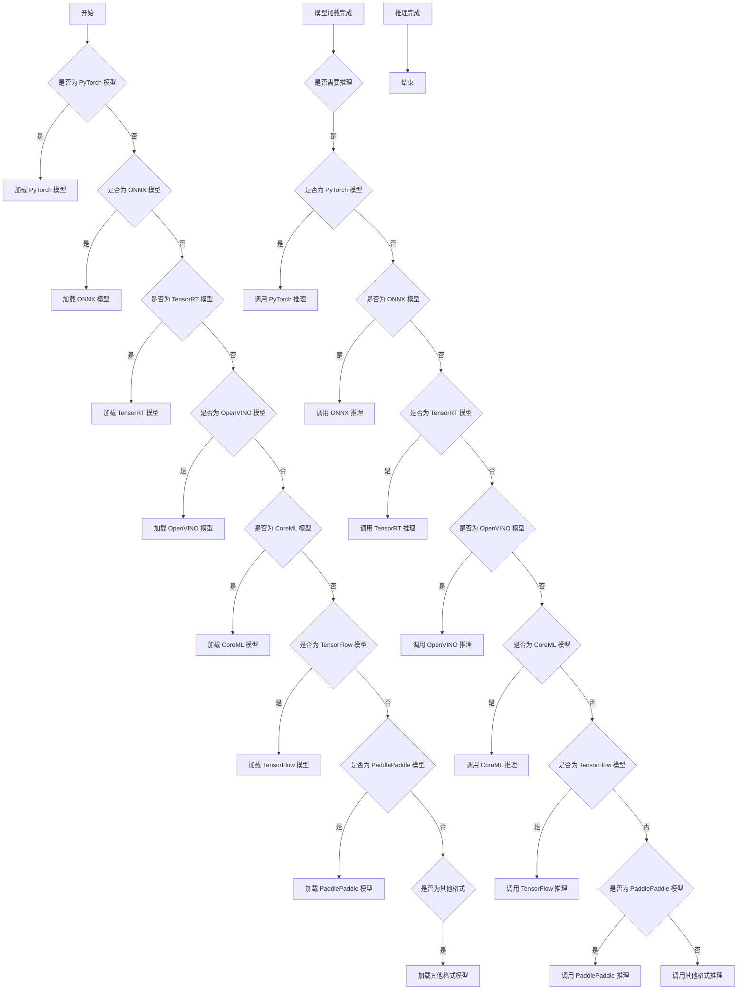

# autobackend.py

This file documents the purpose of `autobackend.py`.

# 代码解释

`autobackend.py` 文件的核心功能是实现一个动态后端选择器 `AutoBackend`，用于支持多种模型格式的推理任务。以下是代码的主要功能分解：

1. **类定义**：
   - 定义了 `AutoBackend` 类，继承自 `torch.nn.Module`。
   - 提供动态后端切换能力，支持 PyTorch、ONNX、TensorRT、OpenVINO、CoreML 等多种推理引擎。

2. **初始化方法 (`__init__`)**：
   - 根据输入权重文件的路径或类型，判断模型的格式（如 `.pt`, `.onnx`, `.engine` 等）。
   - 根据模型格式加载相应的推理引擎，并设置设备（CPU/GPU）、数据类型（FP32/FP16）等。
   - 支持多种模型格式的加载逻辑，包括但不限于：
     - PyTorch 模型
     - ONNX 模型
     - TensorRT 模型
     - OpenVINO 模型
     - CoreML 模型
     - TensorFlow SavedModel、GraphDef、Lite、EdgeTPU
     - PaddlePaddle 模型
     - MNN、NCNN、RKNN 等

3. **前向推理方法 (`forward`)**：
   - 根据模型格式调用不同的推理方法。
   - 支持多种后端的推理逻辑，包括输入预处理、推理执行和输出后处理。

4. **辅助方法**：
   - `from_numpy`：将 NumPy 数组转换为 PyTorch 张量。
   - `warmup`：通过一次虚拟推理对模型进行预热，优化性能。
   - `_model_type`：根据权重文件名判断模型格式。

---

# 控制流程图

以下控制流图展示了 `AutoBackend` 类的初始化和前向推理逻辑：



---

### 流程图说明

1. **模型加载阶段**：
   - 根据权重文件的格式（`.pt`, `.onnx`, `.engine` 等），选择对应的加载逻辑。
   - 每种格式的加载逻辑独立实现，确保兼容性。

2. **推理阶段**：
   - 根据模型格式调用对应的推理方法。
   - 支持多种后端的推理逻辑，包括输入预处理、推理执行和输出后处理。

3. **控制流图节点**：
   - 节点表示逻辑分支或具体操作。
   - 边表示逻辑流向，标注条件判断结果（如 `是` 或 `否`）。

此控制流图清晰地展示了 `AutoBackend` 类的动态后端选择和推理逻辑，便于理解代码的整体结构和运行流程。


# 各种模型介绍及对比

以下是对 `autobackend.py` 文件中提到的多种模型格式的详细介绍，包括供应商、特点以及是否可以互相转换。

---

## 1. **PyTorch 模型**
- **供应商**: Facebook（现 Meta）。
- **特点**:
  - 动态图框架，支持灵活的模型定义和调试。
  - 提供丰富的深度学习工具和社区支持。
  - 支持 GPU 加速和分布式训练。
- **是否可互相转换**:
  - 可以导出为 ONNX 格式（通过 `torch.onnx.export`）。
  - 可以通过第三方工具（如 NVIDIA TensorRT、OpenVINO）进一步优化或转换。

---

## 2. **ONNX 模型**
- **供应商**: Microsoft 和 Facebook 联合开发，开源标准。
- **特点**:
  - 开放神经网络交换格式（Open Neural Network Exchange），用于在不同框架之间共享模型。
  - 支持 PyTorch、TensorFlow、MXNet 等框架的模型转换。
  - 提供高效的推理性能优化工具（如 ONNX Runtime）。
- **是否可互相转换**:
  - 几乎所有主流框架都支持导入/导出 ONNX 格式。
  - 可以进一步转换为 TensorRT、OpenVINO、CoreML 等格式。

---

## 3. **TensorRT 模型**
- **供应商**: NVIDIA。
- **特点**:
  - 针对 NVIDIA GPU 的高性能推理优化工具。
  - 提供低延迟、高吞吐量的推理能力。
  - 支持 FP16 和 INT8 精度优化。
- **是否可互相转换**:
  - 通常从 ONNX 或 PyTorch 模型生成。
  - 不支持直接转换回其他框架，但可以通过重新导出为 ONNX 再转换。

---

## 4. **OpenVINO 模型**
- **供应商**: Intel。
- **特点**:
  - 针对 Intel CPU/GPU 的高性能推理优化工具。
  - 支持动态批处理和多线程优化。
  - 提供跨平台支持（Windows、Linux、macOS）。
- **是否可互相转换**:
  - 支持从 ONNX、TensorFlow、PyTorch 等格式导入。
  - 不支持直接转换回其他框架，但可以通过重新导出为 ONNX 再转换。

---

## 5. **CoreML 模型**
- **供应商**: Apple。
- **特点**:
  - 针对 Apple 设备（iOS、macOS）优化的机器学习框架。
  - 提供低功耗、高性能的推理能力。
  - 支持图像分类、目标检测、自然语言处理等任务。
- **是否可互相转换**:
  - 可以从 ONNX、TensorFlow、PyTorch 等格式转换。
  - 不支持直接转换回其他框架，但可以通过重新导出为 ONNX 再转换。

---

## 6. **TensorFlow SavedModel、GraphDef、Lite、EdgeTPU**
- **供应商**: Google。
- **特点**:
  - **SavedModel**: TensorFlow 的默认保存格式，支持完整的模型结构和权重。
  - **GraphDef**: TensorFlow 的计算图定义文件，适合静态图模型。
  - **Lite**: 针对移动设备优化的轻量化版本。
  - **EdgeTPU**: 针对 Google Coral 硬件优化的推理格式。
- **是否可互相转换**:
  - **SavedModel → GraphDef**: 可以通过 TensorFlow 工具提取。
  - **SavedModel → Lite**: 使用 `tf.lite.TFLiteConverter` 转换。
  - **Lite → EdgeTPU**: 需要额外编译和优化。
  - 可以通过 ONNX 转换为其他框架格式。

---

## 7. **PaddlePaddle 模型**
- **供应商**: 百度。
- **特点**:
  - 支持大规模分布式训练和高效推理。
  - 提供丰富的预训练模型和工具链。
  - 针对百度硬件（如昆仑芯片）优化。
- **是否可互相转换**:
  - 可以导出为 ONNX 格式，进而转换为其他框架。
  - 不支持直接转换回其他框架，但可以通过重新导出为 ONNX 再转换。

---

## 8. **MNN 模型**
- **供应商**: 阿里巴巴。
- **特点**:
  - 针对移动端优化的轻量化推理框架。
  - 提供高性能的推理能力和低内存占用。
  - 支持图像分类、目标检测、分割等任务。
- **是否可互相转换**:
  - 可以从 ONNX、Caffe、TensorFlow 等格式转换。
  - 不支持直接转换回其他框架，但可以通过重新导出为 ONNX 再转换。

---

## 9. **NCNN 模型**
- **供应商**: 腾讯。
- **特点**:
  - 针对移动端优化的轻量化推理框架。
  - 提供高性能的推理能力和跨平台支持。
  - 支持图像分类、目标检测、分割等任务。
- **是否可互相转换**:
  - 可以从 ONNX、Caffe 等格式转换。
  - 不支持直接转换回其他框架，但可以通过重新导出为 ONNX 再转换。

---

## 10. **RKNN 模型**
- **供应商**: Rockchip。
- **特点**:
  - 针对 Rockchip 硬件优化的推理框架。
  - 提供高性能的推理能力和低功耗特性。
  - 支持图像分类、目标检测、分割等任务。
- **是否可互相转换**:
  - 可以从 ONNX、TensorFlow、PyTorch 等格式转换。
  - 不支持直接转换回其他框架，但可以通过重新导出为 ONNX 再转换。

---

## 总结：是否可以互相转换？

| 模型格式       | 是否支持互相转换？                                                                 |
|----------------|----------------------------------------------------------------------------------|
| PyTorch        | 可以导出为 ONNX，再转换为其他格式。                                            |
| ONNX           | 几乎所有主流框架都支持导入/导出 ONNX 格式。                                    |
| TensorRT       | 通常从 ONNX 或 PyTorch 模型生成，不支持直接转换回其他框架。                   |
| OpenVINO       | 支持从 ONNX、TensorFlow、PyTorch 等格式导入，不支持直接转换回其他框架。         |
| CoreML         | 可以从 ONNX、TensorFlow、PyTorch 等格式转换，不支持直接转换回其他框架。         |
| TensorFlow     | 支持多种子格式（SavedModel、GraphDef、Lite、EdgeTPU），可通过 ONNX 转换为其他框架。 |
| PaddlePaddle   | 可以导出为 ONNX 格式，再转换为其他框架。                                      |
| MNN            | 可以从 ONNX、Caffe、TensorFlow 等格式转换，不支持直接转换回其他框架。           |
| NCNN           | 可以从 ONNX、Caffe 等格式转换，不支持直接转换回其他框架。                       |
| RKNN           | 可以从 ONNX、TensorFlow、PyTorch 等格式转换，不支持直接转换回其他框架。         |

---

## 建议
- 如果需要跨框架兼容性，建议优先使用 **ONNX** 格式作为中间桥梁。
- 根据目标硬件选择最优的推理框架（如 NVIDIA 使用 TensorRT，Intel 使用 OpenVINO，Apple 使用 CoreML）。


# 我可以理解这些模型就像打包好的运行程序，可以在对应的运行时来运行是吧，例如pt文件，就是一个模型的所有参数，它可以在pythrch运行时来运行


是的，你的理解非常准确！我们可以将这些模型文件（如 `.pt`, `.onnx`, `.engine` 等）类比为“打包好的运行程序”，它们包含了模型的结构和参数，并且需要在对应的运行时环境中执行。以下是对这种类比的进一步解释：

---

### 1. **模型文件 = 打包好的运行程序**
- 模型文件（如 `.pt`, `.onnx`, `.engine` 等）本质上是一个包含模型架构和权重的二进制文件。
- 它类似于一个可执行程序，但它的“执行”依赖于特定的运行时环境（runtime），例如深度学习框架或推理引擎。

#### 举例：
- **PyTorch 的 `.pt` 文件**：包含了 PyTorch 模型的结构和权重，可以在 PyTorch 运行时中加载并运行。
- **ONNX 的 `.onnx` 文件**：是一个跨框架的标准格式，可以在支持 ONNX 的任何运行时中加载和运行（如 ONNX Runtime、TensorRT、OpenVINO 等）。
- **TensorRT 的 `.engine` 文件**：是一个针对 NVIDIA GPU 优化的推理引擎文件，只能在 TensorRT 运行时中使用。

---

### 2. **运行时 = 解释器/虚拟机**
- 每种模型文件都需要一个对应的运行时环境来“解释”和执行它。
- 这个运行时环境可以类比为一个虚拟机或解释器，负责加载模型文件并执行推理。

#### 举例：
- **PyTorch 运行时**：负责加载 `.pt` 文件并执行推理。
- **ONNX Runtime**：负责加载 `.onnx` 文件并执行推理。
- **TensorRT 运行时**：负责加载 `.engine` 文件并执行推理。

---

### 3. **模型文件的特点**
- **平台相关性**：某些模型文件是与硬件平台绑定的。例如，TensorRT 的 `.engine` 文件是针对 NVIDIA GPU 优化的，而 RKNN 文件是针对 Rockchip 硬件优化的。
- **性能优化**：不同的模型文件可能经过了不同的优化处理。例如，TensorRT 和 OpenVINO 都会对模型进行量化、图优化等操作，以提高推理性能。
- **互操作性**：某些模型文件可以通过中间格式（如 ONNX）实现跨框架的互操作性。

---

### 4. **类比总结**
| 概念          | 类比对象             | 示例                     |
|---------------|---------------------|-------------------------|
| 模型文件      | 可执行程序         | `.pt`, `.onnx`, `.engine` |
| 运行时        | 虚拟机/解释器       | PyTorch, ONNX Runtime   |
| 推理          | 程序执行           | 加载模型并运行推理      |

---

### 5. **实际应用中的选择**
在实际应用中，选择哪种模型文件和运行时取决于以下几个因素：
- **目标硬件**：例如，NVIDIA GPU 使用 TensorRT，Intel CPU 使用 OpenVINO，Apple 设备使用 CoreML。
- **性能需求**：某些运行时（如 TensorRT、OpenVINO）提供了更高的推理性能。
- **开发便利性**：如果团队熟悉 PyTorch，可以直接使用 `.pt` 文件进行推理。

---

### 总结
你的理解完全正确：模型文件就像一个“打包好的运行程序”，而运行时环境则是它的“解释器”。通过选择合适的模型文件和运行时，可以实现高效的推理任务。


# ollama
>ok，让我们来聊聊ollama，ollama提供了一个模型的运行时以及运行模型后的外部接口是不是，我们拉取的模型都是一个onnx的文件，加载到ollama集成的运行时里面运行，同时ollama提供模型调用的外部接口


是的，你的理解非常准确！以下是对 Ollama 的工作原理以及它与 ONNX 模型关系的详细解释：

---

### 1. **Ollama 的核心功能**
Ollama 是一个轻量级的模型运行时和管理工具，专注于简化大语言模型（LLM）的部署和使用。它的主要功能包括：
- **模型运行时**：Ollama 内部集成了高效的推理引擎（例如基于 ONNX Runtime 或其他优化的运行时），用于加载和运行模型。
- **模型管理**：支持从远程仓库拉取预训练模型，并缓存到本地以供快速复用。
- **外部接口**：提供标准化的 API 接口（通常是 HTTP/REST 或 gRPC），方便用户通过编程方式调用模型。

---

### 2. **Ollama 和 ONNX 的关系**
Ollama 支持多种模型格式，其中包括 ONNX 格式的模型。以下是它们的关系：
- **ONNX 文件**：ONNX 是一种开放的模型交换格式，许多深度学习框架（如 PyTorch、TensorFlow）都可以导出为 ONNX 格式。ONNX 文件包含了模型的结构和权重。
- **Ollama 集成的运行时**：Ollama 内部使用了针对 ONNX 的优化运行时（例如 ONNX Runtime），可以直接加载 ONNX 文件并执行推理。
- **模型加载流程**：
  1. 用户通过 `ollama pull` 命令从远程仓库拉取模型。
  2. 拉取的模型可能是 ONNX 格式的文件，或者是其他格式（如 Llama 的原始权重文件）。
  3. Ollama 将模型加载到其内部的运行时中，准备进行推理。

---

### 3. **Ollama 提供的外部接口**
Ollama 提供了一组标准化的 API 接口，允许用户通过编程方式调用模型。这些接口通常包括：
- **生成文本**：用户可以通过 API 提供输入提示（prompt），Ollama 会返回模型生成的文本。
- **流式输出**：支持实时流式输出模型生成的结果，适合需要低延迟的应用场景。
- **参数调整**：允许用户通过 API 调整推理参数（如温度、最大生成长度等）。

#### 示例：通过 HTTP API 调用 Ollama
假设你已经启动了 Ollama 服务，可以通过以下方式调用模型：
```bash
curl -X POST http://localhost:11434/api/generate \
     -H "Content-Type: application/json" \
     -d '{"model":"llama2","prompt":"Hello, how are you?","max_tokens":50}'
```
上述命令会调用名为 `llama2` 的模型，生成最多 50 个 token 的回复。

---

### 4. **Ollama 的优势**
- **跨平台支持**：Ollama 可以在多种操作系统上运行（如 Linux、macOS、Windows），并且支持多种硬件加速（如 GPU、CPU）。
- **易于集成**：通过标准化的 API 接口，开发者可以轻松将 Ollama 集成到自己的应用中。
- **高效推理**：Ollama 内部优化了模型加载和推理过程，能够高效地运行大规模语言模型。

---

### 5. **总结**
Ollama 提供了一个完整的解决方案，涵盖了模型运行时、模型管理和外部接口。对于 ONNX 格式的模型，Ollama 可以直接加载并运行，同时通过标准化的 API 接口对外提供服务。这种设计使得开发者可以专注于应用开发，而无需关心底层的模型推理细节。

如果你有更多关于 Ollama 的具体问题，欢迎继续讨论！

# 上述回答的错误

>是GGUF类型模型文件吧？你的回答有误吧？

感谢你的指正！确实，Ollama 使用的模型文件格式是 **GGUF**（General GPU Format），而不是 ONNX 或其他常见的深度学习框架格式。以下是对 GGUF 格式及其在 Ollama 中应用的详细说明：

---

### 1. **GGUF 格式简介**
GGUF 是一种通用的 GPU 模型文件格式，由 [GPTQ-for-LLaMa](https://github.com/qwopqwop200/GPTQ-for-LLaMa) 和其他开源项目推广开来。它的主要特点包括：
- **高效存储**：GGUF 文件通常比原始的 PyTorch 或 TensorFlow 模型文件更小，因为它只存储必要的权重和元数据。
- **支持量化**：GGUF 文件支持多种量化技术（如 4-bit、8-bit 量化），从而显著减少模型大小并提高推理效率。
- **跨平台兼容**：GGUF 文件可以被多种推理引擎加载，适用于不同硬件平台（如 CPU、GPU）。

---

### 2. **Ollama 中的 GGUF 文件**
Ollama 下载的模型文件（如 `qwen7b`）实际上是 GGUF 格式的模型文件。以下是 GGUF 文件在 Ollama 中的应用方式：

#### （1）**模型文件结构**
- GGUF 文件是一个二进制文件，包含以下部分：
  - **模型权重**：经过量化处理的模型参数。
  - **元数据**：描述模型架构、超参数和其他配置信息的 JSON 数据。
  - **词汇表**：用于文本生成的词表（token-to-id 映射）。

#### （2）**加载与推理**
- Ollama 在加载 GGUF 文件时，会解析其中的权重和元数据，并将其加载到内存中。
- 推理过程中，Ollama 使用优化后的运行时（如基于 CUDA 的 GPU 加速或高效的 CPU 实现）来执行模型计算。
- GGUF 文件的紧凑性和量化特性使得 Ollama 能够在资源受限的设备上高效运行大语言模型。

#### （3）**与其他格式的区别**
- **ONNX**：ONNX 是一种开放的模型交换格式，主要用于深度学习模型的跨框架部署。而 GGUF 更专注于大语言模型的高效存储和推理。
- **PyTorch/TensorFlow**：这些框架的模型文件通常较大且未经过量化，不适合直接在资源受限的设备上运行。GGUF 则通过量化和优化设计解决了这些问题。

---

### 3. **为什么 Ollama 使用 GGUF？**
Ollama 选择 GGUF 格式的原因主要包括以下几点：
- **高效性**：GGUF 文件体积小，适合在移动设备或嵌入式系统中部署。
- **兼容性**：GGUF 支持多种量化技术，能够适应不同的硬件条件（如 GPU、CPU）。
- **灵活性**：GGUF 文件包含完整的模型权重和元数据，便于实现自定义推理逻辑。

---

### 4. **GGUF 文件的特点**
以下是 GGUF 文件的一些关键特点：
- **无后缀名**：Ollama 下载的模型文件通常没有后缀名（如 `qwen7b`），但实际上它们是 GGUF 格式的文件。
- **量化支持**：GGUF 文件支持多种量化技术（如 4-bit、8-bit 量化），从而显著减少模型大小。
- **元数据丰富**：除了模型权重外，GGUF 文件还包含丰富的元数据，例如模型架构、超参数、词汇表等。

---

### 5. **总结**
虽然 Ollama 的模型文件（如 `qwen7b`）没有明确的后缀名，但它实际上是 GGUF 格式的文件。GGUF 格式以其高效性、兼容性和灵活性成为大语言模型部署的理想选择。Ollama 利用 GGUF 文件实现了高性能的推理能力，同时支持多种硬件平台和量化技术。

如果你有更多关于 GGUF 或 Ollama 的具体问题，请随时告诉我！