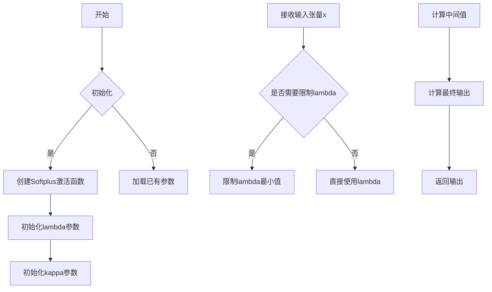
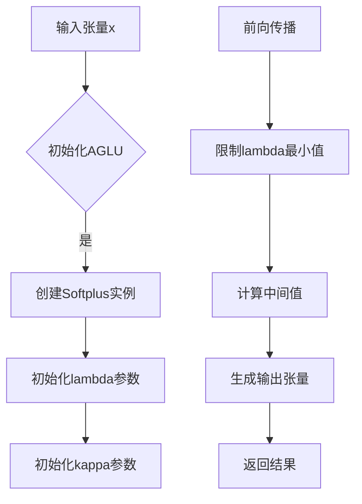

# activation.py

This file documents the purpose of `activation.py`.

# 代码解释
该Python代码实现了一个名为AGLU的自定义激活函数模块，具体功能如下：
1. **类初始化**：在`__init__`方法中，首先调用父类`nn.Module`的初始化方法。然后定义一个Softplus激活函数实例`act`，其参数`beta`设为-1.0。接着定义两个可学习参数`lambd`和`kappa`，它们通过均匀分布随机初始化。
2. **前向传播**：在`forward`方法中，首先对`lambd`进行clamp操作，确保其最小值为0.0001以避免后续计算中的除零错误。然后使用公式`torch.exp((1 / lam) * self.act((self.kappa * x) - torch.log(lam)))`计算并返回输出结果，其中`x`是输入张量。

# 控制流图

此流程图展示了从初始化到前向传播的完整过程，包括参数初始化、输入处理及输出计算的关键步骤。

# 代码解释

AGLU（Adaptive Generalized Logistic Unit）是一种自定义的激活函数，其设计目的是通过引入可学习参数`lambda`和`kappa`来增强模型的表达能力。这种灵活性使得激活函数可以根据任务需求动态调整形状，从而更好地拟合复杂的数据分布。

在YOLO（You Only Look Once）目标检测框架中，激活函数的作用主要体现在以下几个方面：
1. **非线性映射**：激活函数为神经网络引入了非线性特性，使模型能够学习复杂的特征表示。
2. **特征提取优化**：AGLU通过其参数化形式，可以适应不同层的特征提取需求，提升模型对目标检测任务中多样性和复杂性的处理能力。
3. **性能改进**：相比传统的固定激活函数（如ReLU、Sigmoid等），AGLU的自适应特性可能带来更高的检测精度或更快的收敛速度。

# 控制流图

# YOLO中的角色

在YOLO中，AGLU可能被用作卷积层的激活函数，具体作用如下：
- **骨干网络**：在特征提取阶段，AGLU通过其灵活的非线性特性帮助网络捕捉更丰富的图像特征。
- **检测头**：在预测阶段，AGLU有助于提高边界框回归和类别概率预测的准确性。
- **自适应调整**：由于YOLO需要同时处理多尺度目标检测，AGLU的参数化形式可以适应不同尺度的目标特征，提升整体检测性能。

好的！用最直白的语言和比喻来解释：

## 1. 激活函数是什么？‌
- **简单说**‌**：它是一个“加工器”，负责对神经元的计算结果进行“再处理”。
类比‌：就像炒菜时用的调料——盐让菜变咸，糖让菜变甜，激活函数决定了数据传递时的“味道”。
## 2. 出现在什么位置？‌
主要在两个地方‌：
隐藏层（中间层）‌：比如用ReLU、Sigmoid处理数据，像流水线上的质检员。
输出层（最后一层）‌：比如用Softmax生成概率（猫/狗/鸟的概率），像包装员贴标签。
## 3. 对数据怎么加工？‌

>根据不同的激活函数，加工方式不同：

- ReLU（隐藏层常用）‌：
    - 操作‌：输入＞0就原样输出，≤0就归零。
    - 比喻‌：质检员说：“零件合格（>0）就放行，不合格（≤0）直接扔掉”。
- Sigmoid（输出层二分类用）‌：
    - 操作‌：把任意数值压缩到0~1之间，比如0.7代表“70%是猫”。
    - 比喻‌：把考试成绩（0~100分）换算成及格概率。
- Softmax（输出层多分类用）‌：
    - 操作‌：把多个数值变成概率，总和为100%。
    - 比喻‌：把三个候选人的得分，换算成各自的得票率。
## 4. 为什么要加工数据？‌

> 核心目的就两个‌：

- 让网络能解决复杂问题‌（比如识别猫狗）：

- 如果没有激活函数，神经网络只能叠直线，像小学生只会画简单图形；
- 有了激活函数，网络能画曲线、折线，像画家一样处理复杂图案。
    - 例子‌：用曲线才能画出猫和狗的分界线（直线分不开）！

**控制信号传递‌：**

- 过滤垃圾信号（比如ReLU把负数变0）；
- 放大关键信号（比如Sigmoid在0.5附近敏感）；
- 确保输出符合要求（比如概率必须是0~1）。
5. 在神经网络中扮演什么角色？‌
核心角色‌：神经网络的“非线性能力来源”和“信号控制器”。
比喻‌：
如果神经网络是工厂流水线，激活函数就是流水线上的关键机器：
切割机（ReLU）‌：切掉不合格零件；
压缩机（Sigmoid）‌：把零件压成标准尺寸；
分拣机（Softmax）‌：把零件按比例分配到不同箱子。
没有这些机器，流水线只能生产单调的初级产品；有了它们，才能造出复杂的高级产品！
一句话总结‌

激活函数是神经网络的“灵魂调料”——没有它，网络就像没放盐的菜，平淡无奇；有了它，网络才能学会处理复杂的现实问题，像人类一样“思考”！ 🧠