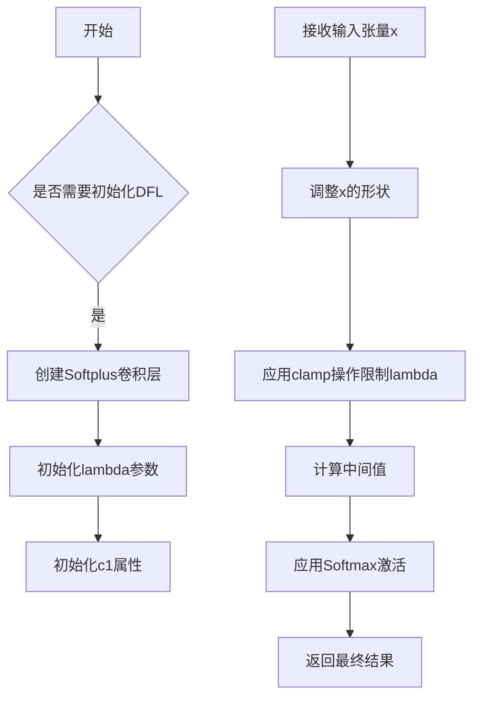

# block.py

This file documents the purpose of `block.py`.

# 代码解释

`block.py` 文件定义了多个用于构建神经网络的模块，这些模块主要用于目标检测框架（如YOLO）中的特征提取、注意力机制和卷积操作。以下是文件中主要类的功能概述：

1. **DFL (Distribution Focal Loss)**:
   - 实现了一种分布式的焦点损失函数，用于提升模型对不同类别样本的学习能力。
   - 包含一个可学习的卷积层，用于计算输入张量的softmax值。

2. **Proto**:
   - YOLOv8 中的分割模块，用于生成掩码原型。
   - 包含卷积层、上采样层和最终的输出卷积层。

3. **HGStem 和 HGBlock**:
   - HGStem 是一种改进的骨干网络结构，包含多个卷积层和最大池化操作。
   - HGBlock 是一种轻量级的卷积块，支持自定义卷积类型（普通卷积或轻量卷积）。

4. **SPP 和 SPPF**:
   - 空间金字塔池化（SPP）和快速空间金字塔池化（SPPF）模块，用于增强模型的空间特征表达能力。

5. **C1, C2, C3, C2f**:
   - 这些是不同形式的CSP（跨阶段部分连接）模块，通过组合卷积层和残差连接来提高计算效率和特征提取能力。

6. **Attention 和 PSA**:
   - Attention 模块实现了多头自注意力机制，用于捕捉全局依赖关系。
   - PSA（Position-Sensitive Attention）模块结合了注意力机制和前馈网络，增强了局部特征的表达能力。

7. **其他模块**:
   - 包括 ResNetLayer、ContrastiveHead、RepVGGDW、CIB 等多种模块，分别用于不同的网络架构设计和任务需求。

---

# 控制流图

以下是文件中 `DFL` 类的控制流图示例，展示其初始化和前向传播的逻辑流程：

如果需要更详细的控制流图或其他类的流程图，请明确指出具体类或方法名称，我将为您进一步绘制！