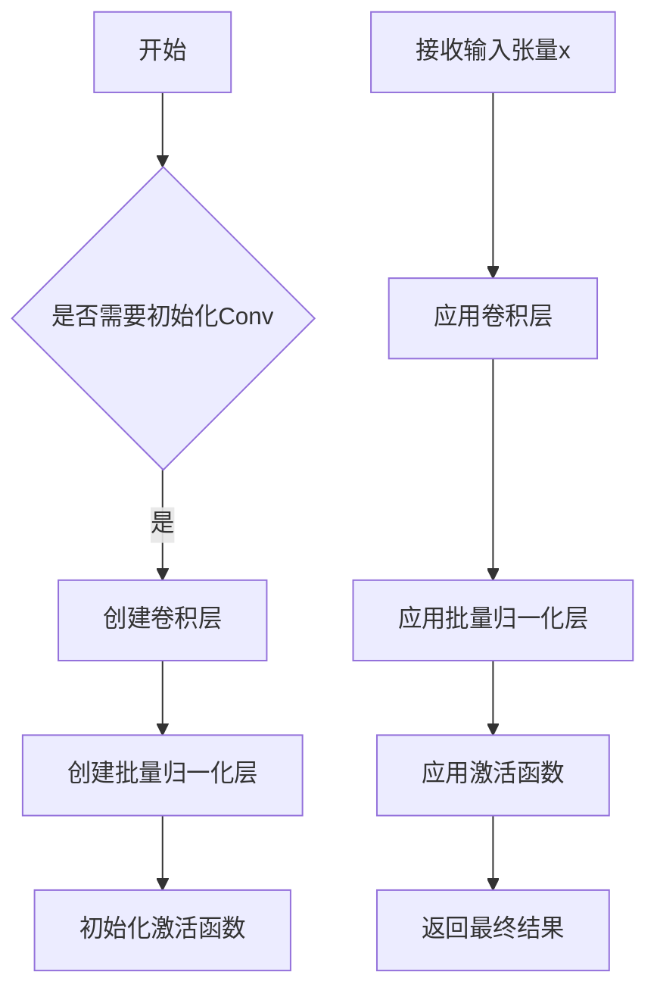

# conv.py

This file documents the purpose of `conv.py`.

# 代码解释

`conv.py` 文件定义了多个用于构建神经网络的卷积模块，这些模块主要用于目标检测框架（如YOLO）中的特征提取和处理。以下是文件中主要类的功能概述：

1. **Conv**:
   - 标准卷积模块，包含卷积层、批量归一化层和激活函数。
   - 支持自动填充（`autopad`），简化了卷积操作的参数设置。

2. **Conv2**:
   - 简化的可重复卷积模块，结合了3x3卷积和1x1卷积，支持卷积融合以提高推理效率。

3. **LightConv**:
   - 轻量级卷积模块，结合1x1卷积和深度卷积，减少计算量和参数数量。

4. **DWConv 和 DWConvTranspose2d**:
   - 深度卷积模块，分别用于普通卷积和转置卷积，适用于轻量级网络设计。

5. **ConvTranspose**:
   - 转置卷积模块，支持批量归一化和激活函数，常用于上采样操作。

6. **Focus**:
   - 特征集中模块，通过切片和拼接操作将输入张量的分辨率降低一半，同时增加通道数。

7. **GhostConv**:
   - 幻影卷积模块，通过廉价操作生成更多特征，减少参数数量。

8. **RepConv**:
   - 可重复卷积模块，支持训练和部署模式切换，部署时可以融合卷积以提高推理速度。

9. **ChannelAttention 和 SpatialAttention**:
   - 分别实现通道注意力和空间注意力机制，用于增强特征表达能力。

10. **CBAM**:
    - 卷积块注意力模块，结合通道注意力和空间注意力，提供全面的特征重校准。

11. **Concat 和 Index**:
    - 辅助模块，分别用于张量拼接和索引选择。

---

# 控制流图

以下是文件中 `Conv` 类的控制流图示例，展示其初始化和前向传播的逻辑流程：

如果需要更详细的控制流图或其他类的流程图，请明确指出具体类或方法名称，我将为您进一步绘制！