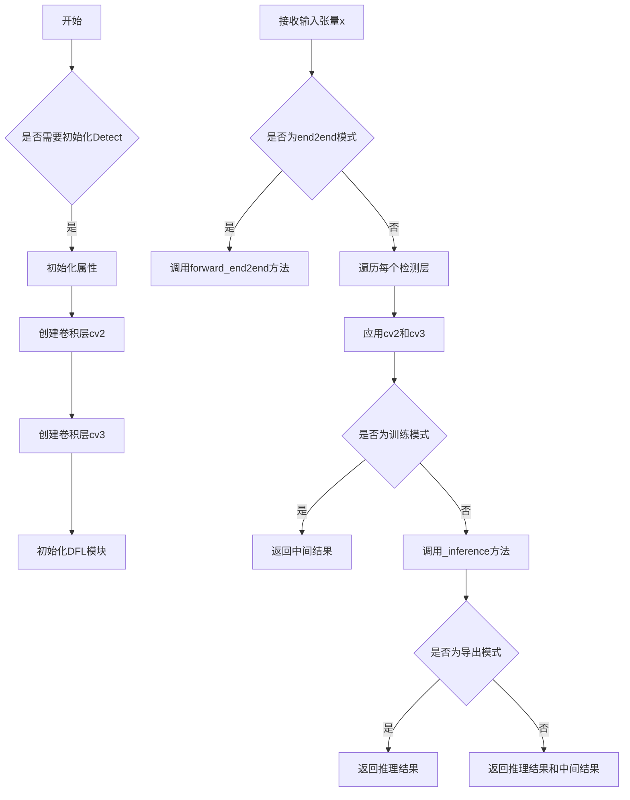

# head.py

This file documents the purpose of `head.py`.

# 代码解释

`head.py` 文件定义了多个用于目标检测、分割、姿态估计等任务的头部模块。这些模块负责从特征图中生成最终的预测结果，包括边界框、类别概率、分割掩码、关键点坐标等。以下是文件中主要类的功能概述：

1. **Detect**:
   - 标准检测头模块，用于生成边界框和类别概率。
   - 包含两个卷积分支：一个用于回归（边界框），另一个用于分类（类别）。
   - 支持训练模式和推理模式，并提供动态网格重建功能。

2. **Segment**:
   - 分割头模块，扩展了 `Detect` 模块，增加了掩码系数和原型生成功能。
   - 使用 `Proto` 模块生成分割掩码原型。

3. **OBB**:
   - 定向边界框检测头模块，扩展了 `Detect` 模块，支持旋转框预测。
   - 增加了一个角度预测分支。

4. **Pose**:
   - 姿态估计头模块，扩展了 `Detect` 模块，增加了关键点预测功能。
   - 使用额外的卷积层生成关键点坐标。

5. **Classify**:
   - 分类头模块，用于图像分类任务。
   - 包含卷积层、全局平均池化层、Dropout 层和全连接层。

6. **WorldDetect**:
   - 结合文本嵌入的检测头模块，扩展了 `Detect` 模块，支持语义理解。
   - 增加了一个对比学习头模块，用于生成文本嵌入。

7. **RTDETRDecoder**:
   - 实时可变形 Transformer 解码器模块，用于目标检测。
   - 利用 Transformer 架构和可变形卷积生成最终的预测结果。

8. **v10Detect**:
   - v10 版本的检测头模块，扩展了 `Detect` 模块，优化了分类分支的设计。

---

# 控制流图

以下是文件中 `Detect` 类的控制流图示例，展示其初始化和前向传播的逻辑流程：

如果需要更详细的控制流图或其他类的流程图，请明确指出具体类或方法名称，我将为您进一步绘制！