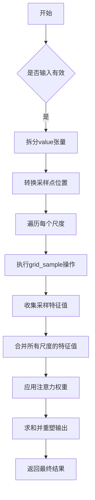
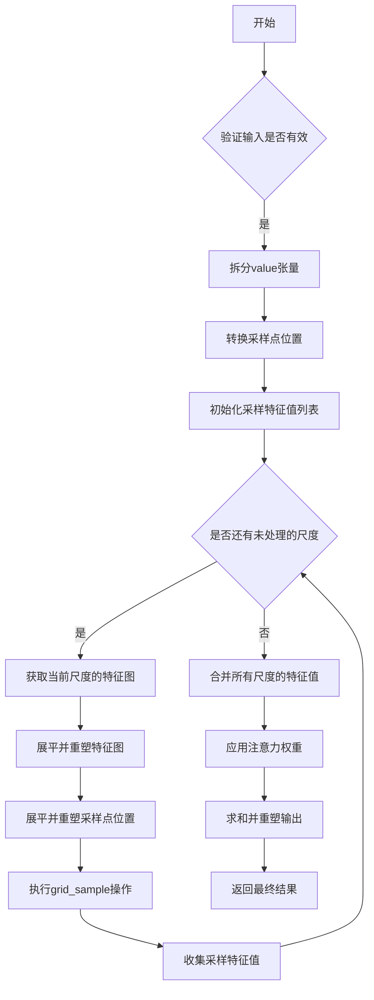

# utils.py

This file documents the purpose of `utils.py`.

# 代码解释

`utils.py` 文件定义了一系列辅助函数和工具，用于支持深度学习模型的构建和训练。这些工具涵盖了权重初始化、多尺度变形注意力机制、逆 Sigmoid 计算等功能。以下是文件中主要函数的功能概述：

1. **_get_clones**:
   - 创建一个包含多个相同模块的列表，用于重复使用相同的网络结构。

2. **bias_init_with_prob**:
   - 根据给定的概率值初始化卷积或全连接层的偏置值，通常用于分类任务中的正类概率初始化。

3. **linear_init**:
   - 初始化线性层的权重和偏置，采用均匀分布的方式，确保初始权重在合理范围内。

4. **inverse_sigmoid**:
   - 计算张量的逆 Sigmoid 值，常用于目标检测中的边界框回归任务。

5. **multi_scale_deformable_attn_pytorch**:
   - 实现多尺度变形注意力机制，允许模型通过学习到的采样点位置对不同尺度的特征图进行注意力计算。
   - 支持跨尺度特征融合，增强模型对多尺度目标的感知能力。

---

### 函数详细说明

#### `_get_clones`
- **功能**: 复制给定的模块 `n` 次，并返回一个包含这些复制模块的 `nn.ModuleList`。
- **用途**: 在 Transformer 等架构中，需要重复使用相同的层结构时非常有用。

#### `bias_init_with_prob`
- **功能**: 根据指定的先验概率值 `prior_prob`，计算并返回卷积或全连接层的偏置初始化值。
- **公式**: 
  \[
  \text{bias} = -\log\left(\frac{1 - p}{p}\right)
  \]
- **用途**: 在分类任务中，初始化偏置以反映类别先验概率。

#### `linear_init`
- **功能**: 使用均匀分布初始化线性层的权重和偏置。
- **公式**: 
  \[
  \text{bound} = \frac{1}{\sqrt{\text{num_outputs}}}
  \]
  权重和偏置均从区间 \([- \text{bound}, \text{bound}]\) 中随机采样。
- **用途**: 确保线性层的初始权重分布在合理范围内，避免梯度消失或爆炸问题。

#### `inverse_sigmoid`
- **功能**: 对输入张量执行逆 Sigmoid 操作，确保输出值范围在 \([0, 1]\) 内。
- **公式**: 
  \[
  \text{output} = \log\left(\frac{x + \epsilon}{1 - x + \epsilon}\right)
  \]
  其中 \(x\) 是输入张量，\(\epsilon\) 是一个小的数值，防止除零错误。
- **用途**: 在目标检测任务中，用于将预测的边界框坐标转换为对数空间，便于优化。

#### `multi_scale_deformable_attn_pytorch`
- **功能**: 实现多尺度变形注意力机制，允许模型通过学习到的采样点位置对不同尺度的特征图进行注意力计算。
- **参数**:
  - `value`: 输入特征张量，形状为 `(bs, num_keys, num_heads, embed_dims)`。
  - `value_spatial_shapes`: 每个尺度的特征图空间形状，形状为 `(num_levels, 2)`。
  - `sampling_locations`: 采样点的位置，形状为 `(bs, num_queries, num_heads, num_levels, num_points, 2)`。
  - `attention_weights`: 注意力权重，形状为 `(bs, num_queries, num_heads, num_levels, num_points)`。
- **步骤**:
  1. 将 `value` 张量按每个尺度的空间形状拆分为多个子张量。
  2. 转换采样点位置为归一化坐标系（范围为 \([-1, 1]\)）。
  3. 对每个尺度的特征图执行 `grid_sample` 操作，获取采样点对应的特征值。
  4. 将所有尺度的采样特征值与注意力权重相乘，并求和得到最终输出。
- **用途**: 在目标检测和分割任务中，用于跨尺度特征融合和注意力计算。

---

# 控制流图

以下是 `multi_scale_deformable_attn_pytorch` 函数的控制流图示例，展示其逻辑流程：

---

### 详细步骤说明

#### `multi_scale_deformable_attn_pytorch`
1. **输入检查**:
   - 验证输入张量的形状是否符合要求。
2. **拆分 `value` 张量**:
   - 根据 `value_spatial_shapes` 将 `value` 张量按每个尺度的空间形状拆分为多个子张量。
3. **转换采样点位置**:
   - 将 `sampling_locations` 的采样点位置从原始坐标系转换为归一化坐标系（范围为 \([-1, 1]\)）。
4. **遍历每个尺度**:
   - 对每个尺度的特征图执行以下操作：
     - 将特征图展平并重塑为 `(bs * num_heads, embed_dims, H_, W_)`。
     - 将采样点位置展平并重塑为 `(bs * num_heads, num_queries, num_points, 2)`。
     - 使用 `F.grid_sample` 提取采样点对应的特征值。
5. **合并采样特征值**:
   - 将所有尺度的采样特征值堆叠在一起。
6. **应用注意力权重**:
   - 将采样特征值与注意力权重相乘。
7. **求和并重塑输出**:
   - 对所有采样点的特征值求和，并重塑为 `(bs, num_queries, embed_dims)`。
8. **返回结果**:
   - 返回最终的输出张量。

---

# 控制流图 (详细版)

以下是 `multi_scale_deformable_attn_pytorch` 函数的详细控制流图：

如果需要更详细的控制流图或其他函数的流程图，请明确指出具体函数名称，我将为您进一步绘制！