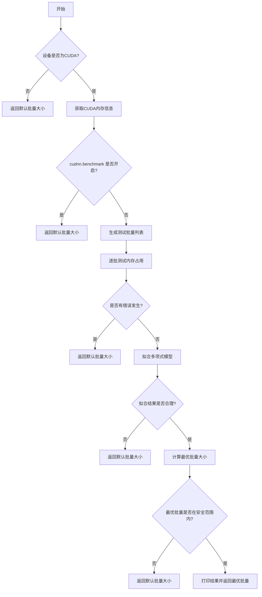

# autobatch.py

This file documents the purpose of `autobatch.py`.

# 代码解释
这段代码包含两个主要函数，`check_train_batch_size` 和 `autobatch`，用于估算YOLO模型训练时的最佳批量大小。具体功能如下：

1. **`check_train_batch_size` 函数**：
   - 接收模型、图像尺寸、是否使用自动混合精度（AMP）、批量大小比例和最大对象数作为参数。
   - 使用 `autocast` 上下文管理器启用或禁用 AMP。
   - 调用 `autobatch` 函数计算并返回最佳批量大小。

2. **`autobatch` 函数**：
   - 首先检查设备类型（CPU、MPS 或 CUDA），若非CUDA则返回默认批量大小。
   - 获取CUDA设备的内存信息（总内存、已分配内存、保留内存和空闲内存）。
   - 生成一系列测试批量大小，并通过 `profile` 函数测量每个批量大小的内存占用情况。
   - 对有效结果进行多项式拟合，预测最优批量大小。
   - 检查拟合结果是否合理，若不合理则返回默认批量大小；否则返回计算出的最优批量大小。

# 控制流图

### 详细说明：
- **节点A到B**：程序从开始进入主逻辑，首先判断设备是否为CUDA。
- **节点B到C**：如果设备不是CUDA，则直接返回默认批量大小。
- **节点B到D**：如果是CUDA设备，则继续获取CUDA设备的内存信息。
- **节点E**：检查 `torch.backends.cudnn.benchmark` 是否开启，若开启则返回默认批量大小。
- **节点G到H**：生成一系列测试批量大小，并逐个测试其内存占用情况。
- **节点I**：如果有任何错误发生，则返回默认批量大小。
- **节点K到L**：对测试结果进行多项式拟合，并检查拟合结果是否合理。
- **节点O**：检查计算出的最优批量大小是否在安全范围内，若不在则返回默认批量大小，否则打印结果并返回最优批量大小。