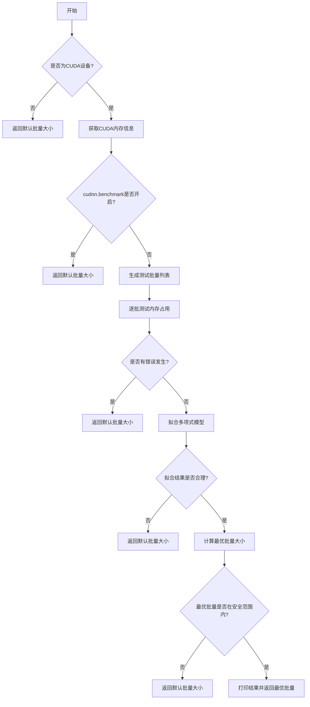
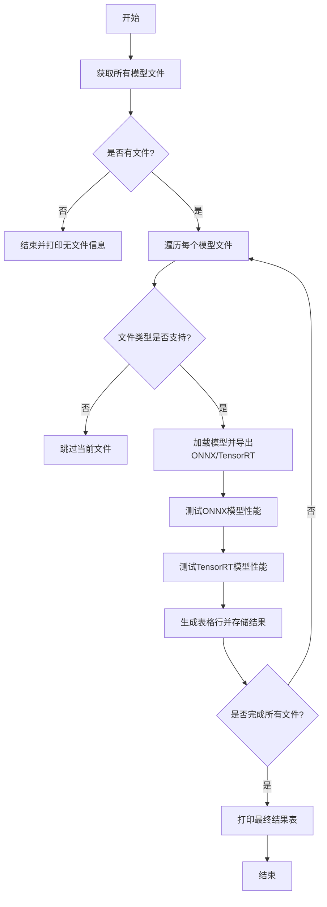
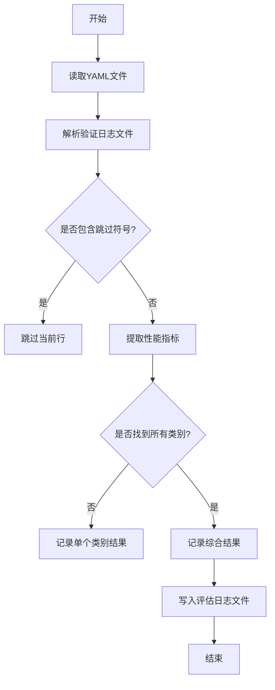

# benchmarks.py

This file documents the purpose of `benchmarks.py`.

# 代码解释

`benchmarks.py` 文件的主要功能是为YOLO模型的不同格式（如PyTorch、ONNX、TensorRT等）进行性能基准测试，包括速度和精度的评估。以下是文件中主要类和函数的功能分解：

1. **`benchmark` 函数**：
   - 用于对YOLO模型的不同格式进行基准测试。
   - 支持多种导出格式（如PyTorch、ONNX、TensorRT等），并根据指定的设备（CPU或GPU）进行推理和验证。
   - 测试过程中会检查设备兼容性、导出模型、运行预测和验证，并记录结果。

2. **`RF100Benchmark` 类**：
   - 提供了基于Roboflow平台的数据集解析和模型评估功能。
   - 主要方法包括设置API密钥、解析数据集链接、修复YAML配置文件以及评估模型性能。

3. **`ProfileModels` 类**：
   - 用于对多个YOLO模型进行性能分析，支持ONNX和TensorRT格式。
   - 提供了模型导出、性能测试（包括预热和多次运行）、结果生成和表格打印等功能。

---

# 控制流程图

以下为 `benchmark` 函数的控制流程图，展示了其核心逻辑：

---

以下为 `ProfileModels.profile` 方法的控制流程图，展示了其核心逻辑：

---

以下为 `RF100Benchmark.evaluate` 方法的控制流程图，展示了其核心逻辑：

---

以上流程图详细描述了文件中主要逻辑的执行过程，帮助理解代码的结构和功能。