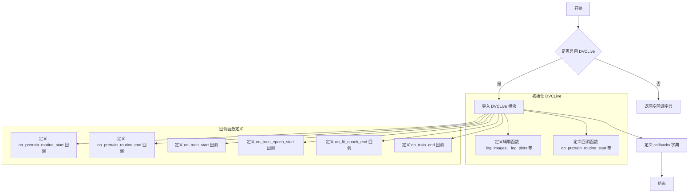

# dvc.py

This file documents the purpose of `dvc.py`.

# 代码解释

`dvc.py` 文件实现了与 DVCLive 的集成，用于在 Ultralytics 的训练、验证和预测过程中记录日志和模型信息。以下是文件的具体功能分解：

1. **模块导入与初始化**：
   - 尝试导入 `dvclive` 模块，并检查是否启用了 DVCLive 集成功能（通过 `SETTINGS["dvc"]`）。
   - 如果未安装或禁用 DVCLive，则将 `dvclive` 设置为 `None`。

2. **辅助函数定义**：
   - `_log_images`：记录指定路径的图像，并支持按批次分组以启用 UI 滑块功能。
   - `_log_plots`：记录训练过程中的绘图（如 PR 曲线、混淆矩阵等），避免重复记录。
   - `_log_confusion_matrix`：记录混淆矩阵，支持分类任务的可视化。

3. **回调函数定义**：
   - **`on_pretrain_routine_start`**：在预训练阶段开始时初始化 DVCLive 实例。
   - **`on_pretrain_routine_end`**：在预训练阶段结束时记录训练相关的绘图。
   - **`on_train_start`**：在训练开始时记录训练参数。
   - **`on_train_epoch_start`**：在每个训练 epoch 开始时设置全局变量 `_training_epoch` 为 `True`。
   - **`on_fit_epoch_end`**：在每个 fit epoch（训练 + 验证）结束时记录训练指标、模型信息和绘图。
   - **`on_train_end`**：在训练结束时记录最佳指标、绘图、混淆矩阵和最佳模型。

4. **回调字典**：
   - 定义了 `callbacks` 字典，将上述回调函数映射到相应的事件（如 `on_pretrain_routine_start`）。
   - 如果未启用 DVCLive，则回调字典为空。

---

# 控制流图

---

# 总结

### 文件角色与作用

1. **DVCLive 集成**：
   - `dvc.py` 文件实现了 Ultralytics 与 DVCLive 的集成，允许用户通过 DVCLive 平台监控和管理训练过程。
   - 提供了多个回调函数，在不同的生命周期阶段记录日志和模型信息。

2. **日志记录功能**：
   - 支持记录训练参数、训练损失、学习率、混淆矩阵、PR 曲线、预测图像等多种信息。
   - 提供灵活的辅助函数，确保日志记录的高效性和准确性。

3. **灵活性与可扩展性**：
   - 如果未启用 DVCLive，回调字典为空，不会影响其他功能。
   - 用户可以通过自定义回调函数扩展日志记录逻辑。

4. **简化开发流程**：
   - 通过回调机制，开发者可以轻松地在不同阶段插入日志记录逻辑，而无需修改核心代码。

### 总体作用

`dvc.py` 文件的核心作用是为 Ultralytics 提供与 DVCLive 平台的无缝集成，支持用户在训练、验证和预测过程中记录详细的日志和模型信息，从而提升实验管理和可复现性。