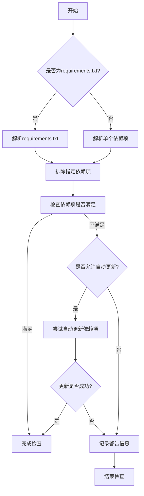
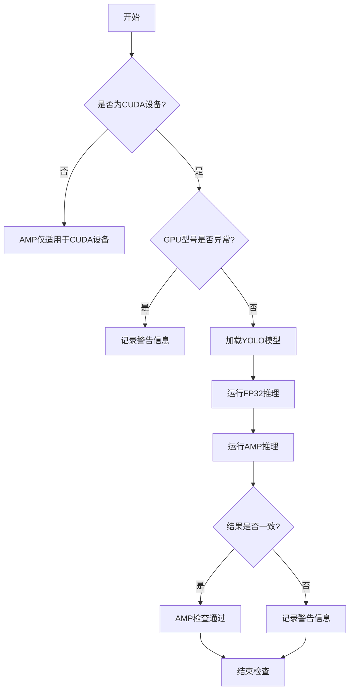

# checks.py

This file documents the purpose of `checks.py`.

# 代码解释

`checks.py` 文件的主要功能是提供一系列工具函数，用于检查和验证环境、依赖项、模型文件以及系统配置是否满足YOLO模型运行的需求。以下是文件中主要功能的分解：

1. **`parse_requirements` 函数**：
   - 解析 `requirements.txt` 文件或指定包的依赖项，返回包含名称和版本信息的 `SimpleNamespace` 对象列表。

2. **`parse_version` 函数**：
   - 将版本字符串解析为元组形式（如 `'2.0.1+cpu' -> (2, 0, 1)`），忽略非数字部分。

3. **`is_ascii` 函数**：
   - 检查字符串是否仅由 ASCII 字符组成。

4. **`check_imgsz` 函数**：
   - 验证图像尺寸是否为步幅（stride）的倍数，并根据需要调整尺寸。

5. **`check_version` 函数**：
   - 检查当前版本是否满足指定的版本要求（支持 `==`, `!=`, `>=`, `<=`, `>`, `<` 等比较运算符）。

6. **`check_latest_pypi_version` 函数**：
   - 获取指定 PyPI 包的最新版本号。

7. **`check_pip_update_available` 函数**：
   - 检查是否有新的 `ultralytics` 包版本可用。

8. **`check_font` 函数**：
   - 查找本地字体文件，若不存在则从远程下载到用户配置目录。

9. **`check_python` 函数**：
   - 检查当前 Python 版本是否满足最低要求。

10. **`check_requirements` 函数**：
    - 检查并尝试自动更新未满足的依赖项。

11. **`check_torchvision` 函数**：
    - 检查 PyTorch 和 Torchvision 的版本兼容性。

12. **`check_suffix` 函数**：
    - 验证文件后缀是否符合预期。

13. **`check_yolov5u_filename` 函数**：
    - 替换旧版 YOLOv5 文件名为更新后的 YOLOv5u 格式。

14. **`check_file` 函数**：
    - 搜索或下载文件，并返回其路径。

15. **`check_yaml` 函数**：
    - 检查 YAML 文件是否存在或下载。

16. **`check_is_path_safe` 函数**：
    - 验证路径是否安全，防止路径遍历攻击。

17. **`check_imshow` 函数**：
    - 检查环境是否支持图像显示（如 `cv2.imshow()` 或 PIL 图像显示）。

18. **`check_yolo` 函数**：
    - 返回 YOLO 软件和硬件的摘要信息。

19. **`collect_system_info` 函数**：
    - 收集并打印系统信息（包括 OS、Python、RAM、CPU、CUDA 等）。

20. **`check_amp` 函数**：
    - 检查 PyTorch 自动混合精度（AMP）功能是否正常工作。

21. **`git_describe` 函数**：
    - 返回 Git 仓库的人类可读描述（如标签、提交次数等）。

22. **`print_args` 函数**：
    - 打印函数参数及其值。

23. **`cuda_device_count` 和 `cuda_is_available` 函数**：
    - 检查 CUDA 设备数量及可用性。

24. **`is_rockchip` 函数**：
    - 检测当前环境是否运行在 Rockchip SoC 上。

25. **`is_sudo_available` 函数**：
    - 检查系统中是否可用 `sudo` 命令。

---

# 控制流程图

以下为 `check_requirements` 函数的控制流程图，展示了其核心逻辑：



---

以下为 `check_yolo` 函数的控制流程图，展示了其核心逻辑：

```merramid
flowchart TD
    A[开始] --> B{是否为Colab环境?}
    B -->|是| C[清理Colab默认数据目录]
    B -->|否| D[获取系统信息]
    D --> E{是否支持GPU?}
    E -->|是| F[选择设备]
    E -->|否| G[仅使用CPU]
    F --> H[打印系统信息]
    G --> H
    H --> I[完成检查]
```

---

以下为 `check_amp` 函数的控制流程图，展示了其核心逻辑：



---

以上流程图详细描述了文件中主要逻辑的执行过程，帮助理解代码的结构和功能。