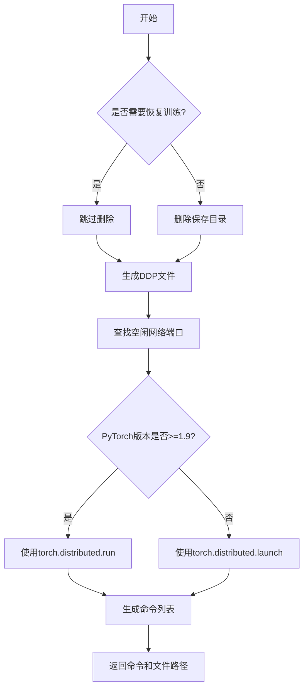
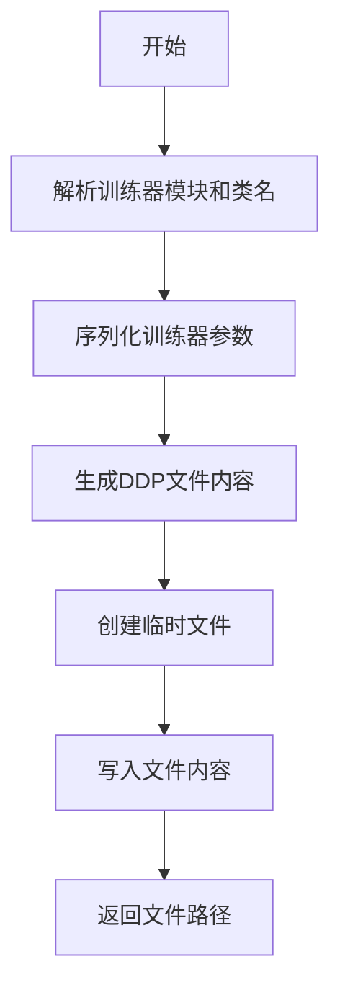
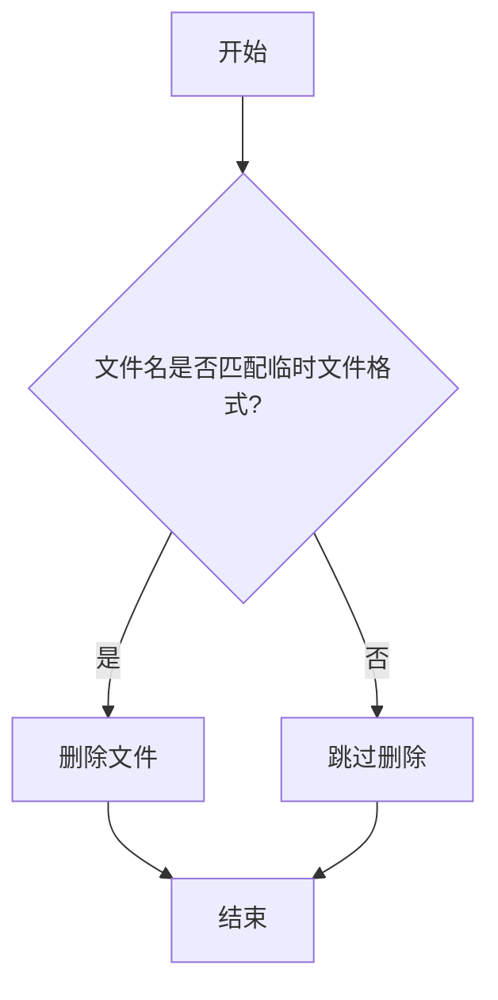

# dist.py

This file documents the purpose of `dist.py`.

# 代码解释

`dist.py` 文件的主要功能是支持分布式数据并行（DDP, Distributed Data Parallel）训练，提供生成临时文件、查找空闲网络端口以及清理临时文件的功能。以下是文件中主要功能的分解：

1. **`find_free_network_port` 函数**：
   - 找到本地主机上的一个空闲端口。
   - 使用 `socket` 模块绑定到 `127.0.0.1` 的随机端口，并返回该端口号。
   - 主要用于单节点训练时设置 `MASTER_PORT` 环境变量。

2. **`generate_ddp_file` 函数**：
   - 生成一个临时的 DDP 文件，包含训练器的配置和初始化逻辑。
   - 将训练器的参数（`trainer.args`）序列化为字典，并写入临时文件。
   - 临时文件存储在用户配置目录下的 `DDP` 子目录中。

3. **`generate_ddp_command` 函数**：
   - 生成用于分布式训练的命令。
   - 根据 PyTorch 版本选择使用 `torch.distributed.run` 或 `torch.distributed.launch`。
   - 查找空闲网络端口，并将其作为主节点端口传递给分布式训练命令。
   - 返回生成的命令列表和临时文件路径。

4. **`ddp_cleanup` 函数**：
   - 清理生成的临时文件。
   - 如果文件名包含特定的后缀（如 `id(trainer).py`），则删除该文件。

---

# 控制流程图

以下为 `generate_ddp_command` 函数的控制流程图，展示了其核心逻辑：

---

以下为 `generate_ddp_file` 函数的控制流程图，展示了其核心逻辑：

---

以下为 `ddp_cleanup` 函数的控制流程图，展示了其核心逻辑：

---

以上流程图详细描述了文件中主要逻辑的执行过程，帮助理解代码的结构和功能。