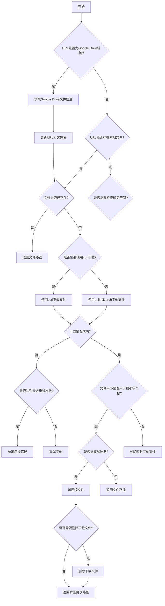

# downloads.py

This file documents the purpose of `downloads.py`.

# 代码解释

`downloads.py` 文件的主要功能是提供一系列工具函数，用于处理文件的下载、解压缩和删除操作。这些函数支持从 URL 下载文件、检查磁盘空间、处理 Google Drive 链接以及并发下载等。以下是文件中主要功能的分解：

1. **`is_url` 函数**：
   - 检查给定字符串是否为有效的 URL，并可选地检查该 URL 是否在线存在。

2. **`delete_dsstore` 函数**：
   - 删除指定目录下的所有 `.DS_Store` 文件（macOS 系统生成的隐藏文件）。

3. **`zip_directory` 函数**：
   - 将一个目录压缩成 ZIP 文件，排除指定的文件类型（如 `.DS_Store`），并显示进度条。

4. **`unzip_file` 函数**：
   - 解压缩 ZIP 文件到指定路径，排除指定的文件类型，并显示进度条。
   - 如果 ZIP 文件包含多个顶层目录，则创建一个新的目录来存储解压后的文件。

5. **`check_disk_space` 函数**：
   - 检查目标路径是否有足够的磁盘空间来下载和存储指定大小的文件。

6. **`get_google_drive_file_info` 函数**：
   - 获取 Google Drive 分享链接的直接下载链接和文件名。

7. **`safe_download` 函数**：
   - 安全下载文件，支持重试机制、进度条显示、解压缩和删除下载文件等功能。
   - 支持从 Google Drive 和普通 URL 下载文件。

8. **`get_github_assets` 函数**：
   - 从 GitHub 仓库的特定版本获取资产文件列表。

9. **`attempt_download_asset` 函数**：
   - 尝试从 GitHub 资产库下载指定文件，如果本地不存在则进行下载。

10. **`download` 函数**：
    - 支持多线程并发下载多个文件，并提供解压缩、删除下载文件等功能。

---

# 控制流程图

以下为 `safe_download` 函数的控制流程图，展示了其核心逻辑：

---

以下为 `unzip_file` 函数的控制流程图，展示了其核心逻辑：

---

以下为 `check_disk_space` 函数的控制流程图，展示了其核心逻辑：

---

以上流程图详细描述了文件中主要逻辑的执行过程，帮助理解代码的结构和功能。