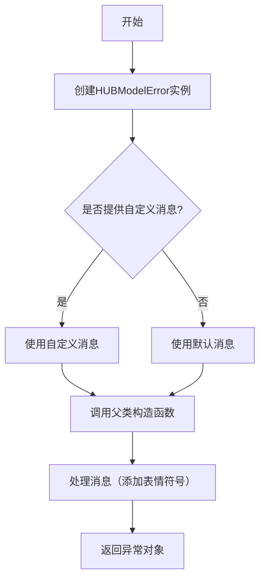
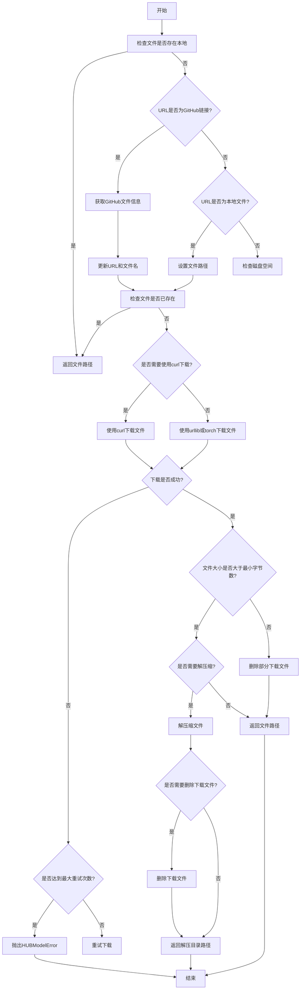

# errors.py

This file documents the purpose of `errors.py`.

# 代码解释

`errors.py` 文件定义了一个自定义异常类 `HUBModelError`，用于处理与 Ultralytics YOLO 模型获取相关的错误。以下是文件中主要功能的分解：

1. **`HUBModelError` 类**：
   - 继承自 Python 内置的 `Exception` 类。
   - 提供了一个构造函数 `__init__`，用于初始化异常对象并设置错误消息。
   - 错误消息通过 `ultralytics.utils` 包中的 `emojis` 函数进行处理，以增强用户体验。

### 具体功能描述

- **`HUBModelError` 类**：
  - **继承关系**：`HUBModelError` 继承自 `Exception`，因此它可以像标准异常一样被抛出和捕获。
  - **构造函数**：`__init__` 方法接收一个可选参数 `message`，默认值为 `"Model not found. Please check model URL and try again."`。该消息会被传递给 `super().__init__()`，并通过 `emojis` 函数进行处理，将文本转换为带有表情符号的形式。
  - **属性**：`message` 属性存储了经过 `emojis` 函数处理后的错误消息。

### 示例用法

```python
try:
    # 假设这里有一些代码尝试获取模型但失败了
    raise HUBModelError("Failed to fetch model from the hub.")
except HUBModelError as e:
    print(e)  # 输出带有表情符号的错误消息
```

---

# 控制流程图

以下为 `HUBModelError` 类的控制流程图，展示了其核心逻辑：



---

### 图表详细说明

1. **A[开始]**：程序开始执行，准备创建 `HUBModelError` 实例。
2. **B[创建HUBModelError实例]**：根据需要创建 `HUBModelError` 异常对象。
3. **C{是否提供自定义消息?}**：检查是否提供了自定义错误消息。
4. **D[使用自定义消息]**：如果提供了自定义消息，则使用该消息作为异常的错误信息。
5. **E[使用默认消息]**：如果没有提供自定义消息，则使用默认错误信息 `"Model not found. Please check model URL and try again."`。
6. **F[调用父类构造函数]**：调用 `Exception` 类的构造函数，将处理后的消息传递给它。
7. **G[处理消息（添加表情符号）]**：通过 `emojis` 函数对消息进行处理，添加表情符号以增强用户体验。
8. **H[返回异常对象]**：返回包含处理后消息的异常对象。

---

# 总结

`errors.py` 文件通过定义一个自定义异常类 `HUBModelError`，实现了对模型获取相关错误的优雅处理。通过使用 `emojis` 函数，增强了错误消息的可读性和用户体验。控制流程图清晰地展示了异常对象的创建过程及其内部逻辑，帮助理解代码的工作原理。

# 我的理解和问题
>你解释的，不切题，应该是用来处理云模型的错误，如果根据url拉取模型过程发生错误，就用这个自定义错误来抛出错误，是吧？


明白了，您希望我更具体地解释 `HUBModelError` 是如何在拉取模型的过程中使用的。以下是详细的解释和控制流程图，重点说明在拉取模型过程中如何使用 `HUBModelError` 来抛出错误。

### 代码解释

`errors.py` 文件定义了一个自定义异常类 `HUBModelError`，用于处理与从云模型库（如 GitHub）拉取模型相关的错误。以下是文件中主要功能的分解：

1. **`HUBModelError` 类**：
   - 继承自 Python 内置的 `Exception` 类。
   - 提供了一个构造函数 `__init__`，用于初始化异常对象并设置错误消息。
   - 错误消息通过 `ultralytics.utils` 包中的 `emojis` 函数进行处理，以增强用户体验。

### 示例用法

假设在 `downloads.py` 文件中有一个函数 `attempt_download_asset`，用于尝试从 GitHub 下载模型文件。如果下载过程中发生错误，将抛出 `HUBModelError` 异常。

#### 示例代码

```python
# downloads.py
from ultralytics.utils import attempt_download_asset, HUBModelError

def fetch_model(model_url):
    try:
        file_path = attempt_download_asset(model_url)
        print(f"Model downloaded successfully to {file_path}")
    except HUBModelError as e:
        print(f"Error fetching model: {e}")

# 示例调用
fetch_model("https://github.com/ultralytics/assets/releases/download/v8.3.0/yolov8n.pt")
```

### 控制流程图

以下为 `attempt_download_asset` 函数的控制流程图，展示了如何在拉取模型过程中使用 `HUBModelError` 抛出错误：



### 图表详细说明

1. **A[开始]**：程序开始执行，准备尝试下载模型。
2. **B[检查文件是否存在本地]**：检查指定的文件是否已经存在于本地。
3. **C[返回文件路径]**：如果文件已存在，直接返回文件路径。
4. **D{URL是否为GitHub链接?}**：检查提供的 URL 是否为 GitHub 链接。
5. **E[获取GitHub文件信息]**：如果是 GitHub 链接，获取直接下载链接和文件名。
6. **F{URL是否为本地文件?}**：如果不是 GitHub 链接，检查 URL 是否为本地文件路径。
7. **G[更新URL和文件名]**：如果是 GitHub 链接，更新 URL 和文件名。
8. **H[设置文件路径]**：如果是本地文件路径，设置文件路径。
9. **I[检查磁盘空间]**：如果不是本地文件路径，检查目标路径是否有足够的磁盘空间。
10. **J[检查文件是否已存在]**：检查文件是否已经存在于本地。
11. **K{是否需要使用curl下载?}**：决定是否使用 `curl` 工具进行下载。
12. **L[使用curl下载文件]**：使用 `curl` 工具下载文件。
13. **M[使用urllib或torch下载文件]**：使用 `urllib` 或 `torch` 工具下载文件。
14. **N{下载是否成功?}**：检查下载是否成功。
15. **O{是否达到最大重试次数?}**：如果下载失败，检查是否达到最大重试次数。
16. **P[抛出HUBModelError]**：如果达到最大重试次数，抛出 `HUBModelError` 异常。
17. **Q[重试下载]**：如果没有达到最大重试次数，重试下载。
18. **R{文件大小是否大于最小字节数?}**：检查下载文件的大小是否大于最小字节数。
19. **S{是否需要解压缩?}**：决定是否需要解压缩文件。
20. **T[删除部分下载文件]**：如果文件大小不符合要求，删除部分下载文件。
21. **U[解压缩文件]**：如果需要解压缩，解压缩文件。
22. **V[返回文件路径]**：返回文件路径。
23. **W{是否需要删除下载文件?}**：决定是否删除下载文件。
24. **X[删除下载文件]**：删除下载文件。
25. **Y[返回解压目录路径]**：返回解压目录路径。
26. **Z[结束]**：结束流程。

---

### 总结

`HUBModelError` 类用于处理从云模型库拉取模型时发生的错误。在 `attempt_download_asset` 函数中，如果下载过程中发生错误（如文件未找到、下载失败等），将抛出 `HUBModelError` 异常，并通过 `emojis` 函数处理错误消息，增强用户体验。控制流程图详细展示了在拉取模型过程中如何使用 `HUBModelError` 抛出错误，帮助理解代码的工作原理。