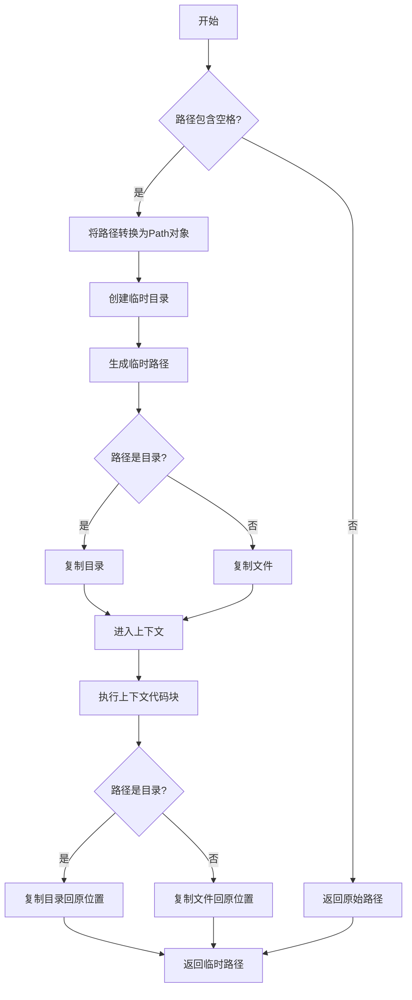
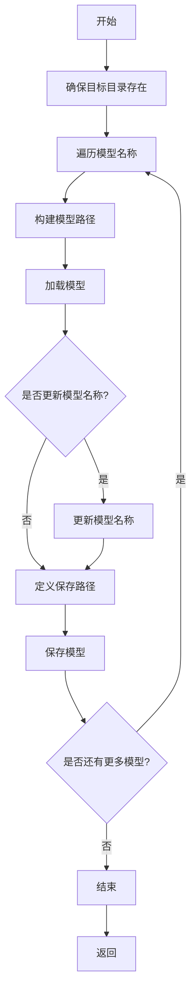

# files.py

This file documents the purpose of `files.py`.

# 代码解释

`files.py` 文件提供了一系列工具函数，用于处理文件和目录操作，包括临时更改工作目录、处理路径中的空格、增量路径生成、文件和目录的元数据获取、模型更新等。以下是文件中主要功能的详细解释：

## 1. `WorkingDirectory` 类

`WorkingDirectory` 类是一个上下文管理器和装饰器，用于临时更改当前工作目录，并在操作完成后恢复原始目录。

### 属性
- `dir (Path | str)`: 新的工作目录路径。
- `cwd (Path)`: 原始工作目录路径。

### 方法
- `__enter__`: 进入上下文时更改当前工作目录。
- `__exit__`: 退出上下文时恢复原始工作目录。

### 示例用法
```python
# 使用作为上下文管理器
with WorkingDirectory('/path/to/new/dir'):
    # 在新目录中执行操作
    pass

# 使用作为装饰器
@WorkingDirectory('/path/to/new/dir')
def some_function():
    # 在新目录中执行操作
    pass
```

## 2. `spaces_in_path` 上下文管理器

`spaces_in_path` 是一个上下文管理器，用于处理路径中包含空格的情况。如果路径包含空格，它会将空格替换为下划线，复制文件或目录到临时路径，执行上下文代码块，然后将文件或目录复制回原始位置。

### 参数
- `path (str | Path)`: 原始路径，可能包含空格。

### 返回值
- `(Path | str)`: 如果路径包含空格，返回临时路径；否则返回原始路径。

### 示例用法
```python
with spaces_in_path('/path/with spaces') as new_path:
    # 在新路径中执行操作
    pass
```

## 3. `increment_path` 函数

`increment_path` 函数用于生成一个增量路径。如果路径已存在且 `exist_ok` 为 `False`，则在路径末尾添加一个数字和分隔符 `sep`。如果路径是文件，保留文件扩展名；如果是目录，直接在目录名后添加数字。

### 参数
- `path (str | Path)`: 要增量的路径。
- `exist_ok (bool)`: 如果为 `True`，路径将不被增量并按原样返回。
- `sep (str)`: 用于分隔路径和增量数字的分隔符。
- `mkdir (bool)`: 如果为 `True`，创建目录（如果不存在）。

### 返回值
- `(Path)`: 增量后的路径。

### 示例用法
```python
path = Path("runs/exp")
new_path = increment_path(path)
print(new_path)  # runs/exp2

path = Path("runs/exp/results.txt")
new_path = increment_path(path)
print(new_path)  # runs/exp/results2.txt
```

## 4. `file_age` 函数

`file_age` 函数返回指定文件自上次修改以来的天数。

### 参数
- `path (str | Path)`: 文件路径，默认为当前文件。

### 返回值
- `(int)`: 自上次修改以来的天数。

### 示例用法
```python
days = file_age("path/to/file.txt")
print(days)  # 10
```

## 5. `file_date` 函数

`file_date` 函数返回指定文件的修改日期，格式为 `YYYY-M-D`。

### 参数
- `path (str | Path)`: 文件路径，默认为当前文件。

### 返回值
- `(str)`: 文件的修改日期，格式为 `YYYY-M-D`。

### 示例用法
```python
date = file_date("path/to/file.txt")
print(date)  # 2023-10-01
```

## 6. `file_size` 函数

`file_size` 函数返回文件或目录的大小（以兆字节为单位）。

### 参数
- `path (str | Path)`: 文件或目录路径。

### 返回值
- `(float)`: 文件或目录的大小（MB）。

### 示例用法
```python
size = file_size("path/to/file.txt")
print(size)  # 1.23

size = file_size("path/to/directory")
print(size)  # 5.67
```

## 7. `get_latest_run` 函数

`get_latest_run` 函数返回指定目录中最新的 `last*.pt` 文件路径，用于恢复训练。

### 参数
- `search_dir (str)`: 搜索目录，默认为当前目录。

### 返回值
- `(str)`: 最新的 `last*.pt` 文件路径，如果未找到则返回空字符串。

### 示例用法
```python
latest_run = get_latest_run("/path/to/runs")
print(latest_run)  # /path/to/runs/exp/last.pt
```

## 8. `update_models` 函数

`update_models` 函数更新并重新保存指定的 YOLO 模型到 `updated_models` 子目录。

### 参数
- `model_names (Tuple[str, ...])`: 要更新的模型文件名。
- `source_dir (Path)`: 包含模型和目标子目录的目录。
- `update_names (bool)`: 如果为 `True`，从数据 YAML 更新模型名称。

### 示例用法
```python
from ultralytics.utils.files import update_models

model_names = ("yolo11n.pt", "yolov8s.pt")
update_models(model_names, source_dir=Path("/models"), update_names=True)
```

---

# 控制流程图

以下是 `increment_path` 函数的控制流程图，展示了其核心逻辑：


以下是 `spaces_in_path` 上下文管理器的控制流程图，展示了其核心逻辑：



以下是 `update_models` 函数的控制流程图，展示了其核心逻辑：



---

### 图表详细说明

#### `increment_path` 控制流程图

1. **A[开始]**：程序开始执行，准备生成增量路径。
2. **B[将路径转换为Path对象]**：将输入路径转换为 `Path` 对象，确保路径操作的平台无关性。
3. **C{路径是否存在且exist_ok为False?}**：检查路径是否存在且 `exist_ok` 是否为 `False`。
4. **D[返回路径]**：如果路径不存在或 `exist_ok` 为 `True`，直接返回路径。
5. **E{路径是文件?}**：检查路径是否为文件。
6. **F[获取文件名和后缀]**：如果是文件，获取文件名和后缀。
7. **G[设置后缀为空]**：如果不是文件，设置后缀为空。
8. **H[初始化增量数字n为2]**：初始化增量数字 `n` 为 2。
9. **I[生成新的路径p]**：生成新的路径 `p`，格式为 `路径{sep}n{后缀}`。
10. **J{路径p是否存在?}**：检查新路径 `p` 是否存在。
11. **K[增量数字n加1]**：如果新路径 `p` 存在，增量数字 `n` 加 1。
12. **L[返回路径p]**：如果新路径 `p` 不存在，返回路径 `p`。
13. **M{mkdir为True?}**：检查是否需要创建目录。
14. **N[创建目录]**：如果需要创建目录，创建目录。
15. **D[返回路径]**：返回路径。

#### `spaces_in_path` 控制流程图

1. **A[开始]**：程序开始执行，准备处理路径中的空格。
2. **B{路径包含空格?}**：检查路径是否包含空格。
3. **C[返回原始路径]**：如果路径不包含空格，直接返回原始路径。
4. **D[将路径转换为Path对象]**：将路径转换为 `Path` 对象。
5. **E[创建临时目录]**：创建一个临时目录。
6. **F[生成临时路径]**：生成临时路径，将空格替换为下划线。
7. **G{路径是目录?}**：检查路径是否为目录。
8. **H[复制目录]**：如果是目录，复制目录到临时路径。
9. **I[复制文件]**：如果不是目录，复制文件到临时路径。
10. **J[进入上下文]**：进入上下文管理器。
11. **K[执行上下文代码块]**：执行上下文代码块。
12. **L{路径是目录?}**：检查路径是否为目录。
13. **M[复制目录回原位置]**：如果是目录，复制目录回原位置。
14. **N[复制文件回原位置]**：如果不是目录，复制文件回原位置。
15. **O[返回临时路径]**：返回临时路径。

#### `update_models` 控制流程图

1. **A[开始]**：程序开始执行，准备更新模型。
2. **B[确保目标目录存在]**：确保目标目录 `updated_models` 存在。
3. **C[遍历模型名称]**：遍历要更新的模型名称。
4. **D[构建模型路径]**：构建模型路径。
5. **E[加载模型]**：加载模型。
6. **F{是否更新模型名称?}**：检查是否需要更新模型名称。
7. **G[更新模型名称]**：如果需要更新模型名称，从数据 YAML 更新模型名称。
8. **H[定义保存路径]**：定义保存路径。
9. **I[保存模型]**：保存模型到目标目录。
10. **J{是否还有更多模型?}**：检查是否还有更多模型需要更新。
11. **C[遍历模型名称]**：如果有更多模型，继续遍历。
12. **K[结束]**：所有模型更新完成。
13. **L[返回]**：返回。

---

### 总结

`files.py` 文件提供了多种工具函数，用于处理文件和目录操作，包括临时更改工作目录、处理路径中的空格、增量路径生成、文件和目录的元数据获取、模型更新等。控制流程图详细展示了这些函数的核心逻辑，帮助理解代码的工作原理。