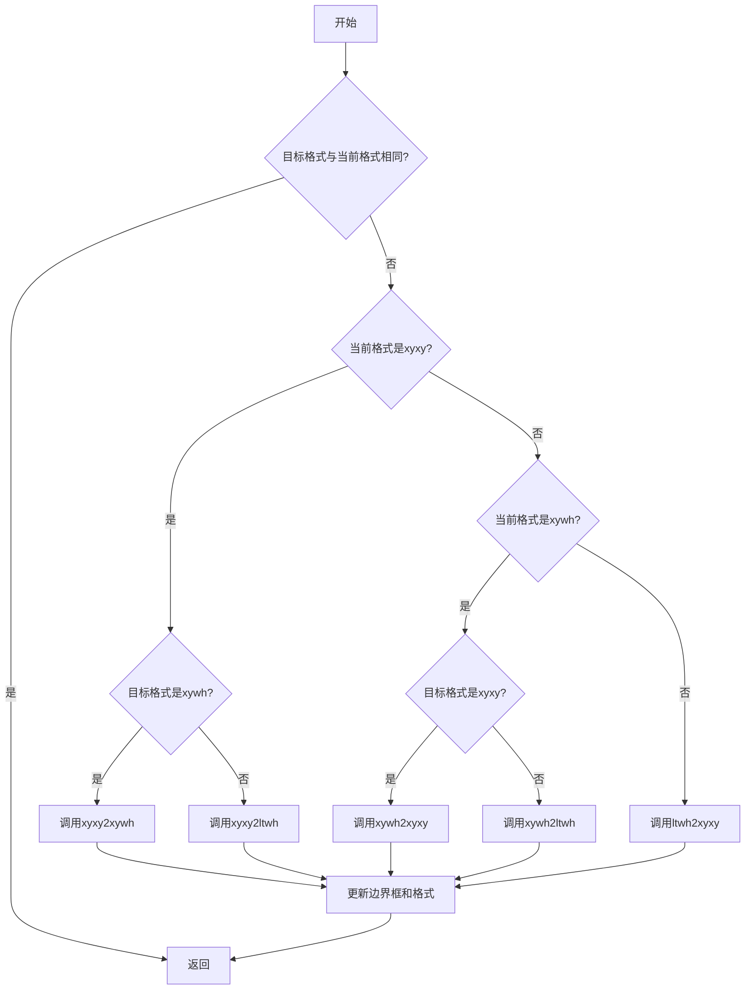
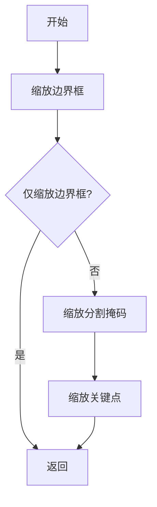
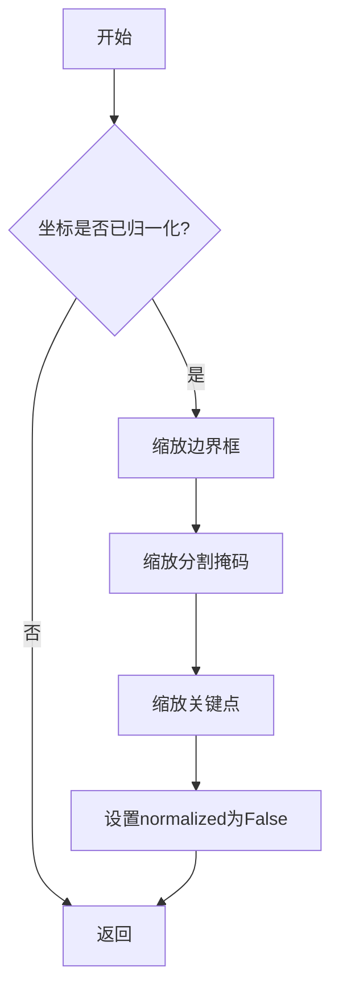
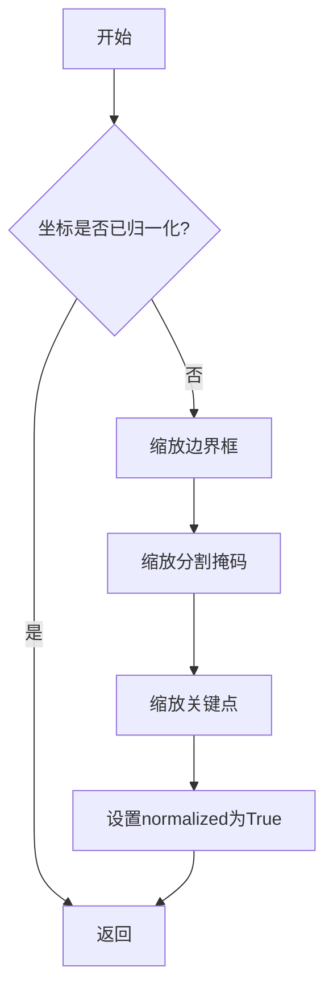
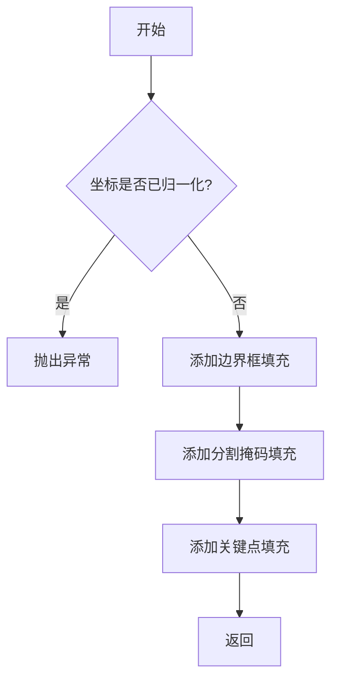
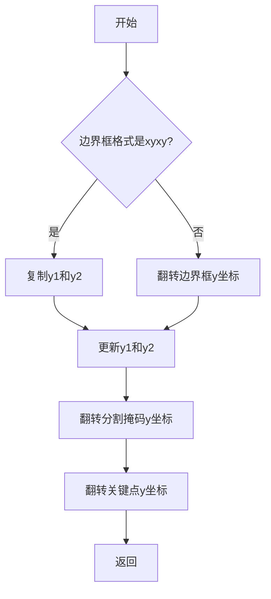
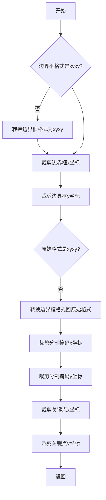
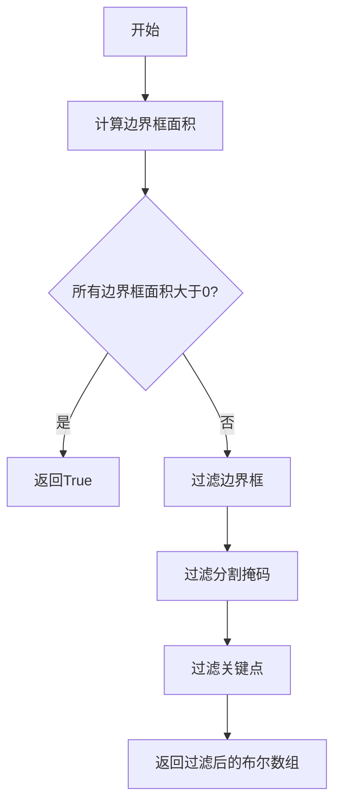
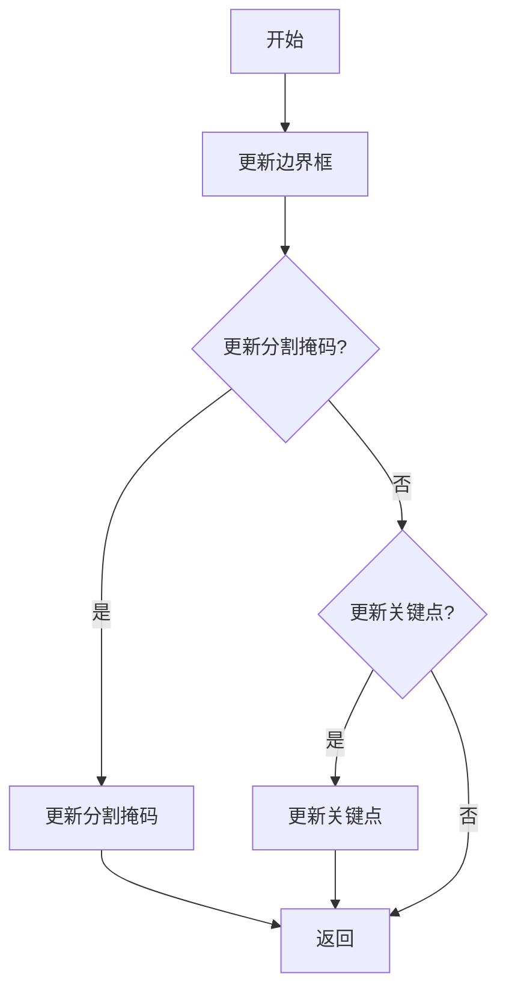
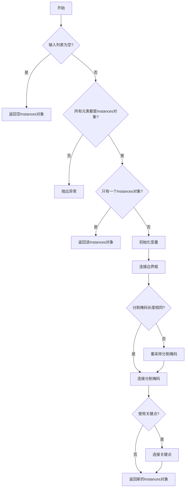

# instance.py

This file documents the purpose of `instance.py`.

# 代码解释

`instance.py` 文件定义了两个主要类 `Bboxes` 和 `Instances`，用于处理检测对象的边界框、分割掩码和关键点。以下是文件中主要功能的详细解释：

## 1. 辅助函数 `_ntuple`

`_ntuple` 是一个辅助函数，用于将输入解析为指定长度的元组。如果输入是可迭代对象，则直接返回；否则，将输入重复指定次数以形成元组。

### 示例用法
```python
to_2tuple(5)  # 返回 (5, 5)
to_4tuple((1, 2))  # 返回 (1, 2, 1, 2)
```

## 2. `Bboxes` 类

`Bboxes` 类用于处理边界框数据，支持多种边界框格式（`xyxy`, `xywh`, `ltwh`）。

### 属性
- `bboxes (np.ndarray)`: 边界框数据，形状为 `(N, 4)`。
- `format (str)`: 边界框格式，可以是 `xyxy`, `xywh`, 或 `ltwh`。

### 方法
- `__init__`: 初始化边界框数据和格式。
- `convert`: 将边界框格式从一种类型转换为另一种类型。
- `areas`: 计算边界框的面积。
- `mul`: 将边界框坐标乘以缩放因子。
- `add`: 将偏移量添加到边界框坐标。
- `__len__`: 返回边界框的数量。
- `concatenate`: 将多个 `Bboxes` 对象连接成一个。
- `__getitem__`: 通过索引获取特定的边界框或边界框集合。

### 示例用法
```python
bboxes = Bboxes(np.array([[10, 10, 30, 30], [20, 20, 40, 40]]), format="xyxy")
bboxes.convert("xywh")
print(bboxes.bboxes)
```

## 3. `Instances` 类

`Instances` 类用于处理检测对象的边界框、分割掩码和关键点。

### 属性
- `_bboxes (Bboxes)`: 内部 `Bboxes` 对象，用于处理边界框操作。
- `keypoints (np.ndarray)`: 关键点数据，形状为 `(N, 17, 3)`，格式为 `(x, y, visible)`。
- `normalized (bool)`: 标志，指示边界框坐标是否归一化。
- `segments (np.ndarray)`: 分割掩码数据，形状为 `(N, M, 2)`，经过重采样。

### 方法
- `__init__`: 初始化边界框、分割掩码和关键点数据。
- `convert_bbox`: 将边界框格式从一种类型转换为另一种类型。
- `scale`: 将坐标乘以缩放因子。
- `denormalize`: 将归一化坐标转换为绝对坐标。
- `normalize`: 将绝对坐标转换为归一化坐标。
- `add_padding`: 添加填充到坐标。
- `flipud`: 垂直翻转坐标。
- `fliplr`: 水平翻转坐标。
- `clip`: 将坐标裁剪到图像边界内。
- `remove_zero_area_boxes`: 移除面积为零的边界框。
- `update`: 更新实例变量。
- `__len__`: 返回实例的数量。
- `concatenate`: 将多个 `Instances` 对象连接成一个。
- `__getitem__`: 通过索引获取特定的实例或实例集合。

### 示例用法
```python
instances = Instances(
    bboxes=np.array([[10, 10, 30, 30], [20, 20, 40, 40]]),
    segments=[np.array([[5, 5], [10, 10]]), np.array([[15, 15], [20, 20]])],
    keypoints=np.array([[[5, 5, 1], [10, 10, 1]], [[15, 15, 1], [20, 20, 1]]]),
    bbox_format="xywh",
    normalized=True
)
instances.scale(scale_w=2, scale_h=2)
print(instances.bboxes)
```

---

# 控制流程图

以下是 `Bboxes` 类和 `Instances` 类的关键方法的控制流程图，展示了其核心逻辑。

## `Bboxes` 类的 `convert` 方法



## `Instances` 类的 `scale` 方法



## `Instances` 类的 `denormalize` 方法



## `Instances` 类的 `normalize` 方法



## `Instances` 类的 `add_padding` 方法



## `Instances` 类的 `flipud` 方法



## `Instances` 类的 `fliplr` 方法


## `Instances` 类的 `clip` 方法



## `Instances` 类的 `remove_zero_area_boxes` 方法



## `Instances` 类的 `update` 方法



## `Instances` 类的 `concatenate` 方法



---

### 图表详细说明

#### `Bboxes` 类的 `convert` 方法

1. **A[开始]**：方法开始执行。
2. **B{目标格式与当前格式相同?}**：检查目标格式是否与当前格式相同。
3. **C[返回]**：如果相同，直接返回。
4. **D{当前格式是xyxy?}**：检查当前格式是否为 `xyxy`。
5. **E{目标格式是xywh?}**：检查目标格式是否为 `xywh`。
6. **F[调用xyxy2xywh]**：调用 `xyxy2xywh` 函数进行转换。
7. **G[调用xyxy2ltwh]**：调用 `xyxy2ltwh` 函数进行转换。
8. **H{当前格式是xywh?}**：检查当前格式是否为 `xywh`。
9. **I{目标格式是xyxy?}**：检查目标格式是否为 `xyxy`。
10. **J[调用xywh2xyxy]**：调用 `xywh2xyxy` 函数进行转换。
11. **K[调用xywh2ltwh]**：调用 `xywh2ltwh` 函数进行转换。
12. **L[调用ltwh2xyxy]**：调用 `ltwh2xyxy` 函数进行转换。
13. **M[更新边界框和格式]**：更新边界框数据和格式。
14. **C[返回]**：返回。

#### `Instances` 类的 `scale` 方法

1. **A[开始]**：方法开始执行。
2. **B[缩放边界框]**：调用 `Bboxes` 类的 `mul` 方法缩放边界框。
3. **C{仅缩放边界框?}**：检查是否仅缩放边界框。
4. **D[返回]**：如果仅缩放边界框，直接返回。
5. **E[缩放分割掩码]**：缩放分割掩码的 x 和 y 坐标。
6. **F[缩放关键点]**：缩放关键点的 x 和 y 坐标。
7. **D[返回]**：返回。

#### `Instances` 类的 `denormalize` 方法

1. **A[开始]**：方法开始执行。
2. **B{坐标是否已归一化?}**：检查坐标是否已归一化。
3. **C[返回]**：如果未归一化，直接返回。
4. **D[缩放边界框]**：调用 `Bboxes` 类的 `mul` 方法缩放边界框。
5. **E[缩放分割掩码]**：缩放分割掩码的 x 和 y 坐标。
6. **F[缩放关键点]**：缩放关键点的 x 和 y 坐标。
7. **G[设置normalized为False]**：设置 `normalized` 标志为 `False`。
8. **C[返回]**：返回。

#### `Instances` 类的 `normalize` 方法

1. **A[开始]**：方法开始执行。
2. **B{坐标是否已归一化?}**：检查坐标是否已归一化。
3. **C[返回]**：如果已归一化，直接返回。
4. **D[缩放边界框]**：调用 `Bboxes` 类的 `mul` 方法缩放边界框。
5. **E[缩放分割掩码]**：缩放分割掩码的 x 和 y 坐标。
6. **F[缩放关键点]**：缩放关键点的 x 和 y 坐标。
7. **G[设置normalized为True]**：设置 `normalized` 标志为 `True`。
8. **C[返回]**：返回。

#### `Instances` 类的 `add_padding` 方法

1. **A[开始]**：方法开始执行。
2. **B{坐标是否已归一化?}**：检查坐标是否已归一化。
3. **C[抛出异常]**：如果已归一化，抛出异常。
4. **D[添加边界框填充]**：将填充值添加到边界框的 x 和 y 坐标。
5. **E[添加分割掩码填充]**：将填充值添加到分割掩码的 x 和 y 坐标。
6. **F[添加关键点填充]**：将填充值添加到关键点的 x 和 y 坐标。
7. **G[返回]**：返回。

#### `Instances` 类的 `flipud` 方法

1. **A[开始]**：方法开始执行。
2. **B{边界框格式是xyxy?}**：检查边界框格式是否为 `xyxy`。
3. **C[复制y1和y2]**：复制边界框的 y1 和 y2 坐标。
4. **D[翻转边界框y坐标]**：翻转边界框的 y 坐标。
5. **E[更新y1和y2]**：更新边界框的 y1 和 y2 坐标。
6. **F[翻转分割掩码y坐标]**：翻转分割掩码的 y 坐标。
7. **G[翻转关键点y坐标]**：翻转关键点的 y 坐标。
8. **H[返回]**：返回。

#### `Instances` 类的 `fliplr` 方法

1. **A[开始]**：方法开始执行。
2. **B{边界框格式是xyxy?}**：检查边界框格式是否为 `xyxy`。
3. **C[复制x1和x2]**：复制边界框的 x1 和 x2 坐标。
4. **D[翻转边界框x坐标]**：翻转边界框的 x 坐标。
5. **E[更新x1和x2]**：更新边界框的 x1 和 x2 坐标。
6. **F[翻转分割掩码x坐标]**：翻转分割掩码的 x 坐标。
7. **G[翻转关键点x坐标]**：翻转关键点的 x 坐标。
8. **H[返回]**：返回。

#### `Instances` 类的 `clip` 方法

1. **A[开始]**：方法开始执行。
2. **B{边界框格式是xyxy?}**：检查边界框格式是否为 `xyxy`。
3. **C[转换边界框格式为xyxy]**：如果格式不是 `xyxy`，转换为 `xyxy`。
4. **D[裁剪边界框x坐标]**：裁剪边界框的 x 坐标。
5. **E[裁剪边界框y坐标]**：裁剪边界框的 y 坐标。
6. **F{原始格式是xyxy?}**：检查原始格式是否为 `xyxy`。
7. **G[转换边界框格式回原始格式]**：如果格式不是 `xyxy`，转换回原始格式。
8. **H[裁剪分割掩码x坐标]**：裁剪分割掩码的 x 坐标。
9. **I[裁剪分割掩码y坐标]**：裁剪分割掩码的 y


