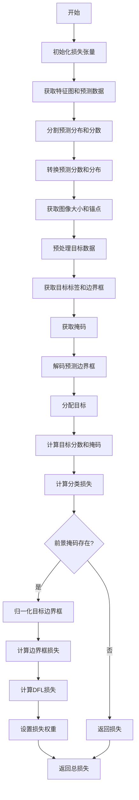
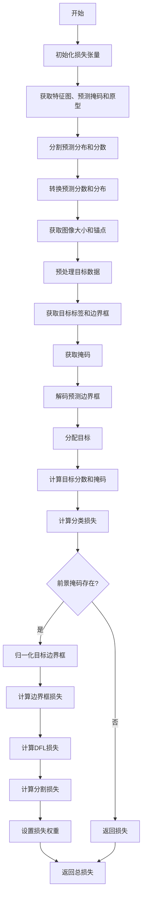
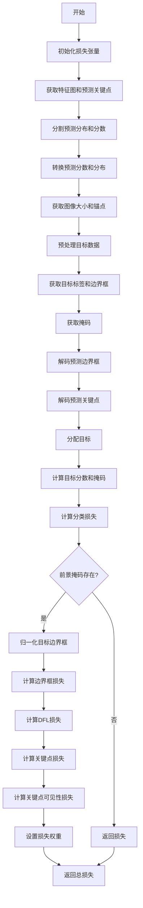

# loss.py

This file documents the purpose of `loss.py`.

# 代码解释

`loss.py` 文件定义了多个损失函数类，用于计算不同类型的检测任务（如目标检测、分割、姿态估计和旋转边界框检测）的训练损失。以下是文件中主要功能的详细解释：

## 1. 辅助函数和类

### `_ntuple` 函数

`_ntuple` 是一个辅助函数，用于将输入解析为指定长度的元组。如果输入是可迭代对象，则直接返回；否则，将输入重复指定次数以形成元组。

### `VarifocalLoss` 类

`VarifocalLoss` 类实现了 Varifocal Loss，用于目标检测任务。

### `FocalLoss` 类

`FocalLoss` 类实现了 Focal Loss，用于目标检测任务。

### `DFLoss` 类

`DFLoss` 类实现了 Distribution Focal Loss (DFL)，用于边界框回归。

### `BboxLoss` 类

`BboxLoss` 类用于计算边界框的 IoU 损失和 DFL 损失。

### `RotatedBboxLoss` 类

`RotatedBboxLoss` 类用于计算旋转边界框的 IoU 损失和 DFL 损失。

### `KeypointLoss` 类

`KeypointLoss` 类用于计算关键点检测的损失。

## 2. 主要损失函数类

### `v8DetectionLoss` 类

`v8DetectionLoss` 类用于计算 YOLOv8 目标检测任务的损失。

#### 方法
- `__init__`: 初始化损失函数类，设置模型相关的属性和 BCE 损失函数。
- `preprocess`: 预处理目标数据。
- `bbox_decode`: 解码预测的边界框坐标。
- `__call__`: 计算边界框、分类和 DFL 损失。

### `v8SegmentationLoss` 类

`v8SegmentationLoss` 类用于计算 YOLOv8 分割任务的损失。

#### 方法
- `__init__`: 初始化损失函数类，设置模型相关的属性和 BCE 损失函数。
- `__call__`: 计算边界框、分类、DFL 和分割损失。
- `single_mask_loss`: 计算单个图像的分割损失。
- `calculate_segmentation_loss`: 计算实例分割的损失。

### `v8PoseLoss` 类

`v8PoseLoss` 类用于计算 YOLOv8 姿态估计任务的损失。

#### 方法
- `__init__`: 初始化损失函数类，设置模型相关的属性和 BCE 损失函数。
- `__call__`: 计算边界框、分类、DFL 和关键点损失。
- `kpts_decode`: 解码预测的关键点坐标。
- `calculate_keypoints_loss`: 计算关键点损失和关键点对象损失。

### `v8ClassificationLoss` 类

`v8ClassificationLoss` 类用于计算 YOLOv8 分类任务的损失。

#### 方法
- `__call__`: 计算分类损失。

### `v8OBBLoss` 类

`v8OBBLoss` 类用于计算 YOLOv8 旋转边界框检测任务的损失。

#### 方法
- `__init__`: 初始化损失函数类，设置模型相关的属性和 BCE 损失函数。
- `preprocess`: 预处理目标数据。
- `__call__`: 计算边界框、分类和 DFL 损失。
- `bbox_decode`: 解码预测的旋转边界框坐标。

### `E2EDetectLoss` 类

`E2EDetectLoss` 类用于计算端到端检测任务的损失。

#### 方法
- `__init__`: 初始化损失函数类，设置 one-to-many 和 one-to-one 检测损失。
- `__call__`: 计算 one-to-many 和 one-to-one 检测损失的总和。

---

# 控制流程图

以下是 `v8DetectionLoss` 类的 `__call__` 方法的控制流程图，展示了其核心逻辑：

以下是 `v8SegmentationLoss` 类的 `__call__` 方法的控制流程图，展示了其核心逻辑：

以下是 `v8PoseLoss` 类的 `__call__` 方法的控制流程图，展示了其核心逻辑：

以下是 `v8OBBLoss` 类的 `__call__` 方法的控制流程图，展示了其核心逻辑：

---

### 图表详细说明

#### `v8DetectionLoss` 类的 `__call__` 方法

1. **A[开始]**：方法开始执行。
2. **B[初始化损失张量]**：初始化损失张量 `loss`，包含边界框、分类和 DFL 损失。
3. **C[获取特征图和预测数据]**：获取特征图和预测数据。
4. **D[分割预测分布和分数]**：将预测数据分割为分布和分数。
5. **E[转换预测分数和分布]**：转换预测分数和分布的形状。
6. **F[获取图像大小和锚点]**：获取图像大小和锚点。
7. **G[预处理目标数据]**：预处理目标数据。
8. **H[获取目标标签和边界框]**：从预处理后的目标数据中获取标签和边界框。
9. **I[获取掩码]**：获取掩码。
10. **J[解码预测边界框]**：解码预测的边界框坐标。
11. **K[分配目标]**：使用分配器分配目标。
12. **L[计算目标分数和掩码]**：计算目标分数和掩码。
13. **M[计算分类损失]**：计算分类损失。
14. **N{前景掩码存在?}**：检查前景掩码是否存在。
15. **O[返回损失]**：如果前景掩码不存在，返回损失。
16. **P[归一化目标边界框]**：归一化目标边界框。
17. **Q[计算边界框损失]**：计算边界框损失。
18. **R[计算DFL损失]**：计算 DFL 损失。
19. **S[设置损失权重]**：设置损失权重。
20. **T[返回总损失]**：返回总损失。

#### `v8SegmentationLoss` 类的 `__call__` 方法

1. **A[开始]**：方法开始执行。
2. **B[初始化损失张量]**：初始化损失张量 `loss`，包含边界框、分类、DFL 和分割损失。
3. **C[获取特征图、预测掩码和原型]**：获取特征图、预测掩码和原型。
4. **D[分割预测分布和分数]**：将预测数据分割为分布和分数。
5. **E[转换预测分数和分布]**：转换预测分数和分布的形状。
6. **F[获取图像大小和锚点]**：获取图像大小和锚点。
7. **G[预处理目标数据]**：预处理目标数据。
8. **H[获取目标标签和边界框]**：从预处理后的目标数据中获取标签和边界框。
9. **I[获取掩码]**：获取掩码。
10. **J[解码预测边界框]**：解码预测的边界框坐标。
11. **K[分配目标]**：使用分配器分配目标。
12. **L[计算目标分数和掩码]**：计算目标分数和掩码。
13. **M[计算分类损失]**：计算分类损失。
14. **N{前景掩码存在?}**：检查前景掩码是否存在。
15. **O[返回损失]**：如果前景掩码不存在，返回损失。
16. **P[归一化目标边界框]**：归一化目标边界框。
17. **Q[计算边界框损失]**：计算边界框损失。
18. **R[计算DFL损失]**：计算 DFL 损失。
19. **S[计算分割损失]**：计算分割损失。
20. **T[设置损失权重]**：设置损失权重。
21. **U[返回总损失]**：返回总损失。

#### `v8PoseLoss` 类的 `__call__` 方法

1. **A[开始]**：方法开始执行。
2. **B[初始化损失张量]**：初始化损失张量 `loss`，包含边界框、分类、DFL、关键点位置和关键点可见性损失。
3. **C[获取特征图和预测关键点]**：获取特征图和预测关键点。
4. **D[分割预测分布和分数]**：将预测数据分割为分布和分数。
5. **E[转换预测分数和分布]**：转换预测分数和分布的形状。
6. **F[获取图像大小和锚点]**：获取图像大小和锚点。
7. **G[预处理目标数据]**：预处理目标数据。
8. **H[获取目标标签和边界框]**：从预处理后的目标数据中获取标签和边界框。
9. **I[获取掩码]**：获取掩码。
10. **J[解码预测边界框]**：解码预测的边界框坐标。
11. **K[解码预测关键点]**：解码预测的关键点坐标。
12. **L[分配目标]**：使用分配器分配目标。
13. **M[计算目标分数和掩码]**：计算目标分数和掩码。
14. **N[计算分类损失]**：计算分类损失。
15. **O{前景掩码存在?}**：检查前景掩码是否存在。
16. **P[返回损失]**：如果前景掩码不存在，返回损失。
17. **Q[归一化目标边界框]**：归一化目标边界框。
18. **R[计算边界框损失]**：计算边界框损失。
19. **S[计算DFL损失]**：计算 DFL 损失。
20. **T[计算关键点损失]**：计算关键点损失。
21. **U[计算关键点可见性损失]**：计算关键点可见性损失。
22. **V[设置损失权重]**：设置损失权重。
23. **W[返回总损失]**：返回总损失。

#### `v8OBBLoss` 类的 `__call__` 方法

1. **A[开始]**：方法开始执行。
2. **B[初始化损失张量]**：初始化损失张量 `loss`，包含边界框、分类和 DFL 损失。
3. **C[获取特征图和预测角度]**：获取特征图和预测角度。
4. **D[分割预测分布和分数]**：将预测数据分割为分布和分数。
5. **E[转换预测分数和分布]**：转换预测分数和分布的形状。
6. **F[获取图像大小和锚点]**：获取图像大小和锚点。
7. **G[预处理目标数据]**：预处理目标数据。
8. **H[获取目标标签和边界框]**：从预处理后的目标数据中获取标签和边界框。
9. **I[获取掩码]**：获取掩码。
10. **J[解码预测边界框]**：解码预测的边界框坐标。
11. **K[分配目标]**：使用分配器分配目标。
12. **L[计算目标分数和掩码]**：计算目标分数和掩码。
13. **M[计算分类损失]**：计算分类损失。
14. **N{前景掩码存在?}**：检查前景掩码是否存在。
15. **O[返回损失]**：如果前景掩码不存在，返回损失。
16. **P[归一化目标边界框]**：归一化目标边界框。
17. **Q[计算边界框损失]**：计算边界框损失。
18. **R[计算DFL损失]**：计算 DFL 损失。
19. **S[设置损失权重]**：设置损失权重。
20. **T[返回总损失]**：返回总损失。

---

### 总结

`loss.py` 文件定义了多个损失函数类，用于计算不同类型的检测任务的训练损失。这些类包括：

- **`VarifocalLoss`**: 实现 Varifocal Loss。
- **`FocalLoss`**: 实现 Focal Loss。
- **`DFLoss`**: 实现 Distribution Focal Loss (DFL)。
- **`BboxLoss`**: 计算边界框的 IoU 损失和 DFL 损失。
- **`RotatedBboxLoss`**: 计算旋转边界框的 IoU 损失和 DFL 损失。
- **`KeypointLoss`**: 计算关键点检测的损失。
- **`v8DetectionLoss`**: 计算 YOLOv8 目标检测任务的损失。
- **`v8SegmentationLoss`**: 计算 YOLOv8 分割任务的损失。
- **`v8PoseLoss`**: 计算 YOLOv8 姿态估计任务的损失。
- **`v8ClassificationLoss`**: 计算 YOLOv8 分类任务的损失。
- **`v8OBBLoss`**: 计算 YOLOv8 旋转边界框检测任务的损失。
- **`E2EDetectLoss`**: 计算端到端检测任务的损失。

这些类通过不同的方法和逻辑来计算各种损失，确保模型在训练过程中能够有效地学习目标检测、分割、姿态估计和旋转边界框检测任务所需的特征。每个类都包含预处理、解码、分配目标和计算损失的步骤，确保损失计算的准确性和效率。

### 文件角色与作用

`loss.py` 文件在 YOLOv8 模型的训练过程中扮演着关键角色，通过定义多种损失函数类，确保模型能够有效地学习不同类型的检测任务。具体作用包括：

- **目标检测**: `v8DetectionLoss` 类计算边界框、分类

