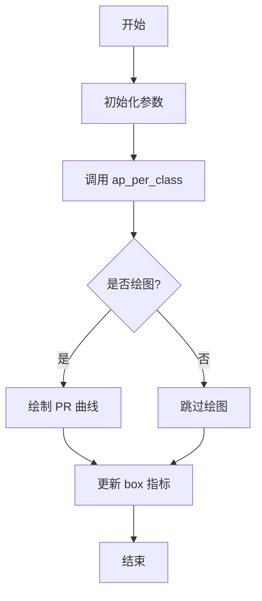
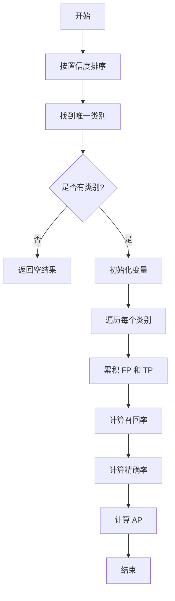
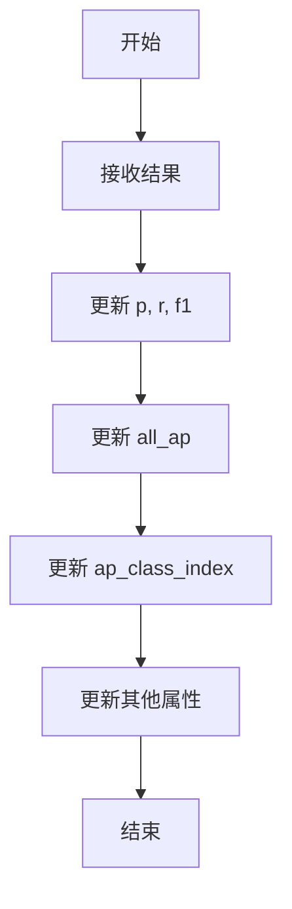

# metrics.py

This file documents the purpose of `metrics.py`.

# 代码解释

`metrics.py` 文件定义了多个用于评估模型性能的指标和工具函数，主要用于目标检测、分割、姿态估计和分类任务。以下是文件中主要功能的详细解释：

## 1. 辅助函数和类

### `bbox_ioa`

`bbox_ioa` 函数计算两个边界框集合之间的交集与第二个边界框面积的比值（Intersection over Area, IOA）。

### `box_iou`

`box_iou` 函数基于 PyTorch 的操作实现，计算两个边界框集合之间的 IoU（Intersection over Union）。

### `bbox_iou`

`bbox_iou` 函数计算两个边界框集合之间的 IoU，并支持 GIoU、DIoU 和 CIoU 的计算。

### `mask_iou`

`mask_iou` 函数计算两个掩码集合之间的 IoU。

### `kpt_iou`

`kpt_iou` 函数计算关键点的相似性（OKS, Object Keypoint Similarity）。

### `probiou`

`probiou` 函数计算旋转边界框的概率 IoU。

### `smooth_bce`

`smooth_bce` 函数计算平滑的正负二元交叉熵目标。

### `ConfusionMatrix`

`ConfusionMatrix` 类用于计算和更新混淆矩阵，适用于目标检测和分类任务。

### `smooth`

`smooth` 函数对输入数据进行平滑处理。

### `plot_pr_curve`

`plot_pr_curve` 函数绘制精度-召回曲线。

### `plot_mc_curve`

`plot_mc_curve` 函数绘制度量-置信度曲线。

### `compute_ap`

`compute_ap` 函数计算给定召回和精确曲线的平均精度（AP）。

### `ap_per_class`

`ap_per_class` 函数计算每个类别的平均精度（AP），并生成 PR 曲线。

## 2. 主要指标类

### `Metric`

`Metric` 类用于计算 YOLOv8 模型的评估指标，包括精度、召回率、F1 分数、AP 等。

#### 方法
- `ap50`: 返回 IoU 阈值为 0.5 时的 AP。
- `ap`: 返回 IoU 阈值范围为 0.5-0.95 时的 AP。
- `mp`: 返回所有类别的平均精度。
- `mr`: 返回所有类别的平均召回率。
- `map50`: 返回 IoU 阈值为 0.5 时的 mAP。
- `map75`: 返回 IoU 阈值为 0.75 时的 mAP。
- `map`: 返回 IoU 阈值范围为 0.5-0.95 时的 mAP。
- `mean_results`: 返回所有类别的平均结果。
- `class_result`: 返回特定类别的结果。
- `maps`: 返回每个类别的 mAP。
- `fitness`: 计算模型的适应度分数。
- `update`: 更新指标结果。

### `DetMetrics`

`DetMetrics` 类用于计算目标检测任务的指标。

#### 方法
- `process`: 更新检测指标结果。
- `keys`: 返回访问检测指标的键。
- `mean_results`: 返回所有类别的平均结果。
- `class_result`: 返回特定类别的结果。
- `maps`: 返回每个类别的 mAP。
- `fitness`: 计算模型的适应度分数。
- `ap_class_index`: 返回每个类别的 AP 索引。
- `results_dict`: 返回包含检测指标的结果字典。
- `curves`: 返回曲线列表。
- `curves_results`: 返回曲线结果。

### `SegmentMetrics`

`SegmentMetrics` 类用于计算分割任务的指标。

#### 方法
- `process`: 更新分割指标结果。
- `keys`: 返回访问分割指标的键。
- `mean_results`: 返回所有类别的平均结果。
- `class_result`: 返回特定类别的结果。
- `maps`: 返回每个类别的 mAP。
- `fitness`: 计算模型的适应度分数。
- `ap_class_index`: 返回每个类别的 AP 索引。
- `results_dict`: 返回包含分割指标的结果字典。
- `curves`: 返回曲线列表。
- `curves_results`: 返回曲线结果。

### `PoseMetrics`

`PoseMetrics` 类用于计算姿态估计任务的指标。

#### 方法
- `process`: 更新姿态估计指标结果。
- `keys`: 返回访问姿态估计指标的键。
- `mean_results`: 返回所有类别的平均结果。
- `class_result`: 返回特定类别的结果。
- `maps`: 返回每个类别的 mAP。
- `fitness`: 计算模型的适应度分数。
- `curves`: 返回曲线列表。
- `curves_results`: 返回曲线结果。

### `ClassifyMetrics`

`ClassifyMetrics` 类用于计算分类任务的指标。

#### 方法
- `process`: 更新分类指标结果。
- `fitness`: 计算模型的适应度分数。
- `results_dict`: 返回包含分类指标的结果字典。
- `keys`: 返回访问分类指标的键。

### `OBBMetrics`

`OBBMetrics` 类用于计算旋转边界框检测任务的指标。

#### 方法
- `process`: 更新旋转边界框检测指标结果。
- `keys`: 返回访问旋转边界框检测指标的键。
- `mean_results`: 返回所有类别的平均结果。
- `class_result`: 返回特定类别的结果。
- `maps`: 返回每个类别的 mAP。
- `fitness`: 计算模型的适应度分数。
- `ap_class_index`: 返回每个类别的 AP 索引。
- `results_dict`: 返回包含旋转边界框检测指标的结果字典。

---

# 控制流程图

以下是 `DetMetrics` 类的 `process` 方法的控制流程图，展示了其核心逻辑：

以下是 `ap_per_class` 函数的控制流程图，展示了其核心逻辑：

以下是 `Metric` 类的 `update` 方法的控制流程图，展示了其核心逻辑：

---

### 图表详细说明

#### `DetMetrics.process` 方法

1. **A[开始]**：方法开始执行。
2. **B[初始化参数]**：初始化传入的参数。
3. **C[调用 ap_per_class]**：调用 `ap_per_class` 函数计算每个类别的 AP。
4. **D{是否绘图?}**：检查是否需要绘制 PR 曲线。
5. **E[绘制 PR 曲线]**：如果需要绘图，则绘制 PR 曲线。
6. **F[跳过绘图]**：如果不绘图，则跳过绘图步骤。
7. **G[更新 box 指标]**：更新 `box` 指标。
8. **H[结束]**：方法结束。

#### `ap_per_class` 函数

1. **A[开始]**：函数开始执行。
2. **B[按置信度排序]**：按置信度降序排列预测结果。
3. **C[找到唯一类别]**：找到目标类别中的唯一类别。
4. **D{是否有类别?}**：检查是否有类别存在。
5. **E[返回空结果]**：如果没有类别，则返回空结果。
6. **F[初始化变量]**：初始化累积变量。
7. **G[遍历每个类别]**：遍历每个类别。
8. **H[累积 FP 和 TP]**：累积假阳性和真阳性。
9. **I[计算召回率]**：计算召回率。
10. **J[计算精确率]**：计算精确率。
11. **K[计算 AP]**：计算平均精度（AP）。
12. **L[结束]**：函数结束。

#### `Metric.update` 方法

1. **A[开始]**：方法开始执行。
2. **B[接收结果]**：接收新的评估结果。
3. **C[更新 p, r, f1]**：更新精度、召回率和 F1 分数。
4. **D[更新 all_ap]**：更新所有类别的 AP。
5. **E[更新 ap_class_index]**：更新每个类别的 AP 索引。
6. **F[更新其他属性]**：更新其他相关属性。
7. **G[结束]**：方法结束。

---

### 总结

`metrics.py` 文件在 YOLOv8 模型的评估过程中扮演着关键角色，通过定义多种指标类和辅助函数，确保模型能够有效地评估不同类型的检测任务。具体作用包括：

- **目标检测**: `DetMetrics` 类计算边界框的精度、召回率、F1 分数和 AP。
- **分割**: `SegmentMetrics` 类计算掩码的精度、召回率、F1 分数和 AP。
- **姿态估计**: `PoseMetrics` 类计算关键点的精度、召回率、F1 分数和 AP。
- **分类**: `ClassifyMetrics` 类计算分类任务的 Top-1 和 Top-5 准确率。
- **旋转边界框检测**: `OBBMetrics` 类计算旋转边界框的精度、召回率、F1 分数和 AP。

这些类通过不同的方法和逻辑来计算各种指标，确保评估过程的准确性和效率。每个类都包含预处理、计算和更新指标的步骤，确保指标计算的完整性和一致性。