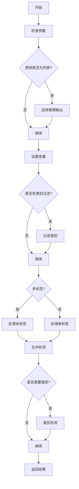
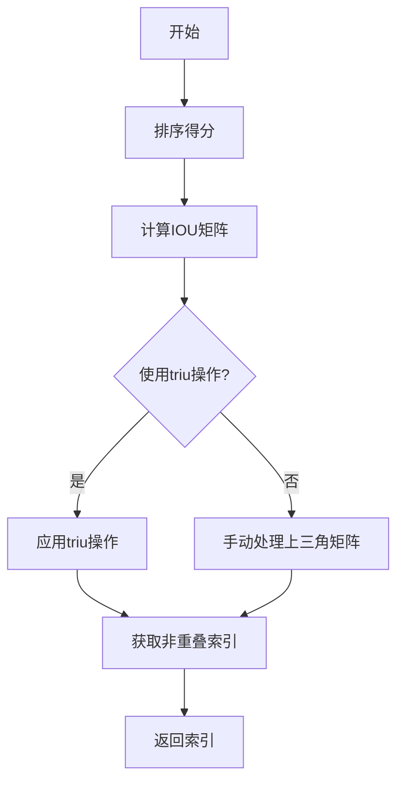
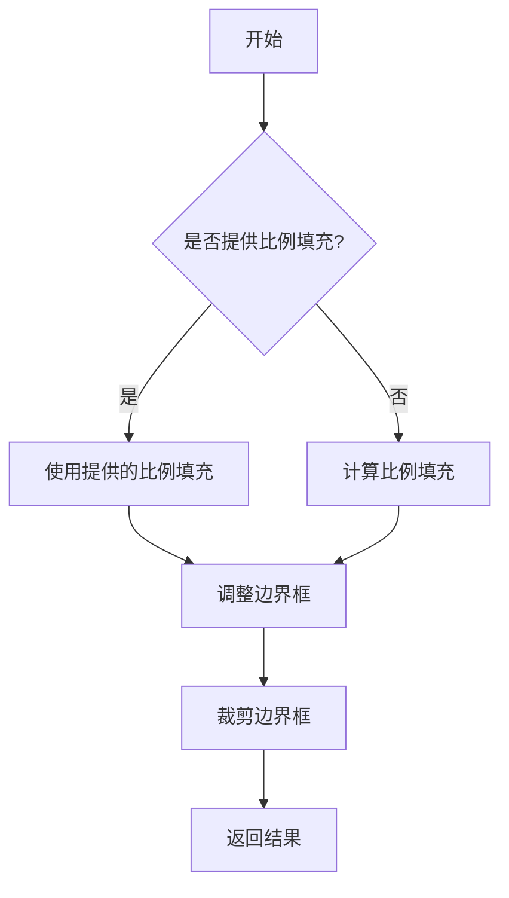

# ops.py

This file documents the purpose of `ops.py`.

# 代码解释

`ops.py` 文件提供了多种用于处理和转换边界框、掩码和其他几何对象的工具函数，主要用于目标检测、分割和姿态估计任务。以下是文件中主要功能的详细解释：

## 1. 辅助类和函数

### `Profile`

`Profile` 类用于测量代码执行时间，可以作为装饰器或上下文管理器使用。

#### 方法
- `__init__`: 初始化参数。
- `__enter__`: 开始计时。
- `__exit__`: 停止计时并累积时间。
- `__str__`: 返回累计时间的字符串表示。
- `time`: 获取当前时间。

### `segment2box`

`segment2box` 函数将一个线段标签转换为一个边界框标签，并应用图像内的约束条件。

### `scale_boxes`

`scale_boxes` 函数将边界框从一个图像形状缩放到另一个图像形状。

### `make_divisible`

`make_divisible` 函数返回最接近给定除数的可整除数。

### `nms_rotated`

`nms_rotated` 函数实现旋转边界框的非极大值抑制（NMS），使用概率IoU和快速NMS。

### `non_max_suppression`

`non_max_suppression` 函数对一组预测框执行非极大值抑制（NMS），支持掩码和多个标签。

#### 参数
- `prediction`: 预测结果张量。
- `conf_thres`: 置信度阈值。
- `iou_thres`: IoU阈值。
- `classes`: 要考虑的类别索引列表。
- `agnostic`: 是否忽略类别信息。
- `multi_label`: 每个框是否可能有多个标签。
- `labels`: 图像的先验标签。
- `max_det`: 最大检测数量。
- `nc`: 类别数量。
- `max_time_img`: 处理一张图像的最大时间。
- `max_nms`: 进入 `torchvision.ops.nms()` 的最大框数。
- `max_wh`: 最大宽高限制。
- `in_place`: 是否就地修改输入张量。
- `rotated`: 是否处理旋转边界框。
- `end2end`: 模型是否不需要NMS。

#### 返回值
- 返回保留的框列表。

### `clip_boxes`

`clip_boxes` 函数将边界框裁剪到图像边界内。

### `clip_coords`

`clip_coords` 函数将坐标裁剪到图像边界内。

### `scale_image`

`scale_image` 函数调整掩码或图像的大小以匹配原始图像尺寸。

### `xyxy2xywh`

`xyxy2xywh` 函数将边界框坐标从 (x1, y1, x2, y2) 格式转换为 (x, y, width, height) 格式。

### `xywh2xyxy`

`xywh2xyxy` 函数将边界框坐标从 (x, y, width, height) 格式转换为 (x1, y1, x2, y2) 格式。

### `xywhn2xyxy`

`xywhn2xyxy` 函数将归一化的边界框坐标转换为像素坐标。

### `xyxy2xywhn`

`xyxy2xywhn` 函数将边界框坐标从 (x1, y1, x2, y2) 格式转换为归一化格式 (x, y, width, height, normalized)。

### `xywh2ltwh`

`xywh2ltwh` 函数将边界框从 [x, y, w, h] 格式转换为 [x1, y1, w, h] 格式，其中 x1, y1 是左上角坐标。

### `xyxy2ltwh`

`xyxy2ltwh` 函数将边界框从 [x1, y1, x2, y2] 格式转换为 [x1, y1, w, h] 格式，其中 xy1=top-left, xy2=bottom-right。

### `ltwh2xywh`

`ltwh2xywh` 函数将边界框从 [x1, y1, w, h] 格式转换为 [x, y, w, h] 格式，其中 xy=center。

### `xyxyxyxy2xywhr`

`xyxyxyxy2xywhr` 函数将OBB（Oriented Bounding Box）从 [xy1, xy2, xy3, xy4] 格式转换为 [xywh, rotation] 格式。

### `xywhr2xyxyxyxy`

`xywhr2xyxyxyxy` 函数将OBB从 [xywh, rotation] 格式转换为 [xy1, xy2, xy3, xy4] 格式。

### `ltwh2xyxy`

`ltwh2xyxy` 函数将边界框从 [x1, y1, w, h] 格式转换为 [x1, y1, x2, y2] 格式，其中 xy1=top-left, xy2=bottom-right。

### `segments2boxes`

`segments2boxes` 函数将线段标签转换为边界框标签。

### `resample_segments`

`resample_segments` 函数将线段重新采样到指定点数。

### `crop_mask`

`crop_mask` 函数根据边界框裁剪掩码。

### `process_mask`

`process_mask` 函数应用掩码到边界框，使用掩码头的输出。

### `process_mask_native`

`process_mask_native` 函数在原生方式下应用掩码到边界框。

### `scale_masks`

`scale_masks` 函数将掩码缩放到指定形状。

### `scale_coords`

`scale_coords` 函数将线段坐标从一个图像形状缩放到另一个图像形状。

### `regularize_rboxes`

`regularize_rboxes` 函数将旋转边界框规范化到范围 [0, pi/2]。

### `masks2segments`

`masks2segments` 函数将掩码转换为线段。

### `convert_torch2numpy_batch`

`convert_torch2numpy_batch` 函数将一批FP32 torch张量转换为NumPy uint8数组。

### `clean_str`

`clean_str` 函数清理字符串中的特殊字符。

### `empty_like`

`empty_like` 函数创建与输入相同形状的空张量或数组，数据类型为float32。

---

# 控制流程图

以下是 `non_max_suppression` 函数的控制流程图，展示了其核心逻辑：

以下是 `nms_rotated` 函数的控制流程图，展示了其核心逻辑：

以下是 `scale_boxes` 函数的控制流程图，展示了其核心逻辑：

---

### 图表详细说明

#### `non_max_suppression` 函数

1. **A[开始]**：方法开始执行。
2. **B[检查参数]**：检查传入参数的有效性。
3. **C{预测是否为列表?}**：判断预测结果是否为列表。
4. **D[选择推理输出]**：如果预测结果为列表，则选择推理输出。
5. **E[继续]**：继续执行后续步骤。
6. **F[设置变量]**：初始化相关变量。
7. **G{是否有类别过滤?}**：判断是否需要按类别过滤。
8. **H[过滤类别]**：如果有类别过滤需求，则进行类别过滤。
9. **I[继续]**：继续执行后续步骤。
10. **J{多标签?}**：判断是否有多标签需求。
11. **K[处理多标签]**：如果有多个标签，则处理多标签情况。
12. **L[处理单标签]**：如果只有一个标签，则处理单标签情况。
13. **M[合并检测]**：合并检测结果。
14. **N{是否需要裁剪?}**：判断是否需要裁剪检测结果。
15. **O[裁剪检测]**：如果需要裁剪，则裁剪检测结果。
16. **P[继续]**：继续执行后续步骤。
17. **Q[返回结果]**：返回最终的检测结果。

#### `nms_rotated` 函数

1. **A[开始]**：函数开始执行。
2. **B[排序得分]**：按得分降序排列预测结果。
3. **C[计算IOU矩阵]**：计算IOU矩阵。
4. **D{使用triu操作?}**：判断是否使用`torch.triu`操作。
5. **E[应用triu操作]**：如果使用`torch.triu`操作，则应用该操作。
6. **F[手动处理上三角矩阵]**：如果不使用`torch.triu`操作，则手动处理上三角矩阵。
7. **G[获取非重叠索引]**：获取非重叠索引。
8. **H[返回索引]**：返回筛选后的索引。

#### `scale_boxes` 函数

1. **A[开始]**：函数开始执行。
2. **B{是否提供比例填充?}**：判断是否提供了比例填充。
3. **C[使用提供的比例填充]**：如果提供了比例填充，则使用提供的比例填充。
4. **D[计算比例填充]**：如果没有提供比例填充，则计算比例填充。
5. **E[调整边界框]**：调整边界框。
6. **F[裁剪边界框]**：裁剪边界框。
7. **G[返回结果]**：返回调整后的边界框。

---

### 总结

`ops.py` 文件在 YOLOv8 模型的后处理过程中扮演着关键角色，通过定义多种工具函数和辅助类，确保模型能够有效地处理和转换不同类型的几何对象。具体作用包括：

- **性能分析**: `Profile` 类用于测量代码执行时间，帮助优化模型性能。
- **边界框处理**: 提供多种函数用于边界框的转换、缩放和裁剪。
- **掩码处理**: 提供函数用于掩码的裁剪、缩放和处理。
- **非极大值抑制**: `non_max_suppression` 和 `nms_rotated` 函数用于去除冗余检测框，提高检测精度。
- **几何转换**: 提供多种函数用于不同格式之间的几何对象转换，如旋转边界框的处理。
- **数据转换**: 提供函数用于不同类型数据之间的转换，如将张量转换为NumPy数组。

这些函数通过不同的方法和逻辑来处理和转换几何对象，确保后处理过程的准确性和效率。每个函数都包含预处理、计算和更新步骤，确保处理过程的完整性和一致性。