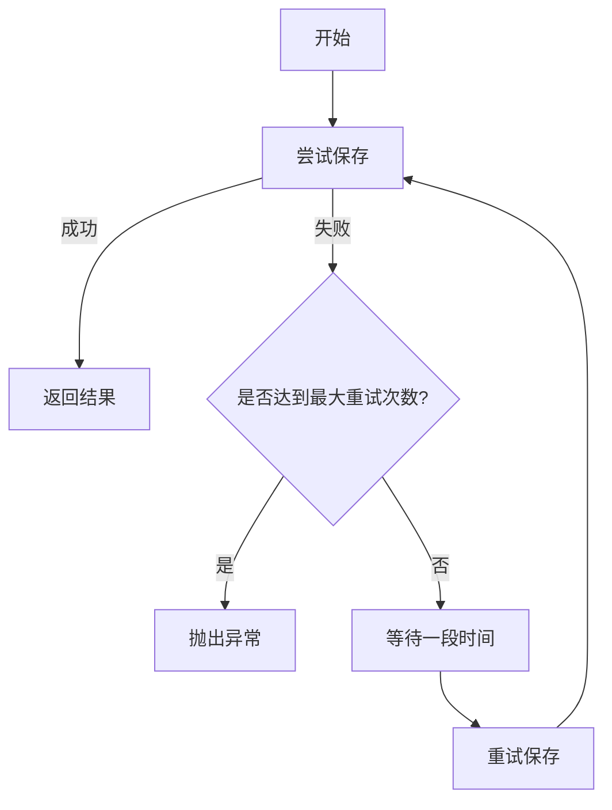
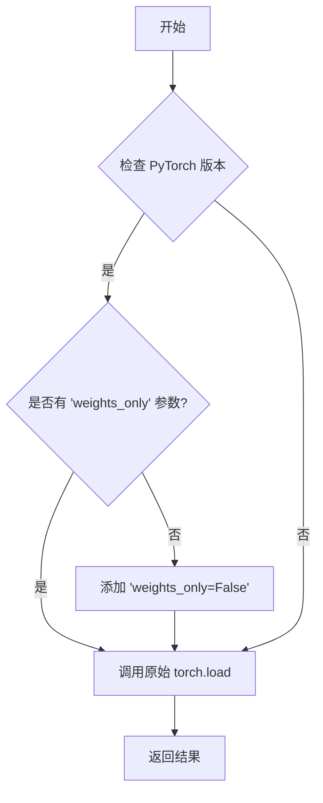
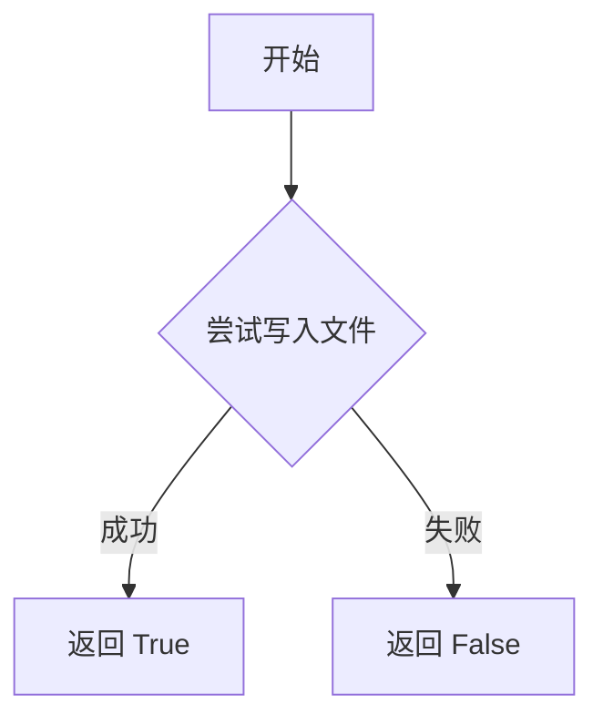
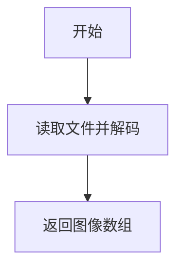
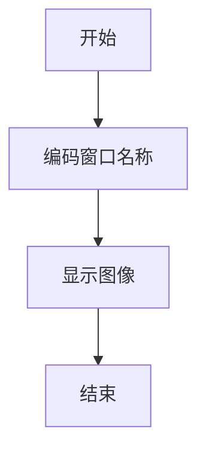

# patches.py

This file documents the purpose of `patches.py`.


# 代码解释

`patches.py` 文件提供了对现有函数的修补（monkey patching），以更新或扩展其功能。具体来说，它针对 OpenCV 和 PyTorch 的一些常用函数进行了改进，以便更好地处理多语言支持、文件读写和模型加载/保存等操作。

## 1. OpenCV 相关补丁

### `imread`

`imread` 函数用于从文件中读取图像，并返回一个 NumPy 数组表示的图像。

#### 参数
- `filename (str)`: 要读取的文件路径。
- `flags (int, optional)`: 标志，可以使用 `cv2.IMREAD_*` 中的值。

#### 返回值
- `(np.ndarray)`: 读取的图像。

```python
def imread(filename: str, flags: int = cv2.IMREAD_COLOR):
    return cv2.imdecode(np.fromfile(filename, np.uint8), flags)
```

### `imwrite`

`imwrite` 函数用于将图像写入文件。

#### 参数
- `filename (str)`: 要写入的文件路径。
- `img (np.ndarray)`: 要写入的图像。
- `params (List[int], optional)`: 额外的参数，用于图像编码。

#### 返回值
- `(bool)`: 如果文件成功写入则返回 `True`，否则返回 `False`。

```python
def imwrite(filename: str, img: np.ndarray, params=None):
    try:
        cv2.imencode(Path(filename).suffix, img, params)[1].tofile(filename)
        return True
    except Exception:
        return False
```

### `imshow`

`imshow` 函数用于在指定窗口中显示图像。

#### 参数
- `winname (str)`: 窗口名称。
- `mat (np.ndarray)`: 要显示的图像。

```python
def imshow(winname: str, mat: np.ndarray):
    _imshow(winname.encode("unicode_escape").decode(), mat)
```

## 2. PyTorch 相关补丁

### `torch_load`

`torch_load` 函数用于加载 PyTorch 模型，并避免警告信息。

#### 参数
- `*args`: 可变长度位置参数，传递给 `torch.load`。
- `**kwargs`: 任意关键字参数，传递给 `torch.load`。

#### 返回值
- `(Any)`: 加载的 PyTorch 对象。

```python
def torch_load(*args, **kwargs):
    from ultralytics.utils.torch_utils import TORCH_1_13

    if TORCH_1_13 and "weights_only" not in kwargs:
        kwargs["weights_only"] = False

    return _torch_load(*args, **kwargs)
```

### `torch_save`

`torch_save` 函数用于保存 PyTorch 对象，并带有重试机制以提高鲁棒性。

#### 参数
- `*args`: 位置参数，传递给 `torch.save`。
- `**kwargs`: 关键字参数，传递给 `torch.save`。

```python
def torch_save(*args, **kwargs):
    for i in range(4):  # 3 retries
        try:
            return _torch_save(*args, **kwargs)
        except RuntimeError as e:  # unable to save, possibly waiting for device to flush or antivirus scan
            if i == 3:
                raise e
            time.sleep((2**i) / 2)  # exponential standoff: 0.5s, 1.0s, 2.0s
```

---

# 控制流程图

以下是 `torch_save` 函数的控制流程图，展示了其核心逻辑：



以下是 `torch_load` 函数的控制流程图，展示了其核心逻辑：



以下是 `imwrite` 函数的控制流程图，展示了其核心逻辑：



以下是 `imread` 函数的控制流程图，展示了其核心逻辑：



以下是 `imshow` 函数的控制流程图，展示了其核心逻辑：



---

### 图表详细说明

#### `torch_save` 函数

1. **A[开始]**：函数开始执行。
2. **B{尝试保存}**：尝试调用 `_torch_save` 函数进行保存。
3. **C[返回结果]**：如果保存成功，则返回结果。
4. **D{是否达到最大重试次数?}**：判断是否已经达到最大重试次数。
5. **E[抛出异常]**：如果达到最大重试次数且仍然失败，则抛出异常。
6. **F[等待一段时间]**：如果没有达到最大重试次数，则等待一段时间（指数退避）。
7. **G[重试保存]**：再次尝试保存。
8. **B[尝试保存]**：继续尝试保存。

#### `torch_load` 函数

1. **A[开始]**：函数开始执行。
2. **B{检查 PyTorch 版本}**：检查当前使用的 PyTorch 版本。
3. **C{是否有 'weights_only' 参数?}**：判断是否已经包含 `'weights_only'` 参数。
4. **D[调用原始 torch.load]**：调用原始的 `_torch_load` 函数。
5. **E[添加 'weights_only=False']**：如果没有 `'weights_only'` 参数，则添加该参数并设置为 `False`。
6. **F[返回结果]**：返回加载的结果。

#### `imwrite` 函数

1. **A[开始]**：函数开始执行。
2. **B{尝试写入文件}**：尝试将图像写入文件。
3. **C[返回 True]**：如果写入成功，则返回 `True`。
4. **D[返回 False]**：如果写入失败，则返回 `False`。

#### `imread` 函数

1. **A[开始]**：函数开始执行。
2. **B[读取文件并解码]**：读取文件并使用 `cv2.imdecode` 解码。
3. **C[返回图像数组]**：返回解码后的图像数组。

#### `imshow` 函数

1. **A[开始]**：函数开始执行。
2. **B[编码窗口名称]**：将窗口名称编码为 Unicode。
3. **C[显示图像]**：调用 `_imshow` 显示图像。
4. **D[结束]**：函数结束。

---

### 总结

`patches.py` 文件通过修补（monkey patching）的方式对现有的 OpenCV 和 PyTorch 函数进行了改进，主要作用包括：

- **OpenCV 补丁**：
  - 提供了多语言友好的 `imread` 和 `imwrite` 函数，解决了不同语言环境下文件名编码问题。
  - 改进了 `imshow` 函数，确保窗口名称能够正确显示。

- **PyTorch 补丁**：
  - 在 `torch.load` 中增加了对 `weights_only` 参数的支持，避免了版本不兼容导致的警告。
  - 在 `torch.save` 中增加了重试机制，提高了保存过程的鲁棒性，防止由于设备刷新延迟或杀毒软件扫描导致的保存失败。

这些补丁通过增强现有函数的功能，提升了代码的可移植性和稳定性，特别是在多语言环境和复杂系统中运行时表现尤为明显。每个补丁都包含了详细的错误处理和重试机制，确保了代码的健壮性和可靠性。