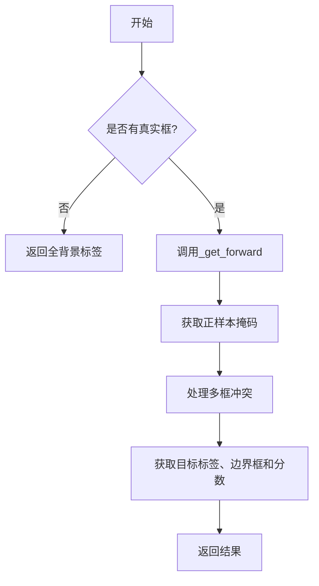
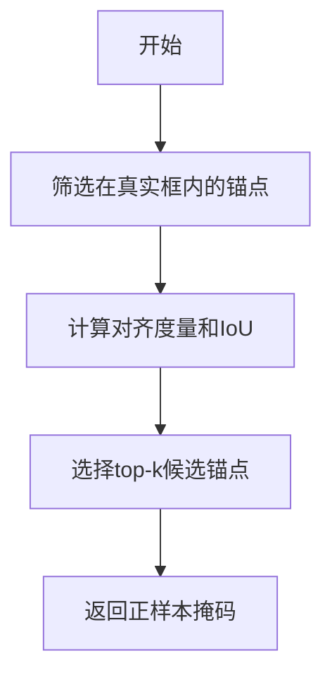

# tal.py

This file documents the purpose of `tal.py`.

# 代码解释

`tal.py` 文件实现了任务对齐分配器（Task-Aligned Assigner），用于目标检测中的正负样本分配。它通过结合分类和定位信息，计算任务对齐度量（Task-Aligned Metric），从而实现更高效的正负样本匹配。

---

## 1. **核心类 `TaskAlignedAssigner`**

### 功能
- 提供了一种基于任务对齐度量的正负样本分配方法。
- 支持水平边界框和旋转边界框的分配。

### 主要属性
- `topk`: 每个目标选择的候选锚点数量。
- `num_classes`: 类别数量。
- `bg_idx`: 背景类别的索引。
- `alpha` 和 `beta`: 控制分类和定位在任务对齐度量中的权重。
- `eps`: 防止除零的小值。

### 主要方法

#### 1.1 `forward`
- **功能**: 计算任务对齐分配。
- **输入**:
  - `pd_scores`: 预测的分类分数。
  - `pd_bboxes`: 预测的边界框。
  - `anc_points`: 锚点坐标。
  - `gt_labels`: 真实标签。
  - `gt_bboxes`: 真实边界框。
  - `mask_gt`: 真实边界框的有效性掩码。
- **输出**:
  - `target_labels`: 目标标签。
  - `target_bboxes`: 目标边界框。
  - `target_scores`: 目标分数。
  - `fg_mask`: 前景掩码。
  - `target_gt_idx`: 分配的目标索引。

#### 1.2 `_forward`
- **功能**: 实现 `forward` 的具体逻辑。
- **步骤**:
  1. 调用 `get_pos_mask` 获取正样本掩码、对齐度量和 IoU。
  2. 调用 `select_highest_overlaps` 处理多个真实框分配给同一锚点的情况。
  3. 调用 `get_targets` 获取目标标签、边界框和分数。

#### 1.3 `get_pos_mask`
- **功能**: 获取正样本掩码。
- **步骤**:
  1. 调用 `select_candidates_in_gts` 筛选在真实框内的锚点。
  2. 调用 `get_box_metrics` 计算对齐度量和 IoU。
  3. 调用 `select_topk_candidates` 选择 top-k 候选锚点。

#### 1.4 `get_box_metrics`
- **功能**: 计算对齐度量和 IoU。
- **公式**:
  \[
  align\_metric = (bbox\_scores^\alpha) \cdot (overlaps^\beta)
  \]

#### 1.5 `iou_calculation`
- **功能**: 计算 IoU 或 ProbIoU（针对旋转框）。

#### 1.6 `select_topk_candidates`
- **功能**: 选择 top-k 候选锚点。

#### 1.7 `get_targets`
- **功能**: 获取目标标签、边界框和分数。

#### 1.8 `select_candidates_in_gts`
- **功能**: 筛选在真实框内的锚点。

#### 1.9 `select_highest_overlaps`
- **功能**: 处理多个真实框分配给同一锚点的情况。

---

## 2. **派生类 `RotatedTaskAlignedAssigner`**

### 功能
- 继承自 `TaskAlignedAssigner`，专为旋转边界框设计。
- 重写了 `iou_calculation` 和 `select_candidates_in_gts` 方法以支持旋转框。

---

## 3. **辅助函数**

#### 3.1 `make_anchors`
- **功能**: 根据特征图生成锚点和步长张量。

#### 3.2 `dist2bbox`
- **功能**: 将距离表示转换为边界框表示。

#### 3.3 `bbox2dist`
- **功能**: 将边界框表示转换为距离表示。

#### 3.4 `dist2rbox`
- **功能**: 将距离和角度预测解码为旋转边界框。

---

# 控制流程图

以下是 `TaskAlignedAssigner` 的核心逻辑控制流程图：

详细展开 `get_pos_mask` 的逻辑：

---

# 总结

### 文件角色
`tal.py` 文件的核心角色是提供一种基于任务对齐度量的正负样本分配方法，适用于目标检测任务中的水平框和旋转框分配。

### 文件作用
1. **高效分配**: 结合分类和定位信息，提高正负样本分配的准确性。
2. **灵活性**: 支持水平框和旋转框，适应多种检测任务。
3. **鲁棒性**: 在 GPU 内存不足时自动切换到 CPU 运行，确保稳定性。

通过这些功能，`tal.py` 在目标检测任务中能够显著提升模型的训练效率和性能。