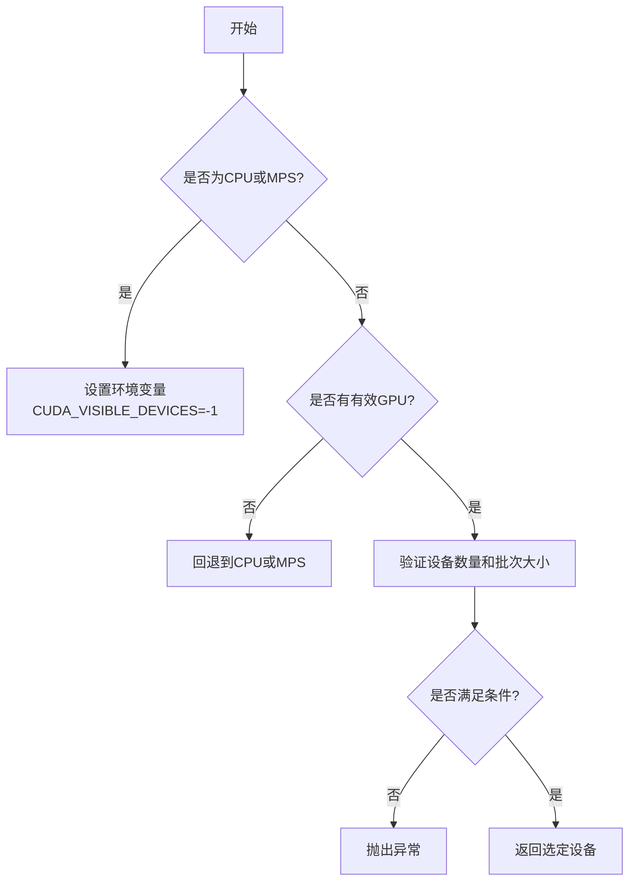
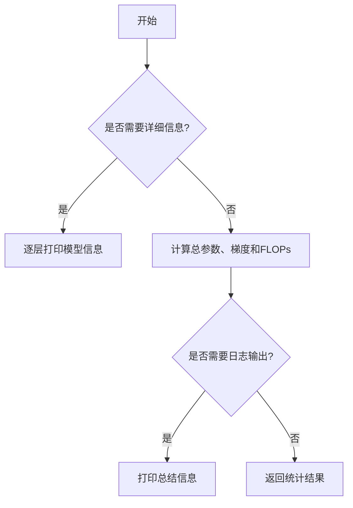
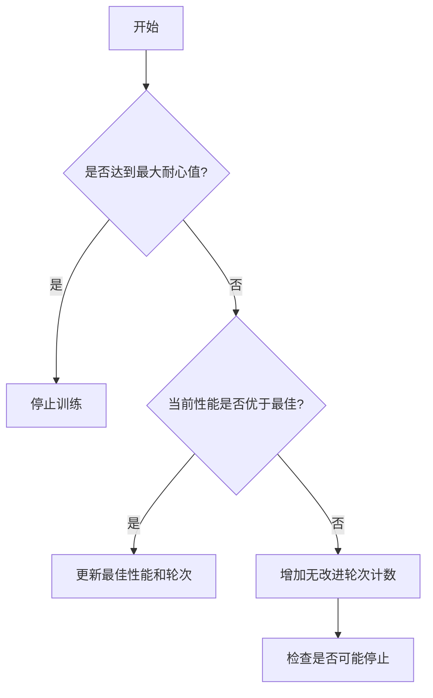

# torch_utils.py

This file documents the purpose of `torch_utils.py`.

# 代码解释

`torch_utils.py` 文件提供了与 PyTorch 相关的工具函数和类，主要用于模型训练、推理、优化和调试。以下是文件中主要功能的详细解释。

---

## 1. **核心功能**

### 1.1 设备选择与管理
- **`select_device`**: 根据用户输入选择合适的设备（CPU、GPU 或 MPS），并验证设备可用性。
- **`get_cpu_info` 和 `get_gpu_info`**: 获取 CPU 和 GPU 的硬件信息。
- **`time_sync`**: 提供精确的时间同步功能，确保跨设备的时间测量一致性。

### 1.2 模型操作
- **`fuse_conv_and_bn` 和 `fuse_deconv_and_bn`**: 将卷积层和批归一化层融合，减少推理时间。
- **`model_info`**: 打印模型的详细信息，包括层数、参数数量、梯度数量和 FLOPs。
- **`get_num_params` 和 `get_num_gradients`**: 计算模型的参数数量和梯度数量。
- **`get_flops` 和 `get_flops_with_torch_profiler`**: 使用 `thop` 或 `torch.profiler` 计算模型的 FLOPs。
- **`initialize_weights`**: 初始化模型权重为随机值。
- **`scale_img`**: 缩放图像张量，并可选地保持形状或填充到指定倍数。

### 1.3 训练辅助
- **`smart_inference_mode`**: 根据 PyTorch 版本选择合适的推理模式（`inference_mode` 或 `no_grad`）。
- **`autocast`**: 提供自动混合精度（AMP）上下文管理器，支持不同版本的 PyTorch。
- **`one_cycle`**: 实现余弦退火学习率调度器。
- **`init_seeds` 和 `unset_deterministic`**: 初始化随机种子以确保训练的可重复性，或取消确定性设置。

### 1.4 模型保存与加载
- **`strip_optimizer`**: 去除模型中的优化器状态，减小模型文件大小。
- **`convert_optimizer_state_dict_to_fp16`**: 将优化器状态字典转换为 FP16，进一步减小存储需求。

### 1.5 其他工具
- **`intersect_dicts`**: 返回两个字典中键值匹配的部分。
- **`de_parallel`**: 去除数据并行包装，返回单 GPU 模型。
- **`copy_attr`**: 复制对象属性，支持包含/排除某些属性。
- **`cuda_memory_usage`**: 监控 CUDA 内存使用情况。
- **`profile`**: 对模型进行速度、内存和 FLOPs 分析。
- **`EarlyStopping`**: 实现早停机制，防止过拟合。

---

## 2. **核心类**

### 2.1 `ModelEMA`
- **功能**: 实现指数移动平均（EMA），用于平滑模型权重，提高泛化能力。
- **方法**:
  - `update`: 更新 EMA 权重。
  - `update_attr`: 更新模型属性。

### 2.2 `FXModel`
- **功能**: 提供一个兼容 `torch.fx` 的模型封装类，确保图操作的正确性。
- **方法**:
  - `forward`: 定义前向传播逻辑，支持多输入和多输出。

---

## 3. **控制流程图**

以下是 `select_device` 函数的控制流程图：

以下是 `model_info` 函数的控制流程图：

以下是 `EarlyStopping` 类的核心逻辑：

---

## 4. **总结**

### 文件角色
`torch_utils.py` 是一个工具库，提供了与 PyTorch 相关的各种实用功能，涵盖了设备管理、模型操作、训练辅助、模型保存与加载等多个方面。

### 文件作用
1. **设备管理**: 提供灵活的设备选择和验证机制，确保模型能够在合适的硬件上运行。
2. **模型优化**: 提供模型融合、初始化、FLOPs 计算等功能，提升模型性能和效率。
3. **训练辅助**: 提供推理模式、混合精度、早停等工具，简化训练流程。
4. **调试与分析**: 提供模型分析、内存监控和性能测试工具，帮助开发者诊断问题。
5. **兼容性支持**: 确保代码在不同 PyTorch 版本下的兼容性，例如 `inference_mode` 和 `autocast`。

通过这些功能，`torch_utils.py` 在模型开发和部署过程中起到了重要作用，显著提升了开发效率和模型性能。