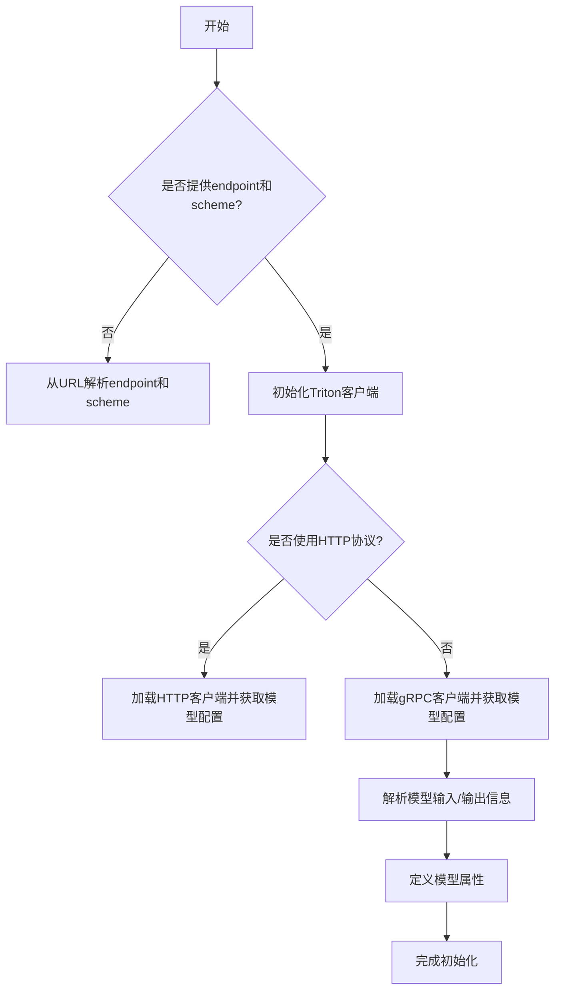
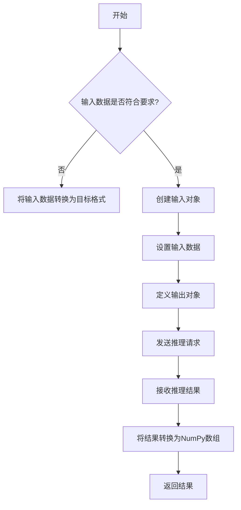

# triton.py

This file documents the purpose of `triton.py`.

# 代码解释

`triton.py` 文件实现了一个用于与远程 Triton Inference Server 交互的客户端类 `TritonRemoteModel`。该类封装了模型推理请求的发送和响应处理逻辑，支持通过 HTTP 或 gRPC 协议与 Triton 服务器通信。

---

## 1. **核心功能**

### 1.1 类初始化
- **`__init__`**: 初始化客户端并加载模型元数据。
  - 根据 URL 和通信协议（HTTP 或 gRPC）选择合适的客户端库。
  - 获取模型配置，包括输入/输出名称、数据类型等。
  - 支持从 URL 中解析 `endpoint` 和 `scheme`。

### 1.2 模型推理
- **`__call__`**: 发送推理请求并返回结果。
  - 将输入数据转换为符合模型要求的格式。
  - 创建输入对象并设置数据。
  - 定义输出对象以接收推理结果。
  - 调用 Triton 客户端的 `infer` 方法执行推理。
  - 将推理结果转换为 NumPy 数组并返回。

---

## 2. **关键属性**

- **`endpoint`**: 模型名称（在 Triton 服务器上的标识）。
- **`url`**: Triton 服务器地址。
- **`triton_client`**: Triton 客户端实例（HTTP 或 gRPC）。
- **`InferInput` 和 `InferRequestedOutput`**: 输入和输出对象类，用于构建推理请求。
- **`input_formats` 和 `np_input_formats`**: 输入数据的数据类型（字符串形式和 NumPy 类型）。
- **`input_names` 和 `output_names`**: 输入和输出张量的名称。
- **`metadata`**: 模型的元数据信息。

---

## 3. **控制流程图**

以下是 `TritonRemoteModel` 类的核心逻辑控制流程图：

以下是 `__call__` 方法的控制流程图：

---

## 4. **总结**

### 文件角色
`triton.py` 提供了一个封装类 `TritonRemoteModel`，用于与远程 Triton Inference Server 进行交互。它简化了模型推理的复杂性，使得用户可以通过简单的函数调用完成推理任务。

### 文件作用
1. **模型初始化**:
   - 自动解析模型元数据，包括输入/输出名称、数据类型等。
   - 支持 HTTP 和 gRPC 两种通信协议。
2. **模型推理**:
   - 提供便捷的接口，允许用户直接传入 NumPy 数组进行推理。
   - 自动处理数据格式转换和结果解析。
3. **灵活性**:
   - 支持从 URL 中解析参数，减少手动配置的工作量。
   - 允许用户根据需求选择不同的通信协议。

通过这些功能，`triton.py` 在分布式推理场景中起到了重要作用，显著降低了与远程推理服务集成的复杂度。

Triton 是 NVIDIA 开发的一个开源推理服务框架，称为 **Triton Inference Server**。它允许开发者将机器学习和深度学习模型部署为可扩展的、高性能的服务，支持多种框架（如 TensorFlow、PyTorch 等）和多种硬件加速器（如 GPU 和 CPU）。以下是 Triton 的主要特点和作用：

---

## 1. **Triton 的核心功能**

### 1.1 模型部署
- **多框架支持**: Triton 支持多种模型格式，包括 TensorFlow SavedModel、PyTorch TorchScript、ONNX、TensorRT 等。
- **动态批处理**: 自动优化推理请求的批处理，提高 GPU 利用率和吞吐量。
- **多模型管理**: 可以同时加载和管理多个模型，支持模型版本控制。

### 1.2 性能优化
- **硬件加速**: 利用 NVIDIA GPU 的 Tensor Cores 提供高效的推理性能。
- **多实例执行**: 在同一 GPU 上运行多个模型实例，最大化资源利用率。
- **异步推理**: 支持异步推理请求，减少等待时间。

### 1.3 易用性
- **REST 和 gRPC API**: 提供标准的 HTTP/REST 和 gRPC 接口，方便客户端与服务器交互。
- **灵活配置**: 支持通过配置文件调整模型的行为（如批处理大小、超时等）。
- **监控和日志**: 提供详细的性能指标和日志信息，便于调试和优化。

---

## 2. **Triton 的工作原理**

Triton 的工作流程可以分为以下几个步骤：
1. **模型注册**: 将训练好的模型保存为支持的格式（如 ONNX 或 TorchScript），并将其注册到 Triton 服务器。
2. **服务器启动**: 启动 Triton Inference Server，并加载注册的模型。
3. **客户端请求**: 客户端通过 REST 或 gRPC 接口发送推理请求。
4. **推理执行**: Triton 根据请求调用相应的模型进行推理，并返回结果。

---

## 3. **Triton 的应用场景**

Triton 广泛应用于需要高效推理的场景，例如：
- **计算机视觉**: 实时目标检测、图像分类等。
- **自然语言处理**: 文本生成、情感分析等。
- **推荐系统**: 用户行为预测、个性化推荐等。
- **自动驾驶**: 实时感知和决策。

---

## 4. **与 `TritonRemoteModel` 的关系**

在 `triton.py` 文件中，`TritonRemoteModel` 类封装了与 Triton Inference Server 交互的逻辑：
- **初始化**: 加载模型元数据（输入/输出名称、数据类型等）。
- **推理**: 将输入数据发送到远程 Triton 服务器，并解析返回的结果。

通过该类，用户可以轻松地与远程部署的模型进行交互，而无需关心底层通信细节。

---

总结来说，Triton 是一个强大的推理服务框架，能够简化模型部署和推理的过程，同时提供高性能和灵活性。