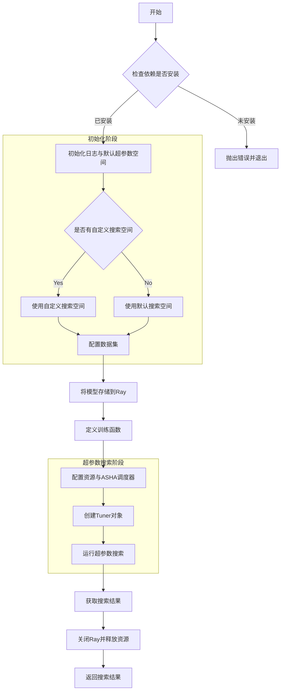

# tuner.py

This file documents the purpose of `tuner.py`.

# 代码解释
这段代码的核心功能是通过Ray Tune框架对YOLO模型进行超参数优化，具体逻辑分解如下：

1. **依赖检查与导入**：  
   - 检查并导入必要的库（如`ray`, `tune`, `WandbLoggerCallback`, `ASHAScheduler`等）。
   - 如果缺少依赖，抛出`ModuleNotFoundError`提示用户安装。

2. **默认超参数空间定义**：  
   - 定义了一个默认的超参数搜索空间`default_space`，包含学习率、动量、权重衰减、数据增强参数等多个维度。

3. **模型存储与训练函数定义**：  
   - 将模型存储到Ray中以支持分布式训练。
   - 定义训练函数`_tune`，该函数从Ray中获取模型并在每次试验中使用指定的超参数进行训练。

4. **数据集配置**：  
   - 如果用户未提供数据集，则使用默认数据集。

5. **资源与调度器配置**：  
   - 配置训练任务的资源分配（CPU和GPU）。
   - 使用`ASHAScheduler`调度器优化超参数搜索过程。

6. **Tuner创建与运行**：  
   - 创建Ray Tune的`Tuner`对象，配置超参数搜索空间、调度器、回调函数等。
   - 运行超参数搜索。

7. **结果处理与资源清理**：  
   - 获取超参数搜索的结果。
   - 关闭Ray以释放资源。

---

# 控制流图

---

### 图解说明
- **依赖检查**：确保所有必要的库已安装。
- **初始化阶段**：包括设置默认超参数空间、数据集配置等。
- **训练函数定义**：定义如何使用指定超参数训练模型。
- **资源与调度器配置**：分配计算资源并设置调度策略。
- **超参数搜索**：运行Ray Tune的超参数搜索过程。
- **结果处理**：获取结果并清理资源。

# 代码解释

`tuner.py` 文件的核心功能是通过 Ray Tune 框架实现超参数优化，具体逻辑分解如下：

1. **依赖检查与导入**：
   - 检查并导入必要的库（如 `ray`, `tune`, `WandbLoggerCallback`, `ASHAScheduler` 等）。
   - 如果缺少依赖，抛出 `ModuleNotFoundError` 提示用户安装。

2. **默认超参数空间定义**：
   - 定义了一个默认的超参数搜索空间 `default_space`，包含学习率、动量、权重衰减、数据增强参数等多个维度。

3. **模型存储与训练函数定义**：
   - 将模型存储到 Ray 中以支持分布式训练。
   - 定义训练函数 `_tune`，该函数从 Ray 中获取模型并在每次试验中使用指定的超参数进行训练。

4. **数据集配置**：
   - 如果用户未提供数据集，则使用默认数据集。

5. **资源与调度器配置**：
   - 配置训练任务的资源分配（CPU 和 GPU）。
   - 使用 `ASHAScheduler` 调度器优化超参数搜索过程。

6. **Tuner 创建与运行**：
   - 创建 Ray Tune 的 `Tuner` 对象，配置超参数搜索空间、调度器、回调函数等。
   - 运行超参数搜索。

7. **结果处理与资源清理**：
   - 获取超参数搜索的结果。
   - 关闭 Ray 以释放资源。

---

# 控制流图

---

# 总结

### 文件角色与作用
`tuner.py` 文件的主要角色是为 YOLO 模型提供基于 Ray Tune 的超参数优化功能。其作用可以概括为以下几点：
1. **超参数优化框架集成**：通过 Ray Tune 实现高效的超参数搜索，支持分布式训练。
2. **灵活的超参数空间定义**：允许用户自定义超参数搜索空间，同时提供默认的超参数空间作为备选。
3. **自动化资源管理**：自动配置 CPU 和 GPU 资源，确保高效利用计算资源。
4. **结果输出与清理**：在完成超参数搜索后，返回最佳结果并清理 Ray 资源，避免内存泄漏。

该文件在 Ultralytics 工具链中扮演了关键角色，帮助用户快速找到最优的超参数组合，从而提升模型性能。

# 超参数空间解释

**超参数空间**是指在机器学习模型训练过程中，所有可调整的超参数的取值范围或候选集合。这些超参数包括但不限于学习率、优化器类型、权重衰减、数据增强参数等。通过定义一个合理的超参数空间，可以系统地探索不同超参数组合对模型性能的影响。

在 `tuner.py` 文件中，超参数空间通过 `default_space` 字典定义，包含了以下几类超参数：
1. **优化器相关**：如初始学习率 (`lr0`)、最终学习率比例 (`lrf`)、动量 (`momentum`)、权重衰减 (`weight_decay`)。
2. **学习率调度相关**：如预热周期 (`warmup_epochs`) 和预热动量 (`warmup_momentum`)。
3. **损失函数相关**：如边界框损失权重 (`box`) 和分类损失权重 (`cls`)。
4. **数据增强相关**：如图像旋转角度 (`degrees`)、平移比例 (`translate`)、缩放比例 (`scale`)、HSV 颜色空间增强 (`hsv_h`, `hsv_s`, `hsv_v`) 等。

这些超参数的范围通过 Ray Tune 的 `tune.uniform` 或其他分布函数（如 `tune.choice`）定义，表示在搜索过程中可以从这些范围内随机采样值。

---

# 模型训练方法

在 `tuner.py` 文件中，模型的训练仍然使用 YOLO 架构本身的训练方法，具体逻辑如下：

1. **训练函数定义**：
   - 定义了 `_tune` 函数，该函数从 Ray 中获取存储的模型，并调用模型的 `train` 方法进行训练。
   - 训练时传入的配置参数由 Ray Tune 动态生成的超参数与用户提供的 `train_args` 合并而成。

2. **YOLO 自身的训练逻辑**：
   - 模型的训练逻辑完全依赖于 YOLO 架构本身实现的 `train` 方法。
   - 例如，YOLO 的训练可能涉及数据加载、前向传播、反向传播、损失计算、优化器更新等步骤，这些逻辑并未在 `tuner.py` 中重新实现，而是直接复用 YOLO 的训练代码。

3. **分布式训练的支持**：
   - Ray Tune 提供了分布式训练的能力，但具体的训练过程仍然是由 YOLO 的 `train` 方法完成的。
   - Ray 的作用是管理多个试验（trials），每个试验运行一个独立的 YOLO 训练任务，并分配计算资源（CPU 和 GPU）。
   - 因此，分布式训练的实现依赖于 Ray 的资源调度能力，而训练的核心逻辑仍然由 YOLO 提供。

---

# 总结

1. **超参数空间的作用**：
   - 定义了需要优化的超参数及其取值范围，帮助系统化地探索最佳超参数组合。

2. **模型训练方法**：
   - 模型的训练仍然使用 YOLO 架构本身的训练方法，Ray Tune 仅负责管理和调度多个试验任务。
   - 分布式训练的实现依赖于 Ray 的资源分配和任务调度能力，但训练的核心逻辑未改变。

3. **Ray 的角色**：
   - Ray Tune 主要用于超参数优化和分布式任务管理，而 YOLO 的训练逻辑保持独立且不变。

通过这种方式，`tuner.py` 文件实现了高效的超参数优化，同时充分利用了 Ray 的分布式能力，提升了超参数搜索的效率。